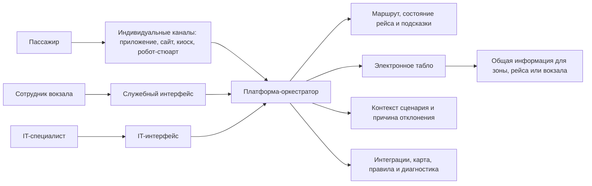

# 01. Описание системы

## Название

Цифровая платформа умного вокзала ВСМ.

## Проблема

Современный вокзал воспринимается пассажиром как набор разрозненных сервисов: расписание, билет, навигация, табло, услуги, обращения, посадка и служебные процессы существуют отдельно. Из-за этого пассажир не получает единого сценария пребывания на вокзале, может пропустить важную услугу, прийти не к той платформе, не узнать о смене статуса рейса или не понять, что делать при отклонении от обычного сценария.

Под пассажирским сценарием в этой работе понимается последовательность шагов пассажира на вокзале от входа или первого обращения к цифровому каналу до посадки на поезд или выхода из сценария. В сценарий входят рейс, платформа, маршрут по вокзалу, изменения расписания, подсказки, уведомления и отклонения: смена платформы, задержка, недоступный проход, необходимость помощи сотрудника.

Для сотрудников вокзала проблема проявляется в том, что при обращении пассажира им приходится восстанавливать контекст вручную: какой у пассажира рейс, где он находится, какая платформа актуальна, какая подсказка была показана и почему сценарий пошел не по обычному пути. Для IT-специалистов проблема выглядит как набор несвязанных интеграций: данные и события распределены по разным системам, нет единого состояния пассажирского пути, а добавление нового канала требует отдельной интеграции с каждым сервисом.

## Цель MVP

MVP должен показать, как единая IT-платформа может быть ядром управления пассажирским сценарием без замены всех систем вокзала. Платформа принимает контекст пассажира и рейса, ведет анонимную сессию пассажирского пути, рассчитывает маршрут по вокзалу и выдает внешним каналам актуальные подсказки.

## Целевые пользователи

| Пользователь | Потребность |
|---|---|
| Пассажир ВСМ | Получить понятный маршрут, актуальные подсказки и уведомления по своему рейсу без ручного поиска по разным сервисам |
| Сотрудник вокзала | Быстро помочь пассажиру при отклонении сценария: увидеть актуальный рейс, платформу, причину подсказки или сбоя и понять, куда направить пассажира дальше |
| IT-специалист инфраструктуры ВСМ | Подключать новые каналы и сервисы через единые API, события и правила обработки |

## Основные сценарии MVP

- Пользовательский канал создает сессию пассажирского пути по ссылке на билет или QR-код. Пользовательским каналом может быть мобильное приложение, сайт, киоск самообслуживания или робот-стюарт.
- Платформа получает из билетной системы ссылку на рейс и минимальный контекст, необходимый для сценария.
- Платформа получает актуальное состояние рейса из сервиса расписания.
- Платформа рассчитывает маршрут по карте-графу вокзала. Начальная точка в MVP передается явно: пассажир выбирает ее на карте, канал передает выбранный вход или зону вокзала, киоск передает свое фиксированное местоположение, робот-стюарт передает точку, в которой он взаимодействует с пассажиром.
- Конечная точка базового маршрута определяется по данным расписания: для рейса известна актуальная платформа или зона посадки.
- Платформа выдает подсказки: куда идти, сколько времени до посадки, что изменилось в рейсе, какие действия нужны сейчас.
- При событии смены платформы платформа обновляет сценарий, пересчитывает маршрут и создает уведомление для активной сессии.

Wi-Fi-точки и Bluetooth-маяки не входят в MVP. В будущих версиях они могут использоваться для автоматического определения положения пассажира в плотной вокзальной среде, но первая версия опирается только на явно переданную начальную точку и карту-граф.

## Как пользователь получает результат

Платформа не реализует собственный пассажирский интерфейс в MVP. Результат передается через API внешним каналам, но характер результата зависит от типа канала.

| Канал | Какой результат получает |
|---|---|
| Мобильное приложение перевозчика или вокзала | Индивидуальный сценарий пассажира: маршрут, состояние рейса, подсказки и уведомления |
| Веб-сайт | Индивидуальный сценарий при наличии сессии или общий маршрут по выбранному рейсу и точке входа |
| Киоск самообслуживания | Маршрут от фиксированного местоположения киоска, статус рейса и подсказки для пассажира рядом с киоском |
| Робот-стюарт | Состояние сценария, маршрут и подсказки, которые робот передает пассажиру голосом, экраном или диалогом |
| Электронное табло | Только общая неперсонализированная информация для зоны, рейса или вокзала: задержки, ремонтные работы, изменения платформ, общие навигационные сообщения |
| Служебный интерфейс сотрудника вокзала | Состояние пассажирского сценария, последняя подсказка, причина отклонения и рекомендуемое действие сотрудника |
| IT-интерфейс или административный доступ | Состояние интеграций, версии карты-графа, правила сценариев, диагностические события и ошибки обработки |

Основной результат для пассажира - актуальное состояние сценария, маршрут и подсказки. Для сотрудника вокзала результат - объяснимый контекст, который помогает оказать помощь на месте. Для IT-специалиста результат - единая интеграционная точка, воспроизводимое состояние сценария и диагностическая информация для сопровождения платформы.

## Границы MVP

В MVP входят:

- API создания и чтения сессии пассажирского пути;
- интеграция с внешней билетной системой;
- интеграция с внешним сервисом расписания;
- карта-граф вокзала;
- расчет маршрута по карте-графу;
- сценарные правила для подсказок;
- выдача подсказок через активную сессию;
- обработка событий изменения рейса и смены платформы;
- аудит ключевых событий сессии.

Подсказка в MVP - это короткое контекстное сообщение или действие, которое платформа возвращает пользовательскому каналу в рамках конкретной сессии. Например: "идите к платформе 4", "платформа изменилась, маршрут пересчитан", "до посадки осталось 20 минут", "маршрут недоступен, обратитесь к сотруднику".

Подсказки адресованы прежде всего пассажирскому сценарию. Сотрудник вокзала и IT-специалист получают не пассажирские подсказки, а служебную информацию: причину подсказки, текущее состояние сценария, диагностические события и рекомендации для ручного вмешательства.

В MVP не входят:

- полный профиль пассажира;
- хранение истории поездок;
- коммерческие заказы;
- обращения пассажиров;
- багаж и потерянные вещи;
- контроль посадки;
- indoor-позиционирование;
- цифровой двойник вокзала;
- самостоятельная отправка SMS, push или email без внешнего канала доставки.

Отсутствие indoor-позиционирования означает, что платформа в MVP не определяет положение пассажира автоматически. Начальная точка маршрута выбирается или передается каналом явно, а конечная точка берется из контекста рейса.

## Критерии успеха

| Критерий | Как проверить |
|---|---|
| Сессия создается по ссылке на билет | Демонстрация сценария через API |
| Платформа показывает актуальный статус рейса | Интеграционный тест с mock сервиса расписания |
| Маршрут до платформы рассчитывается по карте-графу | Unit и integration tests навигации |
| Смена платформы меняет сценарий и создает подсказку | E2E-сценарий события смены платформы |
| Повтор внешнего события не меняет состояние дважды | Тест идемпотентности по `external_event_id` |
| В платформе нет полного профиля пассажира | Проверка модели данных и логов |

E2E-сценарий - это сквозная проверка полного процесса от входного запроса или события до результата в канале. Например: сервис расписания отправил событие смены платформы, платформа приняла событие, обновила сценарий, пересчитала маршрут и вернула новую подсказку.

Идемпотентность означает, что повтор одного и того же действия или внешнего события не создает повторное изменение состояния. Если событие смены платформы пришло два раза с одним `external_event_id`, платформа применяет его только один раз и не создает дубли маршрутов или подсказок.

## Схема ценности

