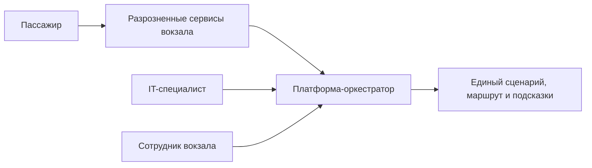

# 01. Описание системы

## Название

Цифровая платформа умного вокзала ВСМ.

## Проблема

Современный вокзал воспринимается пассажиром как набор разрозненных сервисов: расписание, билет, навигация, табло, услуги, обращения, посадка и служебные процессы существуют отдельно. Из-за этого пассажир не получает единого сценария пребывания на вокзале, может пропустить важную услугу, прийти не к той платформе, не узнать о смене статуса рейса или не понять, что делать при отклонении от обычного сценария.

Для сотрудников и IT-специалистов проблема выглядит иначе: данные и события распределены по разным системам, нет единого состояния пассажирского пути, сложно объяснить, почему пассажир получил или не получил конкретную подсказку, а добавление новых каналов требует отдельной интеграции с каждым сервисом.

## Цель MVP

MVP должен показать, как единая IT-платформа может быть ядром управления пассажирским сценарием без замены всех систем вокзала. Платформа принимает контекст пассажира и рейса, ведет анонимную сессию пассажирского пути, рассчитывает маршрут по вокзалу и выдает внешним каналам актуальные подсказки.

## Целевые пользователи

| Пользователь | Потребность |
|---|---|
| Пассажир ВСМ | Получить понятный маршрут, актуальные подсказки и уведомления по своему рейсу без ручного поиска по разным сервисам |
| Сотрудник вокзала | Понимать состояние типовых пассажирских сценариев и причины отклонений |
| IT-специалист инфраструктуры ВСМ | Подключать новые каналы и сервисы через единые API, события и правила обработки |

## Основные сценарии MVP

- Внешний пассажирский канал создает сессию пассажирского пути по ссылке на билет или QR-код.
- Платформа получает из билетной системы ссылку на рейс и минимальный контекст, необходимый для сценария.
- Платформа получает актуальное состояние рейса из сервиса расписания.
- Платформа рассчитывает маршрут от входной точки или выбранной зоны вокзала до платформы.
- Платформа выдает подсказки: куда идти, сколько времени до посадки, что изменилось в рейсе, какие действия нужны сейчас.
- При событии смены платформы платформа обновляет сценарий, пересчитывает маршрут и создает уведомление для активной сессии.

## Как пользователь получает результат

Платформа не реализует собственный пассажирский интерфейс в MVP. Результат передается через API внешним каналам:

- мобильному приложению перевозчика или вокзала;
- веб-сайту;
- киоску самообслуживания;
- электронному табло;
- служебному интерфейсу сотрудника.

Основной результат для пассажира - актуальное состояние сценария, маршрут и подсказки. Для IT-специалиста результат - единая интеграционная точка и воспроизводимое состояние сценария.

## Границы MVP

В MVP входят:

- API создания и чтения сессии пассажирского пути;
- интеграция с внешней билетной системой;
- интеграция с внешним сервисом расписания;
- карта-граф вокзала;
- расчет маршрута по карте-графу;
- сценарные правила для подсказок;
- выдача подсказок через активную сессию;
- обработка событий изменения рейса и смены платформы;
- аудит ключевых событий сессии.

В MVP не входят:

- полный профиль пассажира;
- хранение истории поездок;
- коммерческие заказы;
- обращения пассажиров;
- багаж и потерянные вещи;
- контроль посадки;
- indoor-позиционирование;
- цифровой двойник вокзала;
- самостоятельная отправка SMS, push или email без внешнего канала доставки.

## Критерии успеха

| Критерий | Как проверить |
|---|---|
| Сессия создается по ссылке на билет | Демонстрация сценария через API |
| Платформа показывает актуальный статус рейса | Интеграционный тест с mock сервиса расписания |
| Маршрут до платформы рассчитывается по карте-графу | Unit и integration tests навигации |
| Смена платформы меняет сценарий и создает подсказку | E2E-сценарий события смены платформы |
| Повтор внешнего события не меняет состояние дважды | Тест идемпотентности по `external_event_id` |
| В платформе нет полного профиля пассажира | Проверка модели данных и логов |

## Схема ценности

