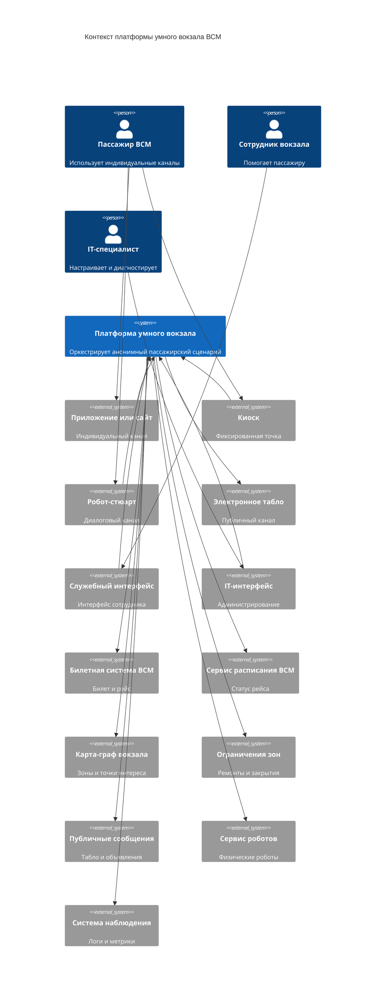

# 02. Контекст и границы

## Контекст

Платформа находится между пользовательскими каналами, внутренними сервисами конкретного вокзала и внешними системами ВСМ. Она не заменяет эти системы, а связывает их в единый пассажирский сценарий: получает факты о билете, рейсе, карте вокзала и ограничениях зон, ведет состояние активной сессии и возвращает каналам маршрут, подсказки и причины решений.

Платформа не является источником истины для билетов, расписания, физических устройств, публичных табло, роботов-стюартов или пользовательских интерфейсов. Ее зона ответственности - оркестрация сценария, единый API, состояние `JourneySession`, правила подсказок и аудит событий.

## Пользователи, каналы и системы окружения

| Участник | Роль в контексте |
|---|---|
| Пассажир ВСМ | Получает маршрут, состояние рейса, подсказки и уведомления через индивидуальный канал |
| Сотрудник вокзала | Помогает пассажиру при отклонениях, видит состояние сценария и причину последней подсказки или сбоя |
| IT-специалист инфраструктуры ВСМ | Настраивает интеграции, карту-граф, правила сценариев и диагностирует ошибки обработки |
| Мобильное приложение или сайт | Создает сессию, передает ссылку на билет и выбранную начальную точку, показывает индивидуальный сценарий |
| Киоск самообслуживания | Создает сессию от своего фиксированного местоположения и показывает маршрут пассажиру рядом с киоском |
| Робот-стюарт | Получает состояние сценария, маршрут и подсказки, затем передает их пассажиру голосом, экраном или диалогом |
| Электронное табло | Показывает только общую неперсонализированную информацию для зоны, рейса или вокзала |
| Служебный интерфейс сотрудника вокзала | Показывает состояние сценария, причину отклонения и рекомендуемое действие сотрудника |
| IT-интерфейс или административный доступ | Показывает состояние интеграций, версии карты-графа, правила сценариев и ошибки обработки |
| Билетная система ВСМ | Подтверждает билет и возвращает ссылку на рейс |
| Сервис расписания ВСМ | Отдает актуальный статус рейса и события изменений |
| Сервис карты-графа и точек интереса вокзала | Отдает карту зон, входов, платформ, сервисных точек и переходов |
| Сервис ограничений зон и ремонтных работ | Отдает временно закрытые зоны, недоступные проходы и ограничения маршрутов |
| Сервис публичных сообщений и табло | Управляет публикацией общих сообщений на табло и других публичных поверхностях |
| Сервис роботов-стюартов | Управляет физическими роботами, их состоянием и местоположением |
| Система наблюдения за инфраструктурой | Собирает технические сигналы, логи, метрики и трассировку |

## Внутри границы платформы

- API платформы.
- Сценарный оркестратор.
- Сервис навигации по карте-графу.
- Интеграционные адаптеры.
- База состояния.
- Брокер событий.
- Фоновый обработчик доставки подсказок.
- Журнал внешних событий и аудита сессии.

Фоновый обработчик доставки подсказок - это внутренний процесс платформы, а не пользователь и не внешний актор. Он берет созданную оркестратором подсказку, определяет подходящий канал доставки для активной сессии и передает сообщение в пользовательский канал, сервис публичных сообщений или служебный интерфейс. Если канал временно недоступен, обработчик фиксирует попытку доставки и позволяет повторить ее позже.

## Внешние зависимости MVP

| Группа | Зависимости MVP |
|---|---|
| Пользовательские и служебные каналы | Мобильное приложение или сайт, киоск самообслуживания, робот-стюарт, электронное табло, служебный интерфейс сотрудника, IT-интерфейс |
| Внешние системы ВСМ | Билетная система ВСМ, сервис расписания ВСМ |
| Внутренние сервисы конкретного вокзала | Сервис карты-графа и точек интереса, сервис ограничений зон и ремонтных работ, сервис публичных сообщений и табло, сервис роботов-стюартов |
| Эксплуатационные системы | Система наблюдения за инфраструктурой |

## Интеграции будущих версий

- Коммерческие услуги вокзала.
- Сервис обращений пассажиров.
- Багаж и потерянные вещи.
- Контроль посадки.
- Wi-Fi/Bluetooth-позиционирование пассажира внутри вокзала.
- Расширенные сценарии роботов-стюартов.
- Расширенное управление электронными табло и публичными сообщениями.
- Системы управления потоками пассажиров.
- Цифровой двойник вокзала.
- Интеграции с лифтами, эскалаторами, турникетами и другим оборудованием вокзала.

## Контекстная диаграмма

Детали связей вынесены в таблицу ниже, чтобы не перегружать контекстную диаграмму длинными подписями.

## Основные потоки вне системы

| Откуда | Куда | Данные | Назначение |
|---|---|---|---|
| Мобильное приложение или сайт | Платформа | Токен канала, ссылка на билет, выбранная начальная точка | Создание сессии и получение индивидуального сценария |
| Киоск самообслуживания | Платформа | Токен канала, ссылка на билет, идентификатор киоска как начальная точка | Создание маршрута от фиксированного места киоска |
| Робот-стюарт | Платформа | Токен канала, ссылка на билет, точка взаимодействия с пассажиром | Получение сценария для голосового, экранного или диалогового ответа |
| Платформа | Билетная система ВСМ | Хэш или ссылка на билет | Проверка билета и получение рейса |
| Платформа | Сервис расписания ВСМ | Идентификатор рейса | Получение актуального статуса рейса |
| Сервис расписания ВСМ | Платформа | Событие изменения рейса, задержки или платформы | Обновление сценария и пересчет маршрута |
| Платформа | Сервис карты-графа и точек интереса | Версия карты, узлы, переходы, платформы, сервисные точки | Построение маршрута по вокзалу |
| Сервис карты-графа и точек интереса | Платформа | Новая версия карты, изменения точек интереса | Обновление справочника маршрутизации |
| Платформа | Сервис ограничений зон и ремонтных работ | Недоступные зоны, закрытые проходы, временные ограничения | Исключение недоступных участков из маршрута |
| Сервис ограничений зон и ремонтных работ | Платформа | Событие закрытия или открытия зоны | Пересчет активных маршрутов и создание подсказок |
| Платформа | Индивидуальные пользовательские каналы | Состояние сценария, маршрут, подсказки, причины подсказок | Отображение пассажиру |
| Платформа | Электронное табло или сервис публичных сообщений | Общие неперсонализированные сообщения для зоны, рейса или вокзала | Публичное информирование без привязки к конкретной сессии |
| Платформа | Служебный интерфейс сотрудника вокзала | Состояние `JourneySession`, последняя подсказка, причина отклонения | Помощь пассажиру и ручное сопровождение сценария |
| Платформа | IT-интерфейс или административный доступ | Состояние интеграций, версии карты, ошибки обработки, диагностические события | Сопровождение платформы |
| Платформа | Система наблюдения за инфраструктурой | Логи, метрики, трассировка, технические события | Эксплуатационный контроль |

## Граница ответственности

`JourneySession` - это состояние активного пассажирского сценария, а не только идентификатор. В него входят идентификатор сессии, техническая ссылка или хэш билета, контекст рейса, начальная точка, целевая точка, версия карты-графа, рассчитанный маршрут, шаги сценария, подсказки, статусы доставки и аудит событий. Полный профиль пассажира, история поездок, документы и платежные данные в `JourneySession` не входят.

Платформа отвечает за:

- состояние `JourneySession` без полного профиля пассажира;
- применение сценарных правил;
- расчет маршрута по карте-графу;
- создание подсказок и фиксацию причин решений;
- идемпотентную обработку внешних событий;
- выдачу API для внешних каналов;
- передачу общих неперсонализированных сообщений для табло;
- аудит изменений сценария и диагностические данные для сопровождения.

Платформа не отвечает за:

- выпуск и оплату билета;
- правовую идентификацию пассажира;
- первичное ведение расписания;
- полный профиль пассажира и хранение истории поездок;
- точное indoor-позиционирование пассажира;
- коммерческие операции и оформление услуг;
- фактическое обслуживание пассажира сотрудником вокзала;
- физическое управление табло, роботами-стюартами, турникетами, лифтами, эскалаторами и другим оборудованием вокзала;
- самостоятельную отправку SMS, push или email без внешнего канала доставки.
