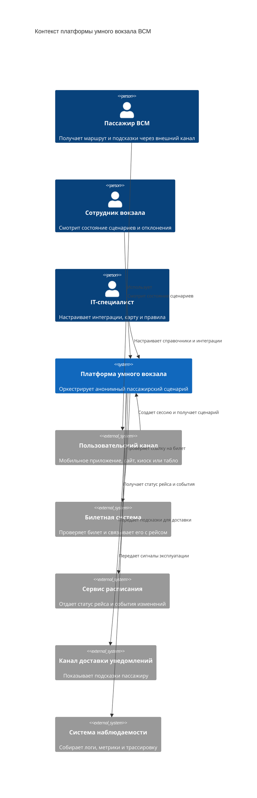

# 02. Контекст и границы

## Контекст

Платформа находится между пользовательскими каналами и внешними сервисами вокзала. Она не является источником истины для билетов или расписания, но хранит состояние активной сессии пассажирского пути и применяет сценарные правила.

## Пользователи и внешние акторы

| Актор | Роль в контексте |
|---|---|
| Пассажир ВСМ | Получает маршрут, состояние сценария и подсказки через внешний канал |
| Внешний пользовательский канал | Создает сессию, показывает состояние, получает подсказки |
| Сотрудник вокзала | Просматривает состояние сценариев и причины отклонений |
| IT-специалист инфраструктуры ВСМ | Настраивает интеграции, карту-граф и правила сценариев |
| Билетная система | Подтверждает билет и возвращает ссылку на рейс |
| Сервис расписания | Отдает актуальный статус рейса и события изменений |
| Канал доставки уведомлений | Доставляет подсказки пассажиру в своем интерфейсе |

## Внутри границы платформы

- API платформы.
- Сценарный оркестратор.
- Сервис навигации по карте-графу.
- Интеграционные адаптеры.
- База состояния.
- Брокер событий.
- Worker уведомлений.
- Журнал внешних событий и аудита сессии.

## Внешние зависимости MVP

- Билетная система.
- Сервис расписания.
- Пользовательские каналы.
- Канал доставки уведомлений.
- Система наблюдаемости инфраструктуры.

## Интеграции будущих версий

- Коммерческие услуги вокзала.
- Сервис обращений пассажиров.
- Багаж и потерянные вещи.
- Контроль посадки.
- Indoor-позиционирование.
- Системы управления потоками людей и цифровой двойник вокзала.

## Контекстная диаграмма

## Основные потоки через границу

| Откуда | Куда | Данные | Назначение |
|---|---|---|---|
| Пользовательский канал | Платформа | Токен канала, ссылка на билет, входная точка вокзала | Создание сессии |
| Платформа | Билетная система | Хэш или ссылка на билет | Проверка билета и получение рейса |
| Платформа | Сервис расписания | Идентификатор рейса | Получение актуального статуса |
| Сервис расписания | Платформа | Событие изменения рейса | Обновление сценария |
| Платформа | Пользовательский канал | Состояние сценария, маршрут, подсказки | Отображение пассажиру |
| Платформа | Канал доставки уведомлений | Подсказка и идентификатор сессии канала | Доставка уведомления |

## Граница ответственности

Платформа отвечает за:

- состояние `JourneySession`;
- применение сценарных правил;
- расчет маршрута по карте-графу;
- идемпотентную обработку внешних событий;
- выдачу API для внешних каналов;
- аудит изменений сценария.

Платформа не отвечает за:

- выпуск и оплату билета;
- правовую идентификацию пассажира;
- первичное ведение расписания;
- фактическую доставку push, SMS или email;
- физическое управление табло, турникетами, лифтами и оборудованием вокзала.

