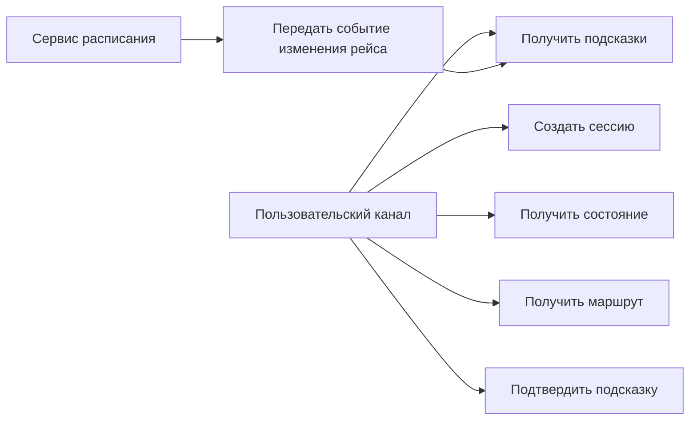

# 03. Требования

## Функциональные требования

| Код | Требование | Приоритет | Как проверить |
|---|---|---|---|
| FR-001 | Платформа должна создавать анонимную `JourneySession` по запросу внешнего канала | Must | API test |
| FR-002 | Платформа должна связывать сессию с рейсом через внешнюю билетную систему | Must | Integration test с fake билетной системой |
| FR-003 | Платформа должна получать актуальный статус рейса из внешнего сервиса расписания | Must | Integration test с fake расписанием |
| FR-004 | Платформа должна хранить текущее состояние пассажирского сценария | Must | Integration test состояния |
| FR-005 | Платформа должна рассчитывать маршрут по карте-графу вокзала | Must | Unit и integration tests навигации |
| FR-006 | Платформа должна возвращать внешнему каналу список актуальных подсказок | Must | API test |
| FR-007 | Платформа должна обрабатывать событие смены платформы и пересчитывать маршрут | Must | E2E test события |
| FR-008 | Платформа должна создавать уведомление через активную сессию | Should | Integration test worker уведомлений |
| FR-009 | Платформа должна позволять внешнему каналу подтвердить получение подсказки | Should | API test |
| FR-010 | Платформа должна завершать сессию вручную или по истечении срока жизни | Must | Integration test cleanup |
| FR-011 | IT-специалист должен иметь возможность обновить карту-граф вокзала | Should | Admin API или миграция справочника |
| FR-012 | Сотрудник вокзала должен видеть состояние сессии и причину последней подсказки | Could | Demonstration сценария |

## Нефункциональные требования

| Код | Требование | Приоритет | Как проверить |
|---|---|---|---|
| NFR-001 | API чтения сценария должен отвечать за 300 мс при нормальной работе зависимостей | Should | Нагрузочный тест |
| NFR-002 | Повтор одного внешнего события не должен менять состояние дважды | Must | Тест идемпотентности |
| NFR-003 | Недоступность сервиса расписания не должна ломать чтение последнего известного сценария | Must | Failure test |
| NFR-004 | Платформа не должна хранить полный профиль пассажира | Must | Проверка схемы данных и логов |
| NFR-005 | Все события сессии должны связываться по `journey_session_id` | Must | Проверка логов и аудита |
| NFR-006 | Сценарные правила должны быть изменяемыми без переработки пользовательских каналов | Should | Архитектурное ревью |
| NFR-007 | Карта-граф должна поддерживать недоступные зоны и альтернативные маршруты | Should | Unit tests навигации |
| NFR-008 | Система должна горизонтально масштабировать stateless API и worker уведомлений | Should | Deployment review |

## Минимальные API

| Метод | Путь | Назначение |
|---|---|---|
| `POST` | `/journey-sessions` | Создать сессию пассажирского пути |
| `GET` | `/journey-sessions/{id}` | Получить состояние сценария |
| `GET` | `/journey-sessions/{id}/route` | Получить маршрут до целевой точки |
| `GET` | `/journey-sessions/{id}/hints` | Получить актуальные подсказки |
| `POST` | `/journey-sessions/{id}/hints/{hint_id}/ack` | Подтвердить получение подсказки |
| `POST` | `/journey-sessions/{id}/complete` | Завершить сессию |
| `POST` | `/external-events/schedule` | Принять событие расписания |
| `POST` | `/admin/station-map/versions` | Загрузить новую версию карты-графа |

## Минимальные события

| Событие | Источник | Что делает платформа |
|---|---|---|
| `trip.status.changed` | Сервис расписания | Обновляет `TripContext` и пересчитывает сценарные шаги |
| `trip.platform.changed` | Сервис расписания | Пересчитывает маршрут и создает подсказку |
| `station_map.version.published` | Администратор или справочник | Делает новую карту доступной для новых расчетов |
| `hint.created` | Сценарный оркестратор | Передает подсказку worker уведомлений |
| `journey_session.expired` | Планировщик | Завершает сессию и запускает очистку временных данных |

## Продуктовые правила

| Правило | Значение MVP | Где применяется | Как проверить |
|---|---|---|---|
| Срок жизни активной сессии | До отправления рейса плюс 2 часа | Сценарный оркестратор, cleanup | Integration test |
| Хранение аудита сессии | 90 дней без персональных данных | База состояния | Проверка retention policy |
| Повтор внешнего события | Обрабатывается один раз по `external_event_id` | Прием событий | Failure test |
| Устаревшее расписание | Сценарий помечается как `stale`, но остается доступен | API сценария | Failure test |
| Недоступная зона вокзала | Навигация строит альтернативный маршрут или возвращает причину невозможности | Сервис навигации | Unit test |

## Основные сценарии

## Ошибочные и альтернативные сценарии

- Билетная система не подтверждает билет: сессия не создается, канал получает код причины и может предложить ручной сценарий.
- Сервис расписания недоступен: платформа возвращает последнее известное состояние с признаком `stale`.
- Платформа получила событие расписания повторно: событие фиксируется как повторное и не применяет изменения второй раз.
- Маршрут до платформы невозможен из-за недоступной зоны: канал получает альтернативу или объяснение, что требуется помощь сотрудника.
- Канал доставки недоступен: подсказка остается доступной через pull API, а попытка доставки фиксируется как неуспешная.

## Открытые вопросы

- Какие внешние идентификаторы билетной системы доступны без нарушения требований к персональным данным?
- Какой канал будет первым потребителем API: мобильное приложение, сайт, киоск или табло?
- Нужно ли в MVP отдельное рабочее место сотрудника или достаточно служебного API и журналов?

