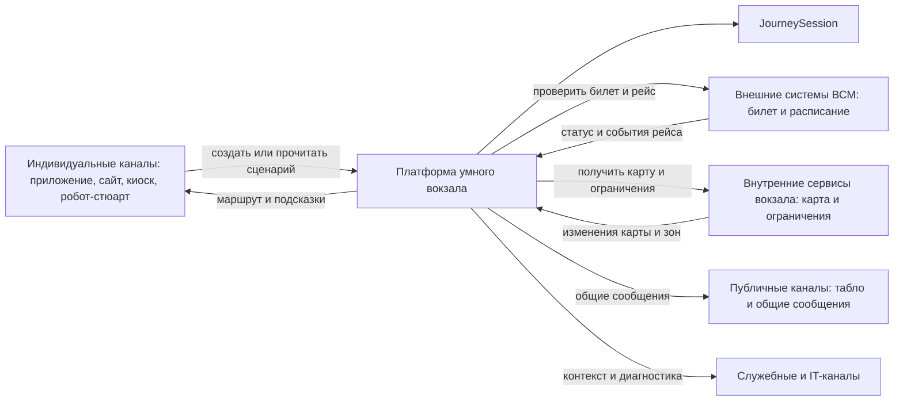

# 03. Требования

## Термины проверок и приоритетов

| Термин | Пояснение |
|---|---|
| Проверка API (API test) | Запрос к API и проверка ответа без полного пользовательского сценария |
| Интеграционная проверка (Integration test) | Проверка взаимодействия платформы с базой данных, очередью, внешней системой или внутренним сервисом вокзала |
| Модульная проверка (Unit test) | Проверка отдельного правила или алгоритма, например расчета маршрута или обработки повторного события |
| Сквозной сценарий (E2E test) | Полный путь от запроса или события до результата в канале |
| Демонстрация сценария (Demonstration) | Ручной показ поведения MVP на подготовленных данных |
| Проверка отказа (Failure test) | Проверка поведения при недоступности сервиса, повторе события или ошибке |
| Проверка схемы развертывания (Deployment review) | Проверка соответствия требований схеме запуска и инфраструктурным ограничениям |

| Приоритет | Значение |
|---|---|
| Обязательно | Требование должно войти в MVP |
| Желательно | Требование важно для полезности MVP, но может быть упрощено в первой демонстрации |
| Дополнительно | Требование повышает удобство или объяснимость, но не блокирует базовый MVP |

## Функциональные требования

| Код | Требование | Приоритет | Как проверить |
|---|---|---|---|
| FR-001 | Платформа должна создавать анонимную `JourneySession` по запросу индивидуального канала: приложения, сайта, киоска или робота-стюарта | Обязательно | Проверка API (API test) |
| FR-002 | Платформа должна связывать сессию с рейсом через билетную систему ВСМ без хранения полного билета и полного профиля пассажира | Обязательно | Интеграционная проверка (Integration test) с имитатором билетной системы |
| FR-003 | Платформа должна получать актуальный статус рейса, платформу и изменения расписания из сервиса расписания ВСМ | Обязательно | Интеграционная проверка (Integration test) с имитатором расписания |
| FR-004 | Платформа должна хранить текущее состояние `JourneySession`: рейс, начальную точку, целевую точку, маршрут, шаги сценария, подсказки, статусы доставки и аудит событий | Обязательно | Интеграционная проверка (Integration test) состояния |
| FR-005 | Платформа должна принимать начальную точку маршрута явно: выбор пассажира на карте, выбранный вход или зона, фиксированное местоположение киоска, точка взаимодействия робота-стюарта | Обязательно | Проверка API (API test) |
| FR-006 | Платформа должна рассчитывать маршрут по карте-графу вокзала с учетом точек интереса и ограничений зон | Обязательно | Модульная проверка (Unit test) и интеграционная проверка (Integration test) навигации |
| FR-007 | Платформа должна возвращать индивидуальным каналам состояние сценария, маршрут, подсказки и причины подсказок | Обязательно | Проверка API (API test) |
| FR-008 | Платформа должна передавать электронному табло и сервису публичных сообщений только общую неперсонализированную информацию | Обязательно | Проверка API (API test) и проверка схемы данных |
| FR-009 | Платформа должна предоставлять существующему служебному каналу сотрудника состояние сценария, последнюю подсказку, причину отклонения и рекомендуемое действие без проектирования отдельного рабочего места | Желательно | Демонстрация сценария (Demonstration) |
| FR-010 | Платформа должна позволять IT-специалисту загружать новую версию карты-графа и проверять состояние интеграций через административный доступ | Желательно | Проверка API (API test) административных операций |
| FR-011 | Платформа должна обрабатывать событие смены платформы, обновлять сценарий, пересчитывать маршрут и создавать подсказку | Обязательно | Сквозной сценарий (E2E test) события смены платформы |
| FR-012 | Платформа должна обрабатывать события закрытия или открытия зоны вокзала и пересчитывать активные маршруты, если они затронуты | Желательно | Сквозной сценарий (E2E test) события ограничения зоны |
| FR-013 | Платформа должна позволять каналу подтвердить получение подсказки, если канал поддерживает такое подтверждение | Желательно | Проверка API (API test) |
| FR-014 | Платформа должна завершать сессию вручную, по окончании сценария или по истечении срока жизни | Обязательно | Интеграционная проверка (Integration test) очистки |

## Нефункциональные требования

| Код | Требование | Приоритет | Как проверить |
|---|---|---|---|
| NFR-001 | API чтения сценария должен отвечать за 300 мс при нормальной работе зависимостей | Желательно | Нагрузочная проверка |
| NFR-002 | Повтор одного внешнего события не должен менять состояние дважды | Обязательно | Проверка отказа (Failure test) и модульная проверка (Unit test) идемпотентности |
| NFR-003 | Недоступность сервиса расписания не должна ломать чтение последнего известного сценария | Обязательно | Проверка отказа (Failure test) |
| NFR-004 | Платформа не должна хранить полный профиль пассажира, историю поездок, документы и платежные данные | Обязательно | Проверка схемы данных и логов |
| NFR-005 | Электронное табло и публичные сообщения не должны получать `JourneySession`, токены каналов или персональные подсказки | Обязательно | Проверка API (API test) и проверка схемы данных |
| NFR-006 | Все события сессии должны связываться по `journey_session_id` для аудита и диагностики | Обязательно | Проверка логов и аудита |
| NFR-007 | Причина подсказки или отклонения должна сохраняться и быть доступной служебному каналу сотрудника | Желательно | Интеграционная проверка (Integration test) состояния |
| NFR-008 | Все пользовательские и служебные каналы должны получать данные из одной платформы одновременно, без выбора одного первого канала-потребителя | Обязательно | Сквозной сценарий (E2E test) с несколькими каналами |
| NFR-009 | Сценарные правила должны быть изменяемыми без переработки пользовательских каналов | Желательно | Архитектурное ревью |
| NFR-010 | Карта-граф должна поддерживать недоступные зоны и альтернативные маршруты | Желательно | Модульная проверка (Unit test) навигации |
| NFR-011 | API платформы и фоновый обработчик доставки подсказок должны масштабироваться горизонтально как компоненты без состояния | Желательно | Проверка схемы развертывания (Deployment review) |

## Минимальные API

Все каналы могут обращаться к платформе одновременно. Платформа возвращает единое состояние сценария, а конкретный канал выбирает способ отображения: экран приложения, сайт, киоск, диалог робота-стюарта, публичное табло, служебный или IT-интерфейс.

| Метод | Путь | Назначение |
|---|---|---|
| `POST` | `/journey-sessions` | Создать сессию пассажирского пути по ссылке на билет и начальной точке |
| `GET` | `/journey-sessions/{id}` | Получить состояние сценария для индивидуального или служебного канала |
| `GET` | `/journey-sessions/{id}/route` | Получить маршрут до целевой точки |
| `GET` | `/journey-sessions/{id}/hints` | Получить актуальные подсказки и причины их создания |
| `POST` | `/journey-sessions/{id}/hints/{hint_id}/ack` | Подтвердить получение подсказки |
| `GET` | `/journey-sessions/{id}/support-context` | Получить служебный контекст для помощи пассажиру через существующий канал сотрудника |
| `POST` | `/journey-sessions/{id}/complete` | Завершить сессию |
| `GET` | `/public-messages` | Получить общие неперсонализированные сообщения для табло, зоны, рейса или вокзала |
| `POST` | `/external-events/schedule` | Принять событие расписания |
| `POST` | `/external-events/station` | Принять событие внутреннего сервиса вокзала: карта, ограничения зон, публичные сообщения |
| `POST` | `/admin/station-map/versions` | Загрузить новую версию карты-графа |

## Минимальные события

| Событие | Источник | Что делает платформа |
|---|---|---|
| `trip.status.changed` | Сервис расписания ВСМ | Обновляет `TripContext` и пересчитывает сценарные шаги |
| `trip.platform.changed` | Сервис расписания ВСМ | Пересчитывает маршрут и создает подсказку |
| `station_map.version.published` | Сервис карты-графа и точек интереса | Делает новую карту доступной для новых расчетов |
| `station_zone.closed` | Сервис ограничений зон и ремонтных работ | Исключает закрытую зону из маршрутов и создает подсказки для затронутых сессий |
| `station_zone.opened` | Сервис ограничений зон и ремонтных работ | Возвращает зону в доступные маршруты для новых расчетов |
| `public_message.published` | Сервис публичных сообщений и табло | Передает общее неперсонализированное сообщение в публичные каналы |
| `hint.created` | Сценарный оркестратор | Передает подсказку фоновому обработчику доставки подсказок |
| `journey_session.expired` | Планировщик | Завершает сессию и запускает очистку временных данных |

## Продуктовые правила

| Правило | Значение MVP | Где применяется | Как проверить |
|---|---|---|---|
| Срок жизни активной сессии | До отправления рейса плюс 2 часа | Сценарный оркестратор, очистка | Интеграционная проверка (Integration test) |
| Хранение аудита сессии | 90 дней без персональных данных | База состояния | Проверка политики хранения |
| Повтор внешнего события | Обрабатывается один раз по `external_event_id` | Прием событий | Проверка отказа (Failure test) |
| Устаревшее расписание | Сценарий помечается как `stale`, но остается доступен | API сценария | Проверка отказа (Failure test) |
| Недоступная зона вокзала | Навигация строит альтернативный маршрут или возвращает причину невозможности | Сервис навигации | Модульная проверка (Unit test) |
| Единая платформа для каналов | Все каналы получают данные из одной платформы, но отображают их по-разному | API сценария, публичные сообщения, служебный канал | Сквозной сценарий (E2E test) |
| Публичное табло | Показывает только общую информацию без `JourneySession` и персональных подсказок | API публичных сообщений | Проверка API (API test) |
| Начальная точка маршрута | Передается каналом явно; MVP не определяет положение пассажира автоматически | Создание сессии, навигация | Проверка API (API test) |
| Киоск и робот-стюарт | Могут передавать фиксированную точку взаимодействия как начальную точку маршрута | Создание сессии, навигация | Интеграционная проверка (Integration test) |

## Основные сценарии

## Ошибочные и альтернативные сценарии

- Билетная система не подтверждает билет: сессия не создается, канал получает код причины и может предложить ручной сценарий.
- Сервис расписания недоступен: платформа возвращает последнее известное состояние с признаком `stale`.
- Карта-граф недоступна или устарела: платформа не строит новый маршрут, возвращает причину и может показать последнее рассчитанное состояние, если оно есть.
- Зона или проход закрыты: платформа исключает участок из маршрута, пересчитывает путь и создает подсказку для затронутых сессий.
- Платформа получила событие расписания повторно: событие фиксируется как повторное и не применяет изменения второй раз.
- Пассажир сменил канал в рамках той же сессии: новый канал получает то же состояние `JourneySession`, если имеет право доступа к этой сессии.
- Киоск или робот-стюарт передали неизвестную начальную точку: платформа не строит маршрут и возвращает ошибку выбора начальной точки.
- Табло запрашивает персональные данные или подсказки: платформа возвращает только общие публичные сообщения.
- Фоновый обработчик доставки подсказок не смог передать подсказку в канал: попытка фиксируется как неуспешная, подсказка остается доступной через чтение сценария.
- Сервис роботов-стюартов недоступен: сценарий остается доступен через приложение, сайт или киоск.
- Служебный канал сотрудника недоступен: пассажирский сценарий продолжает работать, но сотрудник временно не видит контекст отклонения.

## Открытые вопросы

- Какие внешние идентификаторы билетной системы доступны без нарушения требований к персональным данным?
- В каком формате внутренний сервис вокзала передает карту-граф, точки интереса и версии карты?
- Какая модель закрытых зон нужна для MVP: только полное закрытие узла графа или также ограничение по времени, доступности и типу пассажира?
- Какой минимальный состав публичных сообщений нужен для электронных табло: зона, рейс, тип события, текст, срок действия?
- Как несколько каналов безопасно связываются с одной `JourneySession`, если пассажир начинает сценарий в приложении, а продолжает у киоска или робота-стюарта?
