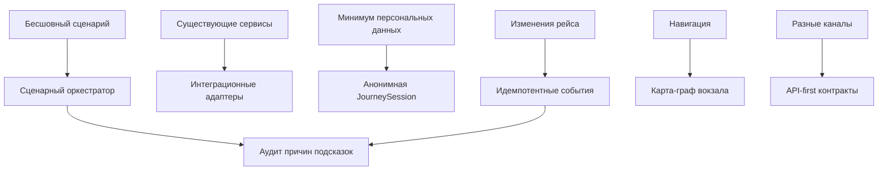

# 04. Архитектурные драйверы

## Драйверы

| Драйвер | Почему важен | Влияние на архитектуру | Как проверять |
|---|---|---|---|
| Бесшовный пассажирский сценарий | Главный эффект проекта - единый путь вместо набора сервисов | Нужен сценарный оркестратор и состояние `JourneySession` | E2E-сценарии |
| Интеграция с существующими системами | Вокзал уже имеет билетные, расписательные и информационные сервисы | Нужны адаптеры и событийная интеграция | Contract tests |
| Минимизация персональных данных | Пассажирские данные чувствительны и усложняют защиту | Хранить только анонимную сессию и внешние ссылки | Проверка схемы и логов |
| Изменения рейса в реальном времени | Смена платформы или задержка резко меняет сценарий | Нужны внешние события, идемпотентность, пересчет маршрута | Failure и E2E tests |
| Подключение разных каналов | Пассажир может использовать приложение, сайт, киоск или табло | Платформа должна быть API-first | Контракт API |
| Навигация по вокзалу | Улучшение опыта зависит от понятного маршрута | Нужна карта-граф и отдельный сервис навигации | Unit tests маршрутов |
| Объяснимость подсказок | Сотрудник и IT-специалист должны понимать, почему пассажир получил рекомендацию | Нужны аудит и причина создания `Hint` | Проверка audit trail |
| Отказ внешних систем | Внешние сервисы могут быть недоступны в критичный момент | Нужны fallback на последнее состояние и статусы деградации | Failure tests |

## Главные компромиссы

| Решение | Выигрыш | Цена |
|---|---|---|
| Платформа как оркестратор | Быстрое подключение к существующей экосистеме | Зависимость от качества внешних API и событий |
| Без полного профиля пассажира | Меньше рисков безопасности и проще MVP | Ограниченная персонализация |
| API-first без собственного UI | Можно подключать разные каналы | Нужно заранее стабилизировать контракты API |
| Статическая карта-граф | Реализуемая навигация для MVP | Нет точного indoor-положения пассажира |
| Событийная обработка изменений рейса | Быстрая реакция на смену платформы | Нужно проектировать идемпотентность и повторы |

## Решения, требующие ADR

- Использовать платформу как оркестратор, а не как единую систему всех сервисов вокзала.
- Не хранить полный профиль пассажира в MVP.
- Использовать карту-граф как основу навигации.
- Делать платформу API-first для внешних каналов.
- Обрабатывать внешние события идемпотентно через `external_event_id`.

## Карта влияния

