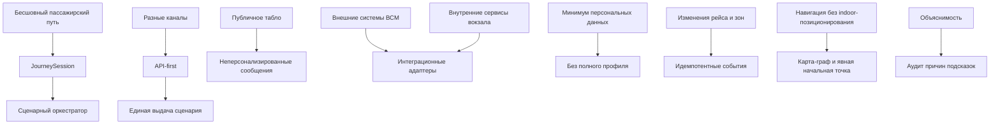

# 04. Архитектурные драйверы

## Пояснения

Бесшовный пассажирский путь - это связанный сценарий от входа на вокзал или обращения к цифровому каналу до посадки на поезд или выхода из сценария. Пассажир не собирает данные вручную из расписания, билета, навигации и табло, а получает согласованные маршрут, статус рейса, подсказки и действия при отклонениях.

| Термин | Пояснение |
|---|---|
| Сквозной сценарий (E2E test) | Проверка полного пути от запроса или события до результата в канале |
| Контрактная проверка (Contract test) | Проверка формата API, события или сообщения между платформой и внешней системой |
| Модульная проверка (Unit test) | Проверка отдельного правила или алгоритма |
| Проверка отказа (Failure test) | Проверка поведения при недоступности сервиса, повторе события или ошибке |
| Проверка API (API test) | Проверка запроса к API и ответа платформы |
| Проверка аудита (Audit trail check) | Проверка, что причины решений и изменения сценария сохранены в истории |
| Архитектурное ревью (Architecture review) | Проверка согласованности требований, границ и архитектурных решений |

## Драйверы

| Драйвер | Почему важен | Влияние на архитектуру | Как проверять |
|---|---|---|---|
| Бесшовный пассажирский путь | Главный эффект проекта - единый путь вместо набора разрозненных сервисов | Нужны `JourneySession`, сценарный оркестратор и единое состояние сценария | Сквозной сценарий (E2E test) |
| Интеграция с внешними системами ВСМ и внутренними сервисами вокзала | Платформа должна связывать билет, расписание, карту-граф, ограничения зон, публичные сообщения и роботов-стюартов | Нужны интеграционные адаптеры, контракты событий и обработка изменений | Контрактная проверка (Contract test) и интеграционная проверка из раздела требований |
| Минимизация персональных данных | Пассажирские данные априори не будут доступны сразу же и в полном объеме, необходимо обеспечивать необходимый минимум без пассажирских данных или с их минимальным количеством | Хранить только `JourneySession`, технические ссылки, хэши и контекст сценария без полного профиля | Проверка схемы данных, логов и аудита |
| Изменения рейса и зон в реальном времени | Смена платформы, задержка или закрытие прохода сразу меняют маршрут и подсказки | Нужны идемпотентные события, пересчет маршрута и деградация до последнего известного состояния | Проверка отказа (Failure test) и сквозной сценарий (E2E test) |
| Несколько каналов одновременно | Пассажир может использовать приложение, сайт, киоск или робота-стюарта, а сотрудник и IT-специалист - служебные каналы | Платформа должна быть API-first и отдавать единое состояние сценария разным каналам отображения | Проверка API (API test) и сквозной сценарий (E2E test) с несколькими каналами |
| Публичное табло без персонализации | Табло видно многим пассажирам и не может показывать данные конкретной сессии | Нужен отдельный поток общих неперсонализированных сообщений без `JourneySession` | Проверка API (API test) и проверка схемы данных |
| Навигация без indoor-позиционирования | В MVP нельзя автоматически определить точное положение пассажира | Нужны карта-граф вокзала и явная начальная точка от канала: выбор пассажира, киоск или робот-стюарт | Модульная проверка (Unit test) маршрутов |
| Объяснимость подсказок и отклонений | Сотрудник должен понять, почему пассажир получил подсказку или почему маршрут недоступен | Нужны причина создания подсказки, аудит изменений и служебный контекст | Проверка аудита (Audit trail check) |
| Отказ зависимостей | Билетная система, расписание, карта-граф, ограничения зон или сервис роботов могут быть недоступны | Нужны запасные режимы, последнее известное состояние и явные статусы деградации | Проверка отказа (Failure test) |

## Главные компромиссы

| Решение | Выигрыш | Цена |
|---|---|---|
| Платформа как оркестратор | Быстрое подключение к существующей экосистеме вокзала и ВСМ | Зависимость от качества внешних и внутренних контрактов |
| Без полного профиля пассажира | Меньше рисков безопасности и проще MVP | Персонализация ограничена текущим контекстом сценария |
| API-first: сначала API, затем каналы отображения | Приложение, сайт, киоск, робот-стюарт, служебный и IT-канал используют одну платформу | Нужно заранее стабилизировать контракты API и правила доступа |
| Единые данные для разных каналов | Выше согласованность сценария между каналами | Сложнее права доступа и разные форматы отображения |
| Внутренние сервисы вокзала остаются внешними к платформе | У платформы меньше ответственности за карту, табло, ограничения зон и роботов | Платформа сильнее зависит от доступности и качества этих сервисов |
| Карта-граф без indoor-позиционирования | Навигация реализуема в MVP без Wi-Fi/Bluetooth-маяков | Начальная точка маршрута должна явно передаваться каналом |
| Событийная обработка изменений рейса и зон | Быстрая реакция на смену платформы, задержки и закрытие проходов | Нужно проектировать идемпотентность, повторы и порядок событий |
| Публичное табло как неперсонализированный канал | Нет риска показать чужую персональную подсказку | Табло не может заменить индивидуальный канал пассажира |

## Решения, требующие ADR

ADR (Architecture Decision Record) - это короткая запись архитектурного решения: контекст, выбранный вариант, рассмотренные альтернативы или компромиссы и последствия. ADR нужен, чтобы на защите было понятно, почему выбрано именно это решение, какие ограничения приняты и когда решение нужно пересматривать.

- Использовать платформу как оркестратор, а не как единую систему всех сервисов вокзала.
- Не хранить полный профиль пассажира в MVP.
- Использовать карту-граф как основу навигации без indoor-позиционирования.
- Делать платформу API-first: сначала API, затем каналы отображения.
- Обрабатывать внешние события идемпотентно через `external_event_id`.
- Считать публичное табло неперсонализированным каналом.
- Считать внутренние сервисы вокзала зависимостями платформы, а не ее внутренними модулями.
- Использовать фоновый обработчик доставки подсказок как внутренний процесс платформы.

## Карта влияния

