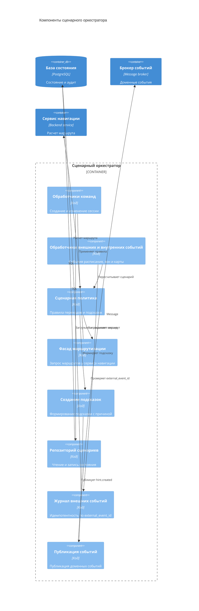

# 05. Архитектура

## Архитектурный стиль

MVP строится как модульная сервисная система с API-first границей и событийной интеграцией с внешними системами ВСМ и внутренними сервисами конкретного вокзала. Платформа хранит собственное состояние пассажирского сценария, но не становится источником данных для билетов, расписания, карты вокзала, физических устройств или пользовательских интерфейсов.

Ключевой принцип: системы-владельцы данных передают платформе необходимые факты, а платформа превращает их в состояние `JourneySession`, маршрут, подсказки, выдачу общих сообщений и объяснимые действия при отклонениях.

## Контейнеры

| Контейнер | Ответственность |
|---|---|
| API платформы | Принимает запросы индивидуальных, публичных, служебных и IT-каналов; проверяет права доступа к сессии; возвращает сценарий, маршрут, подсказки и публичные сообщения |
| Сценарный оркестратор | Ведет состояние `JourneySession`, применяет сценарные правила, создает подсказку с причиной и инициирует пересчет маршрута при изменениях |
| Сервис навигации | Хранит рабочее представление карты-графа, учитывает ограничения зон и рассчитывает маршрут от явно переданной начальной точки до целевой точки сценария |
| Интеграционные адаптеры | Изолируют платформу от форматов билетной системы, сервиса расписания, внутренних сервисов вокзала, сервиса роботов-стюартов и публичных сообщений |
| Брокер событий | Передает события расписания, ограничений зон, обновления карты, созданных подсказок и истечения сессий между процессами платформы |
| База состояния | Хранит данные платформы: `JourneySession`, `TicketReference`, `TripContext`, `StationNode`, `RouteSegment`, `ScenarioStep`, подсказки, `NotificationDelivery`, `ExternalEvent`, аудит и отметки свежести данных |
| Сервис уведомлений | Получает события о созданных подсказках, передает их в доступные индивидуальные или служебные каналы и фиксирует статус доставки или ошибку |
| Планировщик очистки | Завершает истекшие сессии, публикует событие истечения и запускает очистку временных данных по политике хранения |

Сервис уведомлений - это внутренний процесс платформы, а не самостоятельный пользовательский интерфейс. Он работает с уже созданной подсказкой, выбирает доступный канал доставки и сохраняет результат доставки, чтобы сценарий оставался проверяемым.

Планировщик очистки также является внутренним процессом платформы. Он нужен для завершения неактивных `JourneySession`, освобождения временных данных и соблюдения принципа минимального хранения пассажирского контекста.

## Container Diagram

```mermaid
C4Container
    title Контейнерная диаграмма MVP

    Person(passenger, "Пассажир", "Получает маршрут, статус рейса и подсказки")
    Person(staff, "Сотрудник вокзала", "Помогает пассажиру при отклонениях")
    Person(it, "IT-специалист", "Настраивает карту, интеграции и правила")

    System_Ext(individualChannels, "Индивидуальные пользовательские каналы", "Мобильное приложение, сайт, киоск, робот-стюарт")
    System_Ext(publicChannels, "Публичные каналы", "Электронное табло и публичные сообщения")
    System_Ext(serviceChannels, "Служебные каналы", "Интерфейс сотрудника вокзала")
    System_Ext(itChannels, "IT-каналы", "Административный доступ и диагностика")
    System_Ext(vsmSystems, "Внешние системы ВСМ", "Билетная система и сервис расписания")
    System_Ext(stationServices, "Внутренние сервисы вокзала", "Карта-граф, ограничения зон, публичные сообщения, сервис роботов")
    System_Ext(observation, "Система наблюдения за инфраструктурой", "Логи, метрики, трассировка")

    System_Boundary(platform, "Платформа умного вокзала") {
        Container(api, "API платформы", "HTTP API", "Команды и запросы каналов")
        Container(orchestrator, "Сценарный оркестратор", "Backend service", "Состояние сессии и сценарные правила")
        Container(navigation, "Сервис навигации", "Backend service", "Маршруты по карте-графу")
        Container(adapters, "Интеграционные адаптеры", "Backend module", "Вызовы внешних API и прием событий")
        Container(notification, "Сервис уведомлений", "Background service", "Доставка подсказок и статусы доставки")
        Container(cleanup, "Планировщик очистки", "Scheduled job", "Истечение сессий и очистка временных данных")
        Container(queue, "Брокер событий", "Message broker", "Асинхронные события платформы")
        ContainerDb(db, "База состояния", "PostgreSQL", "Сессии, контекст рейса, маршруты, подсказки, аудит")
    }

    Rel(passenger, individualChannels, "Выбирает канал")
    Rel(individualChannels, api, "Сессия и сценарий")
    Rel(api, publicChannels, "Общие сообщения")
    Rel(staff, serviceChannels, "Помощь пассажиру")
    Rel(serviceChannels, api, "Состояние и причины")
    Rel(it, itChannels, "Администрирование")
    Rel(itChannels, api, "Настройки и диагностика")
    Rel(api, orchestrator, "Команды сценария")
    Rel(orchestrator, navigation, "Расчет маршрута")
    Rel(orchestrator, db, "Состояние")
    Rel(navigation, db, "Карта и маршруты")
    Rel(orchestrator, queue, "События")
    Rel(notification, queue, "Подсказки")
    Rel(cleanup, queue, "Истечение сессий")
    Rel(notification, individualChannels, "Доставка подсказок")
    Rel(notification, serviceChannels, "Служебные статусы")
    Rel(adapters, vsmSystems, "Билет и рейс")
    Rel(adapters, stationServices, "Карта и ограничения")
    Rel(orchestrator, adapters, "Запросы и события")
    Rel(api, observation, "Сигналы")
    Rel(orchestrator, observation, "Сигналы")
    Rel(notification, observation, "Сигналы")
    Rel(cleanup, observation, "Сигналы")

    UpdateLayoutConfig($c4ShapeInRow="3", $c4BoundaryInRow="1")
```

## Основные связи

| Откуда | Куда | Зачем |
|---|---|---|
| Индивидуальный пользовательский канал | API платформы | Создать или прочитать `JourneySession`, передать ссылку на билет и явную начальную точку маршрута |
| API платформы | Публичный канал | Выдать только общие неперсонализированные сообщения для табло или зоны вокзала |
| Служебный канал сотрудника | API платформы | Получить состояние сценария, причину подсказки или отклонения, чтобы помочь пассажиру |
| IT-канал | API платформы | Загрузить карту-граф, проверить интеграции, посмотреть диагностику и настройки правил |
| API платформы | Сценарный оркестратор | Выполнить команду сценария и получить согласованное состояние |
| Сценарный оркестратор | Сервис навигации | Рассчитать или пересчитать маршрут по карте-графу и ограничениям зон |
| Сценарный оркестратор | База состояния | Сохранить состояние сценария, маршрут, подсказки, аудит и отметку свежести данных |
| Сценарный оркестратор | Брокер событий | Опубликовать созданную подсказку, изменение сценария или истечение сессии |
| Сервис уведомлений | Индивидуальные и служебные каналы | Доставить подсказку или служебный статус и зафиксировать результат доставки |
| Интеграционные адаптеры | Внешние системы ВСМ | Получить данные билета, рейса, платформы и статуса отправления |
| Интеграционные адаптеры | Внутренние сервисы вокзала | Получить карту-граф, точки интереса, ограничения зон, публичные сообщения и данные сервиса роботов |

## Component Diagram сценарного оркестратора

## Ключевые политики

| Политика | Где реализуется | Почему здесь | Как проверить |
|---|---|---|---|
| Проверка доступа к сессии | API платформы | Все запросы каналов проходят через эту границу | Интеграционная проверка (Integration test): канал не может получить чужую сессию |
| Сценарные переходы | Сценарный оркестратор | Только он владеет состоянием `JourneySession` внутри платформы | Модульная проверка (Unit test): отдельное правило переводит сценарий в ожидаемое состояние |
| Идемпотентность внешних событий | Журнал внешних событий в оркестраторе | Повторы событий от расписания или внутренних сервисов должны отсекаться до изменения состояния | Проверка отказа (Failure test): повтор одного `external_event_id` не создает повторную подсказку или маршрут |
| Расчет маршрута | Сервис навигации | Маршрут зависит от карты-графа, явной начальной точки и правил доступности зон | Модульная проверка (Unit test): алгоритм строит маршрут и учитывает закрытые зоны |
| Доставка подсказок | Сервис уведомлений | Доставка асинхронна, может повторяться и должна фиксироваться отдельно от создания подсказки | Интеграционная проверка (Integration test): сервис сохраняет статус доставки или ошибку канала |
| Истечение сессии | Планировщик очистки и оркестратор | Нужна централизованная политика срока жизни и очистки временных данных | Интеграционная проверка (Integration test): истекшая сессия завершается и больше не выдает активные подсказки |

## Источники данных и владельцы данных

Платформа является владельцем только тех данных, которые возникают внутри ее сценарного слоя: состояния `JourneySession`, шагов сценария, снимков маршрута, подсказок, статусов доставки, журнала примененных событий и аудита причин решений.

Данные, которые приходят из других систем, остаются в зоне ответственности соответствующих систем-владельцев:

- билетная система - для билета, ссылки на билет и признака действительности;
- сервис расписания - для рейса, платформы, времени отправления и статуса рейса;
- внутренние сервисы вокзала - для карты-графа, точек интереса, ограничений зон, ремонтных работ, публичных сообщений и состояния сервиса роботов;
- пользовательские, публичные, служебные и IT-каналы - для способа отображения информации и факта взаимодействия с конкретным интерфейсом.

Платформа хранит рабочий снимок нужного контекста и отметку свежести данных, чтобы продолжать отвечать каналам при временной недоступности зависимостей и явно показывать, когда данные могли устареть.
