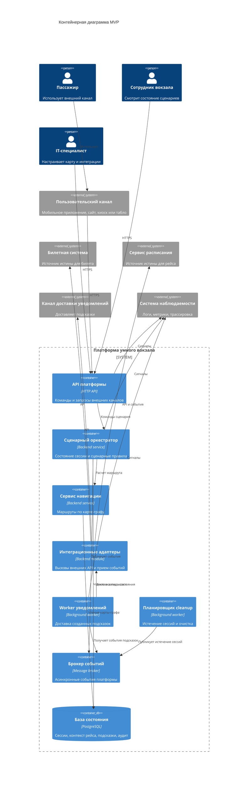
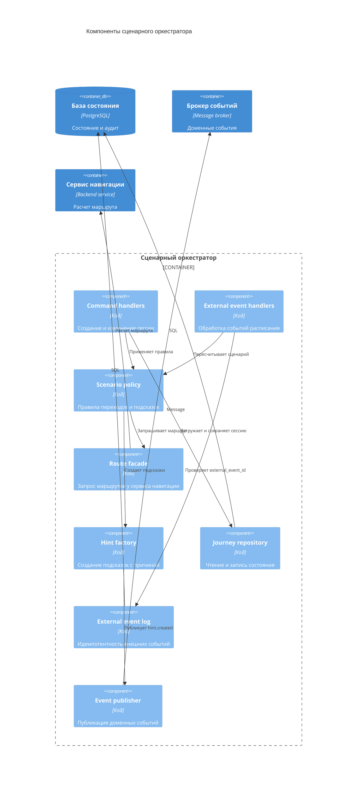

# 05. Архитектура

## Архитектурный стиль

MVP строится как модульная сервисная система с API-first границей и событийной интеграцией с внешними системами. Платформа хранит собственное состояние пассажирского сценария, но не становится источником истины для билетов, расписания или каналов доставки.

Ключевой принцип: внешние сервисы дают факты, а платформа превращает их в состояние `JourneySession`, маршруты и подсказки.

## Контейнеры

| Контейнер | Ответственность |
|---|---|
| API платформы | Принимает запросы внешних каналов, проверяет права доступа к сессии, возвращает сценарий, маршрут и подсказки |
| Сценарный оркестратор | Ведет состояние `JourneySession`, применяет сценарные правила, создает `Hint` |
| Сервис навигации | Хранит карту-граф в рабочем представлении и рассчитывает маршрут |
| Интеграционные адаптеры | Изолируют платформу от форматов билетной системы, расписания и канала доставки |
| Брокер событий | Передает события расписания, подсказок и истечения сессий между процессами |
| База состояния | Источник истины для сессий, контекста рейса, подсказок, внешних событий и аудита |
| Worker уведомлений | Обрабатывает созданные подсказки и вызывает внешний канал доставки |
| Планировщик cleanup | Завершает истекшие сессии и запускает очистку временных данных |

## Container Diagram

## Основные связи

| Откуда | Куда | Зачем |
|---|---|---|
| Пользовательский канал | API платформы | Создать или прочитать сессию |
| API платформы | Сценарный оркестратор | Выполнить команду сценария |
| Сценарный оркестратор | Сервис навигации | Рассчитать или пересчитать маршрут |
| Сценарный оркестратор | База состояния | Сохранить источник истины сценария |
| Сценарный оркестратор | Брокер событий | Опубликовать созданную подсказку |
| Worker уведомлений | Канал доставки уведомлений | Доставить подсказку во внешний канал |
| Интеграционные адаптеры | Билетная система и расписание | Получить внешние факты без протекания форматов внутрь домена |

## Component Diagram сценарного оркестратора

## Ключевые политики

| Политика | Где реализуется | Почему здесь | Как проверить |
|---|---|---|---|
| Проверка доступа к сессии | API платформы | Все внешние запросы проходят через эту границу | Integration test |
| Сценарные переходы | Сценарный оркестратор | Только он владеет состоянием `JourneySession` | Unit tests политики |
| Идемпотентность внешних событий | `External event log` в оркестраторе | Повторы приходят до изменения доменного состояния | Failure test |
| Расчет маршрута | Сервис навигации | Маршрут зависит от карты-графа и правил доступности | Unit tests графа |
| Доставка подсказок | Worker уведомлений | Доставка может быть асинхронной и повторяемой | Integration test |
| Истечение сессии | Планировщик cleanup и оркестратор | Нужна централизованная политика retention | Integration test |

## Источник истины

Источник истины платформы - база состояния. Внешние системы остаются источниками истины для своих данных:

- билетная система - для билета и его действительности;
- сервис расписания - для рейса, платформы и статуса отправления;
- канал доставки - для факта показа уведомления в конкретном интерфейсе.

Платформа хранит снимок нужного контекста и отметку свежести данных, чтобы продолжать отвечать каналам при временной недоступности внешних зависимостей.

