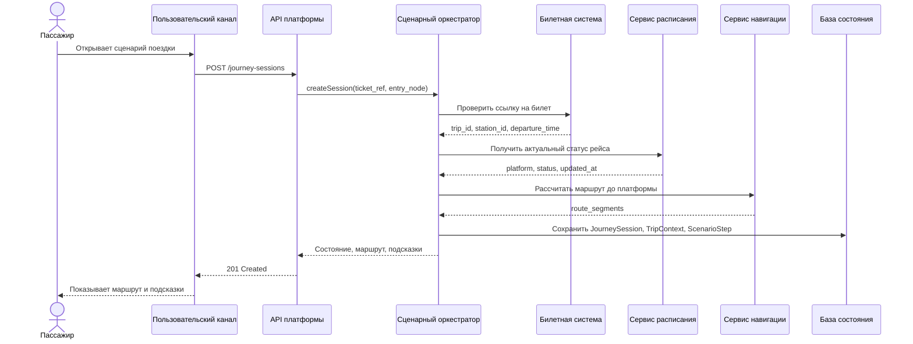
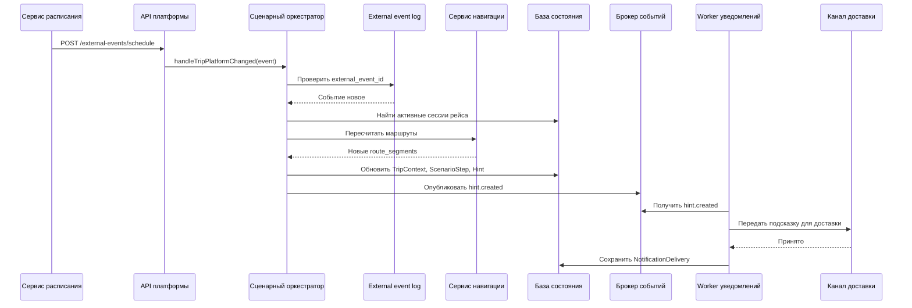
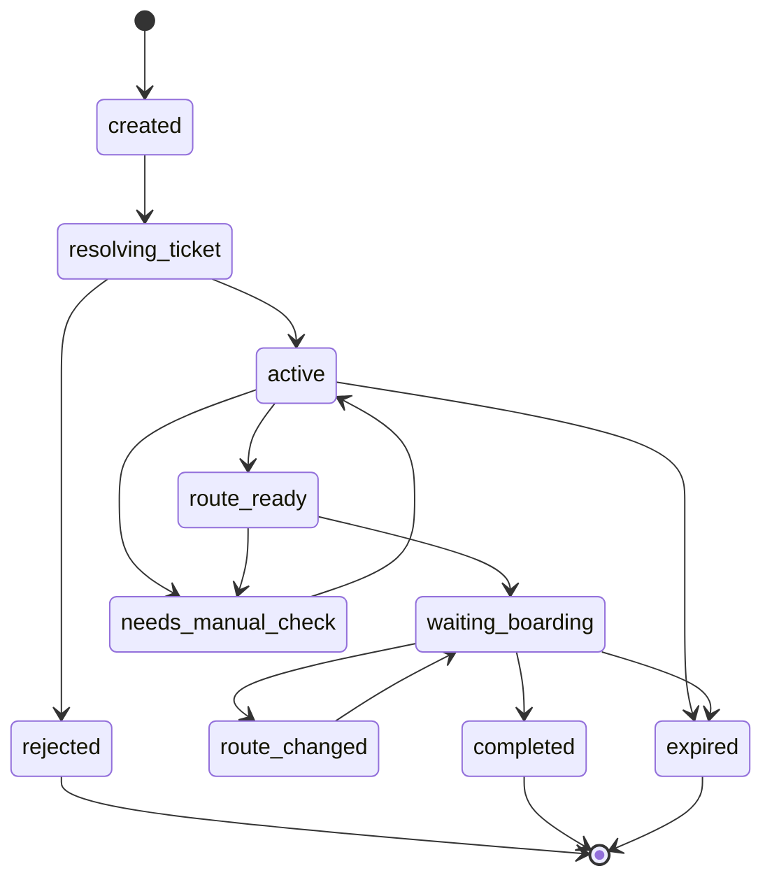
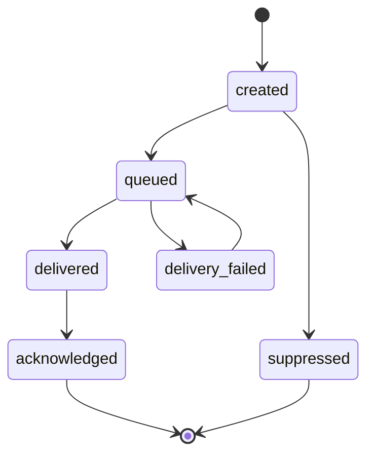

# 06. Сценарии и потоки

## Сценарий 1: создание сессии и получение маршрута

### Ошибки

- Билет не найден: сессия не создается, канал получает код `ticket_not_found`.
- Рейс не найден в расписании: сессия создается в состоянии `needs_manual_check`, канал показывает ручной сценарий.
- Маршрут невозможен: сессия создается, но `ScenarioStep` получает статус `route_unavailable`.

## Сценарий 2: смена платформы

### Ошибки

- Событие пришло повторно: `ExternalEvent` помечается как duplicate, доменное состояние не меняется.
- Сервис навигации не может построить маршрут: создается подсказка с просьбой обратиться к сотруднику.
- Канал доставки недоступен: `NotificationDelivery` фиксируется как failed, подсказка остается доступна через `GET /hints`.

## Жизненный цикл JourneySession

## Жизненный цикл подсказки

## Асинхронные шаги

| Шаг | Почему асинхронный | Повторяемость |
|---|---|---|
| Обработка события расписания | События могут приходить независимо от запросов пассажира | Идемпотентно по `external_event_id` |
| Доставка подсказки | Канал доставки может быть недоступен | Повтор по `hint_id` и `delivery_attempt` |
| Истечение сессии | Выполняется по времени, а не по действию пассажира | Идемпотентно по `journey_session_id` |
| Обновление карты-графа | Новая версия карты применяется отдельно от активных запросов | Версионируется по `map_version` |

## Где меняется состояние

| Состояние | Кто меняет | Условие |
|---|---|---|
| `JourneySession.status` | Сценарный оркестратор | Команда канала, событие расписания, cleanup |
| `TripContext` | Сценарный оркестратор | Ответ расписания или событие изменения рейса |
| `ScenarioStep` | Сценарный оркестратор | Изменение рейса, маршрута или времени до отправления |
| `RouteSegment` | Сервис навигации через оркестратор | Новый маршрут или смена карты |
| `Hint.status` | Оркестратор и worker уведомлений | Создание, доставка, подтверждение |
| `ExternalEvent.status` | Обработчик внешних событий | Новое, обработанное, повторное, ошибочное |

## Правила идемпотентности

- `POST /journey-sessions` принимает `idempotency_key` от канала, если канал может повторить запрос.
- Каждое внешнее событие обязано иметь `external_event_id`, `source_system` и `event_type`.
- Повтор события с тем же `external_event_id` не вызывает повторный пересчет сценария.
- Доставка одной подсказки в один канал различается по `hint_id`, `channel_session_id` и номеру попытки.
- Завершение истекшей сессии можно повторять без изменения результата.

