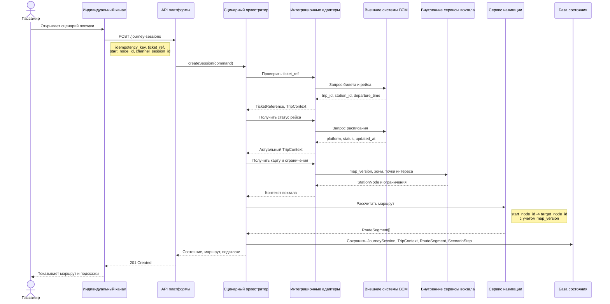
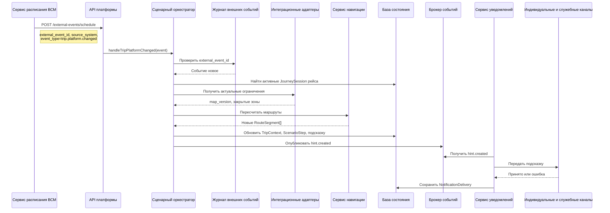
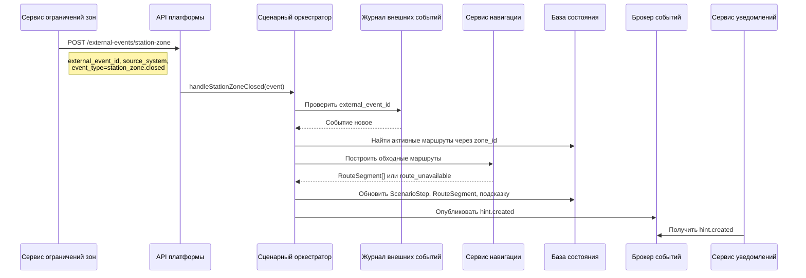
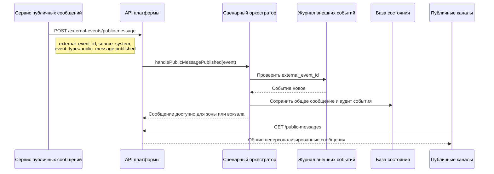
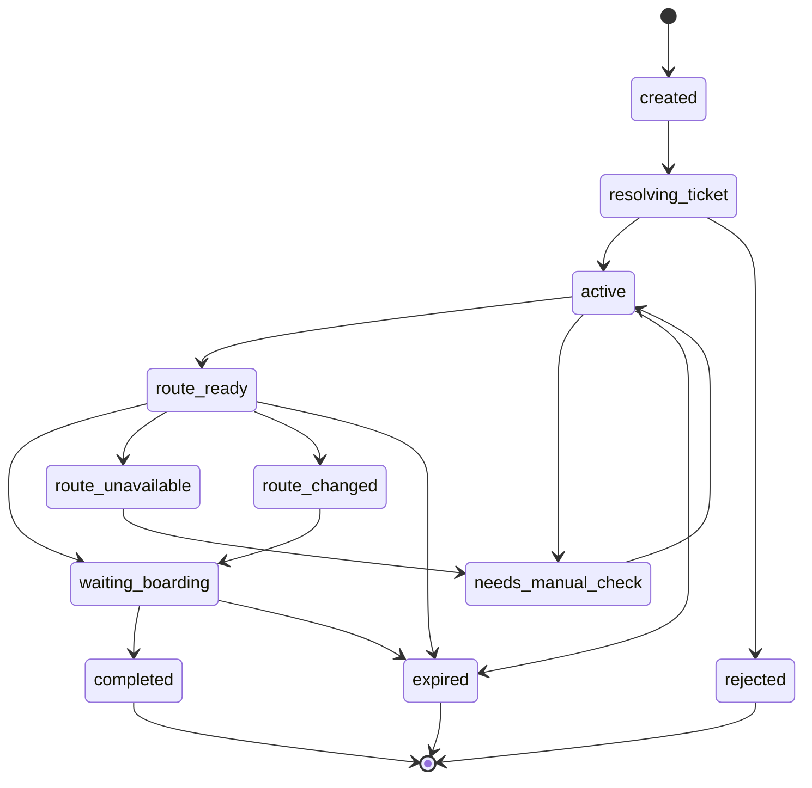
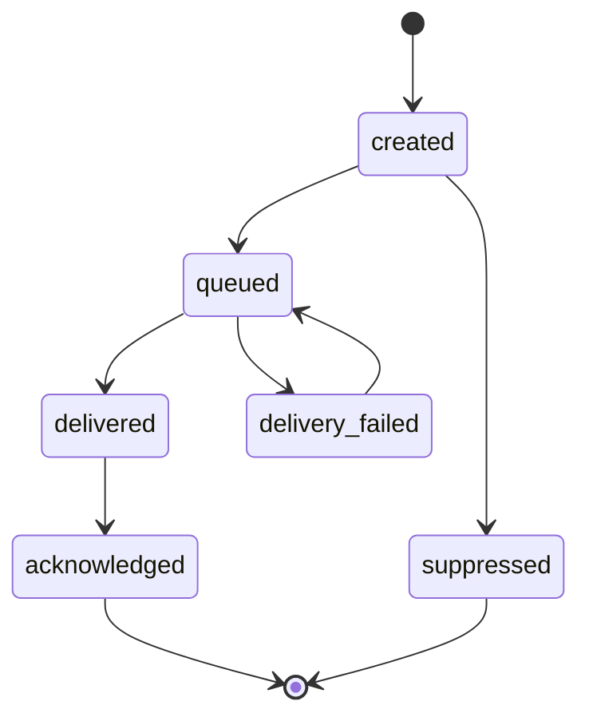

# 06. Сценарии и потоки

Раздел описывает потоки MVP на уровне сценариев, событий и ключевых идентификаторов. Платформа не определяет положение пассажира автоматически: начальная точка маршрута всегда приходит от канала как `start_node_id`.

## Сценарий 1: создание сессии и получение маршрута

`start_node_id` передается каналом явно. В мобильном приложении или на сайте пассажир выбирает вход, зону или точку на карте; киоск передает собственную фиксированную точку; робот-стюарт передает точку текущего взаимодействия, которую ему сообщает сервис роботов.

### Ошибки

- Билет не найден: сессия не создается, канал получает код `ticket_not_found`.
- Рейс не найден в расписании: сессия создается в состоянии `needs_manual_check`, канал показывает ручной сценарий.
- Начальная точка неизвестна: сессия не получает маршрут, а канал просит выбрать другую точку или обратиться к сотруднику.
- Маршрут невозможен: сессия создается, но `ScenarioStep` получает статус `route_unavailable`.

## Сценарий 2: смена платформы

### Ошибки

- Событие пришло повторно: `ExternalEvent` помечается как `duplicate`, состояние сценария не меняется.
- Сервис навигации не может построить маршрут: создается подсказка с просьбой обратиться к сотруднику вокзала.
- Сервис уведомлений не доставил подсказку: `NotificationDelivery` фиксируется как `failed`, а подсказка остается доступна через `GET /journey-sessions/{id}/hints`.

## Сценарий 3: закрытие зоны вокзала

Если обходной маршрут есть, пассажир получает подсказку о новом пути. Если маршрута нет, платформа создает подсказку обратиться к сотруднику и сохраняет причину отклонения для служебного канала.

## Сценарий 4: публикация общего сообщения

Публичное табло не получает `JourneySession`, `ticket_ref`, `channel_session_id` или персональные подсказки. Оно показывает только общие неперсонализированные сообщения для вокзала, зоны или рейса.

## Жизненный цикл JourneySession

`JourneySession` объединяет текущий пассажирский сценарий: ссылку или хэш билета, контекст рейса, начальную и целевую точки, маршрут, шаги сценария, подсказки, статусы доставки и аудит событий без полного профиля пассажира.

## Жизненный цикл подсказки

Подсказка создается оркестратором как короткое контекстное сообщение или действие: идти к платформе, учесть смену платформы, обойти закрытую зону или обратиться к сотруднику. Доставка подсказки является отдельным процессом и фиксируется через `NotificationDelivery`.

## Асинхронные шаги

| Шаг | Почему асинхронный | Повторяемость |
|---|---|---|
| Обработка события расписания | События могут приходить независимо от запросов пассажира | Идемпотентно по `external_event_id` |
| Обработка закрытия или открытия зоны | Ограничения вокзала меняются независимо от активной сессии | Идемпотентно по `external_event_id` и `zone_id` |
| Обновление карты-графа | Новая версия карты применяется отдельно от активных запросов | Версионируется по `map_version` |
| Публикация общего сообщения | Сообщение может относиться к вокзалу, зоне или рейсу без персональной сессии | Идемпотентно по `external_event_id` |
| Доставка подсказки | Канал может быть недоступен или подтверждать доставку позже | Повтор по `hint_id`, `channel_session_id` и `delivery_attempt` |
| Истечение сессии | Выполняется по времени, а не по действию пассажира | Идемпотентно по `journey_session_id` |

## Где меняется состояние

| Состояние | Кто меняет | Условие |
|---|---|---|
| `JourneySession.status` | Сценарный оркестратор | Команда канала, событие расписания, событие зоны, планировщик очистки |
| `TripContext` | Сценарный оркестратор | Ответ расписания или событие изменения рейса |
| `ScenarioStep` | Сценарный оркестратор | Изменение рейса, маршрута, зоны или времени до отправления |
| `RouteSegment` | Сервис навигации через оркестратор | Новый маршрут, смена платформы, закрытие зоны или смена версии карты |
| Статус подсказки | Оркестратор и сервис уведомлений | Создание, постановка в доставку, доставка, ошибка, подтверждение |
| `NotificationDelivery.status` | Сервис уведомлений | Передача подсказки в канал, ошибка канала или подтверждение получения |
| `ExternalEvent.status` | Обработчик внешних и внутренних событий | Новое, обработанное, повторное или ошибочное событие |
| Публичное сообщение | Сценарный оркестратор через API | Событие `public_message.published` без привязки к персональной сессии |

## События, ключи и идентификаторы

| Элемент | Что означает | Где используется |
|---|---|---|
| `journey_session_id` | Внутренний идентификатор активного пассажирского сценария | В API сессии, логах, аудите, доставке подсказок |
| `idempotency_key` | Ключ повторяемого запроса канала | В `POST /journey-sessions`, чтобы повтор запроса не создал вторую сессию |
| `ticket_ref` | Внешняя ссылка на билет или безопасный хэш билета | Для привязки сессии к рейсу без хранения полного профиля пассажира |
| `trip_id` | Идентификатор рейса во внешней системе ВСМ | Для поиска активных сессий рейса и применения событий расписания |
| `start_node_id` | Явно переданная начальная точка маршрута | Для маршрута от выбранного входа, киоска или робота-стюарта |
| `target_node_id` | Целевая точка маршрута | Обычно платформа рейса или зона посадки из `TripContext` |
| `map_version` | Версия карты-графа вокзала | Для воспроизводимого расчета маршрута и обработки обновлений карты |
| `zone_id` | Идентификатор зоны или прохода вокзала | В событиях закрытия/открытия зоны и правилах доступности маршрута |
| `hint_id` | Идентификатор подсказки | Для получения, доставки и подтверждения подсказки |
| `notification_delivery_id` | Идентификатор попытки или результата доставки | Для аудита доставки подсказки в канал |
| `channel_session_id` | Идентификатор взаимодействия конкретного канала с платформой | Для доставки подсказки без хранения полного профиля пассажира |
| `delivery_attempt` | Номер попытки доставки подсказки | Для повторов при временной ошибке канала |
| `external_event_id` | Уникальный идентификатор события от внешней или внутренней системы | Для идемпотентной обработки события |
| `source_system` | Система-отправитель события | Для аудита и диагностики интеграций |
| `event_type` | Тип события | Для выбора сценарной обработки |

| Событие | Источник | Что меняет |
|---|---|---|
| `trip.status.changed` | Сервис расписания ВСМ | Обновляет статус рейса в `TripContext` и может создать подсказку |
| `trip.platform.changed` | Сервис расписания ВСМ | Меняет целевую точку маршрута и пересчитывает маршрут |
| `station_map.version.published` | Сервис карты-графа вокзала | Обновляет доступную версию карты для новых расчетов |
| `station_zone.closed` | Сервис ограничений зон | Исключает зону из маршрутизации и запускает пересчет активных маршрутов |
| `station_zone.opened` | Сервис ограничений зон | Возвращает зону в доступные маршруты для новых расчетов |
| `public_message.published` | Сервис публичных сообщений | Делает общее неперсонализированное сообщение доступным публичным каналам |
| `hint.created` | Сценарный оркестратор | Передает созданную подсказку сервису уведомлений |
| `journey_session.expired` | Планировщик очистки | Завершает сессию и блокирует новые активные подсказки по ней |

## Правила идемпотентности

Идемпотентность означает, что повтор одной и той же команды или события с тем же ключом приводит к тому же результату и не создает повторную сессию, повторный маршрут, повторную подсказку или повторное изменение состояния.

- `POST /journey-sessions` принимает `idempotency_key` от канала, если канал может повторить запрос из-за таймаута или потери ответа.
- Повтор `POST /journey-sessions` с тем же `idempotency_key` возвращает уже созданную `JourneySession`, а не создает новую.
- Каждое событие от внешней или внутренней системы обязано иметь `external_event_id`, `source_system` и `event_type`.
- Повтор события с тем же `external_event_id` сохраняется как `duplicate` и не вызывает повторный пересчет сценария.
- Доставка одной подсказки в один канал различается по `hint_id`, `channel_session_id` и `delivery_attempt`.
- Повтор доставки не создает новую подсказку, а только обновляет или добавляет запись `NotificationDelivery`.
- Завершение истекшей сессии можно повторять по `journey_session_id` без изменения итогового состояния.
