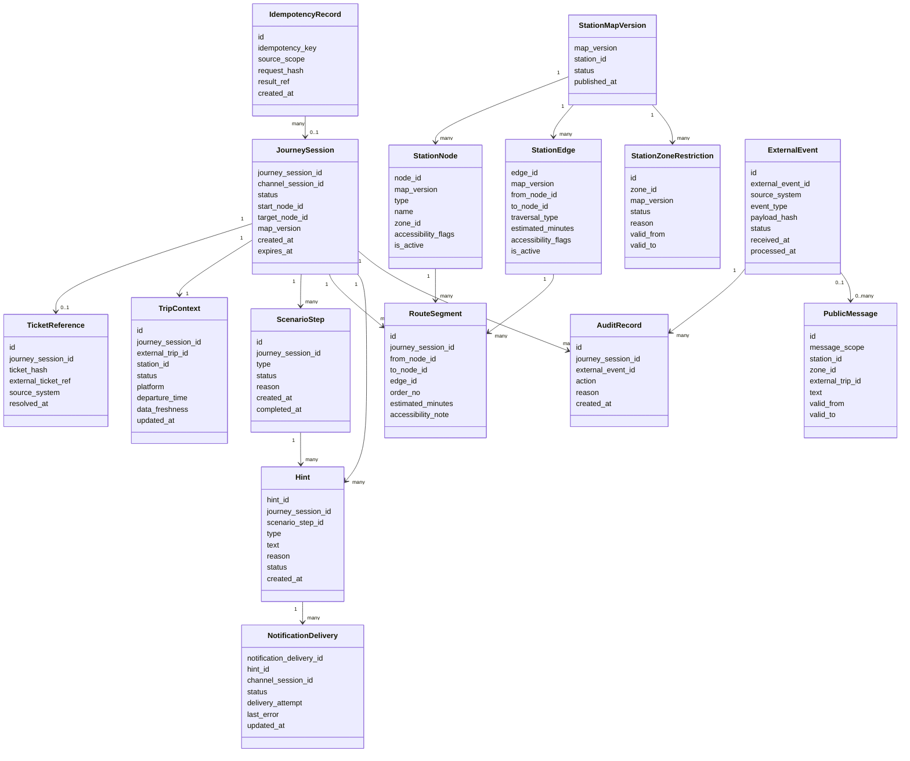

# 07. Данные и хранилища

## Хранилища и владельцы данных

| Хранилище или система | Что хранит или передает | Владелец данных | Комментарий |
|---|---|---|---|
| PostgreSQL | `JourneySession`, ссылки на билет, контекст рейса, маршруты, подсказки, доставки, журнал событий, аудит, версии карты-графа | Платформа для своих данных; внешние системы для исходных фактов | Основное транзакционное хранилище MVP |
| RabbitMQ | Асинхронные события `hint.created`, `journey_session.expired`, события расписания, зон и карты | Платформа и интеграционные адаптеры | Брокер доставки событий, а не долговременное хранилище состояния |
| Система наблюдения за инфраструктурой | Логи, метрики, трассировки, технические ошибки | Эксплуатационная инфраструктура | Используется для диагностики, но не заменяет аудит в PostgreSQL |
| Внешняя билетная система | Билет, действительность билета, связь билета с рейсом | Билетная система ВСМ | Платформа хранит только безопасную ссылку или хэш |
| Внешний сервис расписания | Статус рейса, платформа, время отправления | Сервис расписания ВСМ | Платформа хранит последний известный снимок и свежесть данных |
| Внутренние сервисы вокзала | Карта-граф, зоны, ремонтные работы, публичные сообщения, данные сервиса роботов | Конкретный вокзал или инфраструктурные сервисы | Платформа использует эти данные через адаптеры и хранит рабочие снимки |

## Выбор хранилища карты-графа

Для MVP рекомендуется хранить карту-граф в PostgreSQL без PostGIS: как версионированные узлы, ребра и ограничения зон. Расчет маршрута выполняет сервис навигации, а не SQL-запросы внутри базы:
- навигация идет внутри вокзала и рядом с ним, а не по большой географической территории;
- граф вокзала относительно небольшой и хорошо описывается топологией: узел, ребро, доступность, время прохода, зона;
- начальная точка приходит от канала как `start_node_id`, поэтому в MVP нет задачи вычислять координаты пассажира по геоданным;
- версия карты фиксируется через `map_version`, что позволяет воспроизводить рассчитанный маршрут и безопасно обновлять карту.

| Вариант | Когда подходит | Почему не основной выбор MVP |
|---|---|---|
| PostgreSQL без PostGIS | Версионированный indoor-граф, сценарное состояние, простая эксплуатация | Рекомендуемый вариант для MVP |
| PostgreSQL + PostGIS / pgRouting | Реальные координаты, пространственные запросы, наружная навигация, сложные геометрии | Для топологической навигации внутри вокзала избыточен и усложняет модель |
| Neo4j или другая графовая БД | Сложные графовые запросы, богатая семантика связей, анализ связности | Добавляет отдельную БД и эксплуатационную сложность при небольшом графе |
| Redis или in-memory graph cache | Быстрое чтение активной версии карты и популярных маршрутов | Хорош как кэш, но не как единственное надежное хранилище |
| Файловая карта JSON/YAML | Совсем ранний прототип, ручная загрузка карты | Труднее версионировать, валидировать, аудировать и обновлять без риска |

Оптимальная схема для данной инфраструктуры: PostgreSQL хранит версии карты и ограничения, сервис навигации загружает активную `map_version` в память и строит маршрут алгоритмом графа. При изменении карты или закрытии зоны сервис получает событие и обновляет рабочее представление.

## Масштабирование PostgreSQL

PostgreSQL подходит для MVP и для пиковых периодов вокзала, если не превращать его в вычислитель маршрутов и правильно ограничить транзакции.

Ключевые свойства:

- MVCC позволяет чтениям не блокировать записи в обычных сценариях.
- Конфликтующие записи ограничены конкретной `JourneySession`, `external_event_id` или `idempotency_key`.
- Уникальные индексы защищают от повторной обработки команд и событий.
- Расчет маршрута выполняется сервисом навигации, поэтому рост пассажирского потока нагружает в основном API, оркестратор и кэш графа, а не сложные SQL-запросы.
- Аудит и `ExternalEvent` можно партиционировать по времени, чтобы таблицы не росли бесконтрольно.

Минимальные индексы MVP:

| Индекс | Зачем нужен |
|---|---|
| `JourneySession(journey_session_id)` | Быстрый доступ к активной сессии |
| `JourneySession(channel_session_id)` | Связывание канала с текущей сессией без профиля пассажира |
| `JourneySession(expires_at, status)` | Планировщик очистки быстро находит истекшие сессии |
| `IdempotencyRecord(idempotency_key, source_scope)` | Повтор `POST /journey-sessions` возвращает прежний результат |
| `ExternalEvent(external_event_id, source_system)` | Повтор события не применяет изменение второй раз |
| `TripContext(external_trip_id, station_id)` | Поиск активных сессий при изменении рейса |
| `RouteSegment(journey_session_id, order_no)` | Быстрая выдача маршрута по сессии |
| `NotificationDelivery(hint_id, channel_session_id, delivery_attempt)` | Контроль повторов доставки подсказки |
| `StationNode(map_version, node_id)` | Быстрая загрузка узлов версии карты |
| `StationEdge(map_version, from_node_id, to_node_id)` | Быстрая загрузка ребер графа |

Если нагрузка растет, развитие идет поэтапно: пул соединений, горизонтальное масштабирование API и оркестратора, кэш активной карты в сервисе навигации, read replica для служебных чтений, партиционирование аудита и событий, затем выделение аналитического хранилища.

## Выбор брокера событий

Для MVP рекомендуется RabbitMQ. Он хорошо соответствует характеру системы: события нужны для задач и уведомлений, а не для масштабного потокового анализа.

| Вариант | Сильные стороны | Оценка для MVP |
|---|---|---|
| RabbitMQ | Очереди задач, подтверждения доставки, retry, dead-letter exchange, понятная маршрутизация | Рекомендуемый выбор |
| Kafka или Redpanda | Высокий поток событий, долговременный replay, аналитика событий | Полезно при масштабе сети вокзалов и развитой аналитике, но тяжеловато для MVP |
| NATS JetStream | Низкая задержка, простая модель pub/sub, хорош для инфраструктурных событий | Возможен, но требует аккуратнее проектировать retry и эксплуатационные практики |
| Redis Streams | Быстрый и простой вариант для небольшого потока | Допустим для прототипа, но слабее как центральный надежный брокер |
| Без брокера, только PostgreSQL outbox | Минимум компонентов, высокая согласованность | Подходит для совсем малого прототипа, но усложняет доставку и ретраи подсказок |

RabbitMQ должен использоваться вместе с паттерном transactional outbox: оркестратор сначала фиксирует изменение состояния и событие в PostgreSQL, затем событие публикуется в брокер. Если публикация или обработка повторится, идемпотентность обеспечивается `external_event_id`, `idempotency_key`, `hint_id` и `NotificationDelivery`.

## Основные сущности

| Сущность | Смысл |
|---|---|
| `JourneySession` | Активный пассажирский сценарий без полного профиля пассажира |
| `TicketReference` | Безопасная ссылка или хэш билета, позволяющие получить рейс во внешней системе |
| `TripContext` | Последний известный контекст рейса: статус, платформа, время, свежесть данных |
| `StationMapVersion` | Версия карты-графа вокзала, по которой строятся маршруты |
| `StationNode` | Узел карты: вход, зона, эскалатор, лифт, платформа, точка интереса |
| `StationEdge` | Ребро графа между узлами: проход, лестница, лифт, переход |
| `StationZoneRestriction` | Закрытие или ограничение зоны, ремонтные работы, временная недоступность прохода |
| `RouteSegment` | Сегмент рассчитанного маршрута внутри конкретной `JourneySession` |
| `ScenarioStep` | Шаг сценария: проверка билета, маршрут готов, ожидание посадки, отклонение |
| `Hint` | Подсказка пассажиру с типом, текстом, причиной и статусом |
| `NotificationDelivery` | Факт или попытка доставки подсказки в индивидуальный или служебный канал |
| `ExternalEvent` | Внешнее или внутреннее событие, принятое платформой идемпотентно |
| `PublicMessage` | Общее неперсонализированное сообщение для табло или зоны вокзала |
| `AuditRecord` | Объяснение изменения состояния, подсказки или отклонения |
| `IdempotencyRecord` | Запись о повторяемой команде API и результате ее первичной обработки |

## Данные, которые нельзя потерять

- `JourneySession` и ее финальный статус.
- `ExternalEvent` с `external_event_id`, `source_system` и результатом обработки.
- `IdempotencyRecord` для повторяемых команд API.
- Подсказка (`Hint`) и причина ее создания.
- `NotificationDelivery` для аудита доставки подсказки.
- `AuditRecord` с причиной изменения сценария или отклонения.
- `StationMapVersion`, `StationNode`, `StationEdge` и ограничения зон, по которым был рассчитан маршрут.

## Данные, которые можно пересоздать

- Текущий маршрут, если сохранены `start_node_id`, `target_node_id`, `map_version` и доступная карта-граф.
- Актуальные подсказки, если сохранены сценарные шаги, контекст рейса и правила сценария.
- Публичные сообщения, если они доступны во внутреннем сервисе публичных сообщений.
- Метрики, если есть исходные доменные события, аудит и структурные логи.

## Правила хранения

| Данные | Владелец данных | Срок хранения MVP | Как удалить или восстановить |
|---|---|---|---|
| `JourneySession` | Платформа | 90 дней после завершения | Удаляется политикой retention, агрегаты остаются обезличенными |
| `TicketReference` | Билетная система, платформа хранит ссылку | До удаления сессии | Хранится только хэш или внешняя ссылка |
| `TripContext` | Сервис расписания, платформа хранит снимок | До удаления сессии | Обновляется из расписания при доступности |
| `RouteSegment` | Платформа | До удаления сессии | Пересчитывается по `start_node_id`, `target_node_id` и `map_version` |
| `Hint` | Платформа | 90 дней | Нужен для объяснения сценария и помощи сотрудника |
| `NotificationDelivery` | Платформа | 90 дней | Нужен для проверки доставки подсказки |
| `ExternalEvent` | Платформа как журнал приема событий | 180 дней | Нужен для идемпотентности и расследований |
| `IdempotencyRecord` | Платформа | Не меньше срока возможного повтора запроса | Нужен для защиты от повторного создания сессии |
| `StationMapVersion`, `StationNode`, `StationEdge` | Внутренний сервис карты, платформа хранит рабочую версию | До замены версии и завершения связанных сессий | Новая версия публикуется отдельно, старая остается для воспроизводимости маршрута |
| `StationZoneRestriction` | Сервис ограничений зон | Пока ограничение действует и для аудита события | Обновляется событиями `station_zone.closed` и `station_zone.opened` |
| `PublicMessage` | Сервис публичных сообщений, платформа хранит рабочий снимок | До окончания действия сообщения | Не связан с персональной сессией |
| Структурные логи | Система наблюдения за инфраструктурой | 30 дней | Используются для диагностики |

## Миграции и совместимость

- Каждая версия карты-графа получает `map_version`.
- Активная сессия использует версию карты, с которой был рассчитан маршрут, пока не требуется пересчет из-за события рейса, зоны или карты.
- Формат внешнего события версионируется полем `event_schema_version`.
- Новые сценарные правила должны быть обратно совместимы с уже созданными `ScenarioStep`, либо иметь миграцию состояния.
- Изменение структуры `StationNode` или `StationEdge` не должно ломать воспроизведение маршрутов, уже сохраненных в `RouteSegment`.
- Публичные сообщения и ограничения зон должны иметь срок действия, чтобы не оставаться активными после завершения события.

## Ограничения персональных данных

Платформа не хранит:

- ФИО пассажира;
- паспортные или документные данные;
- полную историю поездок;
- платежные данные;
- полный QR-код билета.

Платформа может хранить:

- `ticket_hash`;
- `external_ticket_ref`, если он не раскрывает персональные данные;
- `channel_session_id`;
- технические идентификаторы сессии и рейса;
- состояние сценария, подсказки, доставки и аудит действий платформы.
