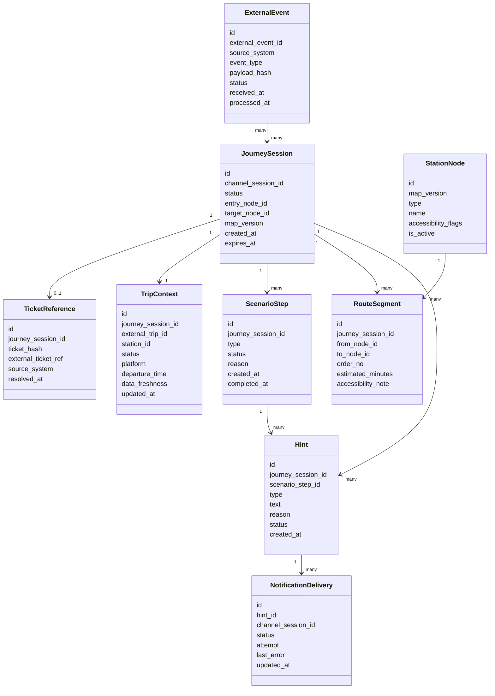

# 07. Данные и хранилища

## Хранилища

| Хранилище | Ответственность | Источник истины |
|---|---|---|
| PostgreSQL | Сессии, контекст рейса, карта-граф, маршруты, подсказки, внешние события, аудит | Да, для состояния платформы |
| Брокер событий | Асинхронная передача событий внутри платформы | Нет, события восстанавливаются из БД при необходимости |
| Система наблюдаемости | Логи, метрики, трассировка | Нет, но используется для расследований |
| Внешняя билетная система | Билет и связь билета с рейсом | Да, для билета |
| Внешний сервис расписания | Статус рейса, платформа, время отправления | Да, для расписания |

## Основные сущности

## Источник истины

Для платформы источником истины является `JourneySession` и связанные записи в PostgreSQL. Внешние данные сохраняются как снимок:

- `TicketReference` хранит ссылку или хэш, но не полный билет.
- `TripContext` хранит последний известный статус рейса и признак свежести.
- `ExternalEvent` хранит факт приема события и позволяет не применить его повторно.

## Данные, которые нельзя потерять

- `JourneySession` и ее финальный статус.
- `ExternalEvent` с `external_event_id`.
- `Hint` и причина создания.
- Аудит изменений сценария.
- Версия карты-графа, по которой был рассчитан маршрут.

## Данные, которые можно пересоздать

- Текущий маршрут, если сохранены входная точка, целевая точка и версия карты.
- Актуальные подсказки, если сохранены сценарные шаги и контекст рейса.
- Метрики, если есть исходные доменные события и логи.

## Правила хранения

| Данные | Источник истины | Срок хранения MVP | Как удалить или восстановить |
|---|---|---|---|
| `JourneySession` | PostgreSQL | 90 дней после завершения | Удаляется политикой retention, агрегаты остаются обезличенными |
| `TicketReference` | PostgreSQL и билетная система | До удаления сессии | Хранится только хэш или внешняя ссылка |
| `TripContext` | PostgreSQL и сервис расписания | До удаления сессии | Обновляется из расписания при доступности |
| `RouteSegment` | PostgreSQL и карта-граф | До удаления сессии | Пересчитывается по карте-графу |
| `Hint` | PostgreSQL | 90 дней | Нужен для объяснения сценария |
| `ExternalEvent` | PostgreSQL | 180 дней | Нужен для идемпотентности и расследований |
| Структурные логи | Система наблюдаемости | 30 дней | Используются для диагностики |

## Миграции и совместимость

- Каждая версия карты-графа получает `map_version`.
- Активная сессия использует версию карты, с которой была создана, пока не требуется пересчет из-за события.
- Формат внешнего события версионируется полем `event_schema_version`.
- Новые сценарные правила должны быть обратно совместимы с уже созданными `ScenarioStep`, либо иметь миграцию состояния.

## Ограничения персональных данных

Платформа не хранит:

- ФИО пассажира;
- паспортные или документные данные;
- полную историю поездок;
- платежные данные;
- полный QR-код билета.

Платформа может хранить:

- `ticket_hash`;
- `external_ticket_ref`, если он не раскрывает персональные данные;
- `channel_session_id`;
- технические идентификаторы сессии и рейса;
- состояние сценария и аудит действий платформы.

