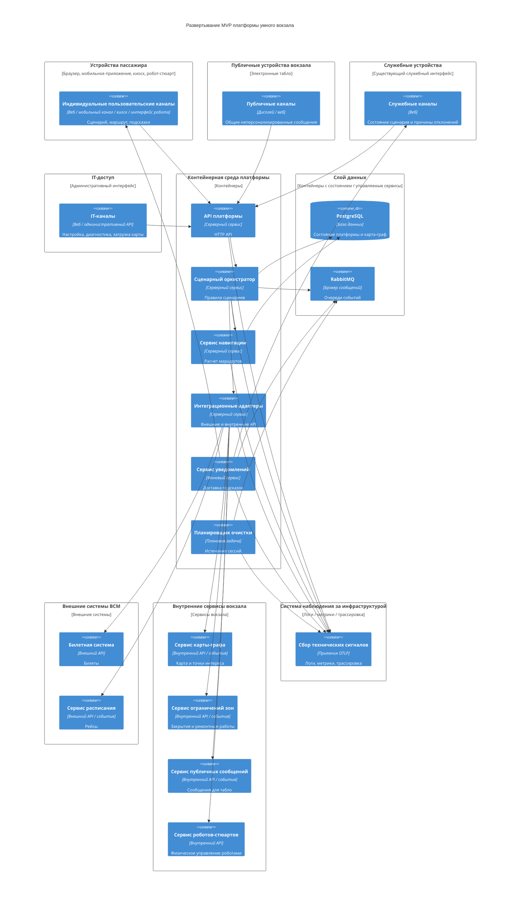

# 08. Развертывание

## Целевая среда MVP

MVP разворачивается в контейнерной среде. Это означает, что каждый процесс платформы запускается как отдельный контейнер с явно заданными переменными окружения, сетевыми связями, зависимостями и правилами перезапуска.

В эксплуатационной среде (production) компоненты без состояния масштабируются горизонтально, а компоненты с состоянием выделяются в слой данных с резервным копированием, мониторингом и контролем доступа.

## Термины развертывания

| Термин | Пояснение |
|---|---|
| Эксплуатационная среда (production) | Среда реальной эксплуатации MVP, где нужны управляемые секреты, резервное копирование, мониторинг, оповещения и регламент обновлений |
| Компонент без состояния (stateless) | Процесс, который не хранит критичные данные внутри своего контейнера; его можно перезапустить или запустить в нескольких экземплярах |
| Компонент с состоянием (stateful) | Процесс, который хранит данные, очередь или долговремое состояние; для него нужны тома, резервные копии и осторожные обновления |
| Единственный активный экземпляр (singleton) | Процесс, который должен выполняться только в одном активном экземпляре, чтобы не обработать одну задачу несколько раз |
| Выбор лидера (leader election) | Механизм, при котором из нескольких запущенных экземпляров только один становится активным исполнителем задачи |
| Политика хранения данных (retention policy) | Правила, которые определяют, сколько хранить сессии, события, аудит, логи и когда их очищать |

Для MVP Docker Compose подходит как компактный способ развернуть платформу целиком: API, оркестратор, сервис навигации, адаптеры, сервис уведомлений, планировщик очистки, PostgreSQL, RabbitMQ и тестовые заглушки внешних систем. При росте требований к отказоустойчивости и масштабированию та же контейнерная модель может быть перенесена в промышленную оркестрацию, например Kubernetes, без изменения границ контейнеров.

## Развертываемые процессы

| Процесс | Тип | Масштабирование |
|---|---|---|
| API платформы | Компонент без состояния | Горизонтально: несколько экземпляров за балансировщиком |
| Сценарный оркестратор | Компонент без состояния с записью в PostgreSQL | Горизонтально при соблюдении транзакций и идемпотентности |
| Сервис навигации | Компонент без состояния с кэшем карты-графа | Горизонтально; активная `map_version` может храниться в памяти каждого экземпляра |
| Интеграционные адаптеры | Компонент без состояния | Горизонтально, если входящие события обрабатываются идемпотентно |
| Сервис уведомлений | Компонент без состояния, читающий очередь | Горизонтально по очередям RabbitMQ и подтверждениям доставки |
| Планировщик очистки | Единственный активный экземпляр или выбор лидера | Один активный исполнитель политики хранения данных |
| PostgreSQL | Компонент с состоянием | Вертикально в MVP; далее реплика для чтения, резервное копирование и партиционирование |
| RabbitMQ | Компонент с состоянием | Один экземпляр в компактном MVP; кластер в эксплуатационной среде |
| Система наблюдения за инфраструктурой | Эксплуатационный компонент | Масштабируется отдельно от платформы |

## Диаграмма развертывания

## Сетевые связи

| Откуда | Куда | Протокол | Назначение и аргументация |
|---|---|---|---|
| Индивидуальные пользовательские каналы | API платформы | HTTPS | Создание и чтение `JourneySession`; TLS и токены канала защищают сессию при работе через приложение, сайт, киоск или робота-стюарта |
| Публичные каналы | API платформы | HTTPS | Получение `GET /public-messages`; HTTPS нужен для целостности данных табло, даже без персонализации |
| Служебные каналы | API платформы | HTTPS | Просмотр состояния сценария и причин отклонений; протокол удобен для существующих web-интерфейсов |
| IT-каналы | API платформы | HTTPS | Администрирование карты, правил и диагностики; требуется строгая авторизация и аудит действий |
| API платформы | Сценарный оркестратор | Internal HTTP или gRPC | Синхронные команды сценария; HTTP проще для MVP, gRPC уместен при строгих контрактах и большом числе внутренних вызовов |
| Сценарный оркестратор | Сервис навигации | Internal HTTP или gRPC | Расчет маршрута требует быстрого синхронного ответа; оба варианта подходят для внутренней контейнерной сети |
| Сценарный оркестратор | PostgreSQL | PostgreSQL wire protocol | Транзакционная запись `JourneySession`, подсказок, аудита, `ExternalEvent` и идемпотентных ключей |
| Сервис навигации | PostgreSQL | PostgreSQL wire protocol | Загрузка версии карты-графа, узлов, ребер и ограничений зон |
| Сценарный оркестратор | RabbitMQ | AMQP 0-9-1 | Публикация событий; AMQP дает очереди, подтверждения, повторную доставку и dead-letter для ошибок |
| Сервис уведомлений | RabbitMQ | AMQP 0-9-1 | Получение `hint.created` и повторная обработка доставки подсказок |
| Планировщик очистки | RabbitMQ | AMQP 0-9-1 | Публикация `journey_session.expired` и асинхронная очистка связанных процессов |
| Интеграционные адаптеры | Внешние системы ВСМ | HTTPS и подписанные события | Билетная система и расписание являются внешними зависимостями; HTTPS и подпись событий нужны для доверия к данным |
| Интеграционные адаптеры | Внутренние сервисы вокзала | HTTPS и подписанные события | Карта, ограничения зон, публичные сообщения и сервис роботов развиваются отдельно, поэтому связь идет через явные контракты |
| Компоненты платформы | Система наблюдения за инфраструктурой | OTLP/HTTP или OTLP/gRPC | Единый протокол OpenTelemetry для логов, метрик и трассировки; выбор HTTP или gRPC зависит от принятого сборщика |

## Конфигурация и секреты

Секреты не хранятся в коде. Для MVP нужны:

- ключи доступа к билетной системе;
- ключи доступа к сервису расписания;
- ключи или токены внутренних сервисов вокзала;
- ключи доступа к сервису роботов-стюартов;
- параметры подключения к PostgreSQL;
- параметры подключения к RabbitMQ;
- секрет подписи входящих событий расписания, карты, зон и публичных сообщений;
- параметры политики хранения данных;
- список разрешенных индивидуальных, публичных, служебных и IT-каналов;
- настройки системы наблюдения за инфраструктурой.

В Docker Compose эти значения передаются через переменные окружения и локальные файлы окружения, а в эксплуатационной среде должны храниться в управляемом хранилище секретов.

## Среды

| Среда | Назначение | Отличия |
|---|---|---|
| Локальная среда | Разработка, демонстрация и ручная проверка MVP | Docker Compose, заглушки внешних систем, локальные PostgreSQL и RabbitMQ |
| Тестовая среда | Интеграционные, контрактные и отказные проверки | Изолированные БД и брокер, mock внешних API, тестовые события расписания и зон |
| Эксплуатационная среда (production) | Реальная эксплуатация MVP | Управляемые секреты, резервное копирование, мониторинг, алерты, регламент обновлений, отказоустойчивый слой данных |

## Обновления без потери состояния

- API, оркестратор, сервис навигации, интеграционные адаптеры и сервис уведомлений обновляются постепенно, если их контракты обратно совместимы.
- Миграции PostgreSQL должны быть обратно совместимыми с предыдущей версией приложения.
- RabbitMQ должен сохранять неподтвержденные сообщения при перезапуске потребителя.
- Сервис уведомлений завершает обработку текущего сообщения или возвращает его в очередь.
- Планировщик очистки запускается как единственный активный экземпляр или использует выбор лидера.
- Новая версия карты-графа публикуется как новая `map_version`, а не перезаписывает старую.
- Политика хранения данных применяется после завершения сессий и не должна удалять карту или события, которые еще нужны для объяснения маршрута, подсказки или отклонения.
