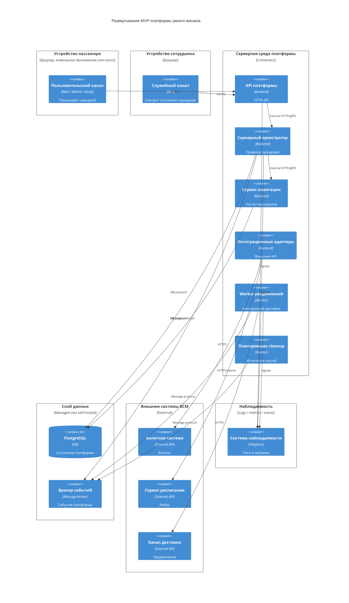

# 08. Развертывание

## Целевая среда MVP

MVP может быть развернут в контейнерной среде инфраструктуры ВСМ или в учебном стенде на базе Docker Compose. В production-варианте stateless-компоненты масштабируются горизонтально, а stateful-компоненты выделяются в управляемый слой данных.

## Развертываемые процессы

| Процесс | Тип | Масштабирование |
|---|---|---|
| API платформы | Stateless | Горизонтально |
| Сценарный оркестратор | Stateless service с записью в БД | Горизонтально при соблюдении транзакций |
| Сервис навигации | Stateless с чтением карты | Горизонтально |
| Интеграционные адаптеры | Stateless | Горизонтально |
| Worker уведомлений | Stateless worker | Горизонтально по очереди |
| Планировщик cleanup | Singleton или leader election | Один активный экземпляр |
| PostgreSQL | Stateful | Вертикально, реплика для чтения в будущем |
| Брокер событий | Stateful | Кластер в production |

## Deployment Diagram

## Сетевые связи

| Откуда | Куда | Протокол | Назначение |
|---|---|---|---|
| Пользовательский канал | API платформы | HTTPS | Команды и запросы сценария |
| Служебный канал | API платформы | HTTPS | Просмотр состояния и диагностика |
| API платформы | Сценарный оркестратор | Internal HTTP/gRPC | Выполнение доменных команд |
| Оркестратор | PostgreSQL | DB protocol | Источник истины состояния |
| Оркестратор | Брокер событий | AMQP/Kafka protocol | Публикация событий |
| Worker | Брокер событий | AMQP/Kafka protocol | Получение событий |
| Адаптеры | Внешние сервисы | HTTPS | Интеграции |
| Компоненты платформы | Наблюдаемость | OTLP/HTTP | Логи, метрики, трассировка |

## Конфигурация и секреты

Секреты не хранятся в коде. Для MVP нужны:

- ключи доступа к билетной системе;
- ключи доступа к сервису расписания;
- ключи доступа к каналу доставки;
- параметры подключения к PostgreSQL и брокеру событий;
- секрет подписи входящих событий расписания;
- настройки retention policy;
- список разрешенных пользовательских каналов.

## Среды

| Среда | Назначение | Отличия |
|---|---|---|
| Local | Разработка и демонстрация | Fake внешних систем, Docker Compose |
| Test | Интеграционные и контрактные тесты | Изолированные БД и брокер, mock внешних API |
| Production | Реальная эксплуатация MVP | Управляемые секреты, резервное копирование, мониторинг, алерты |

## Обновления без потери состояния

- API, оркестратор, навигация и worker могут обновляться rolling update.
- Миграции БД должны быть обратно совместимыми с предыдущей версией приложения.
- Worker завершает обработку текущего сообщения или возвращает его в очередь.
- Планировщик cleanup запускается в одном активном экземпляре.
- Новая версия карты-графа публикуется как новая `map_version`, а не перезаписывает старую.

