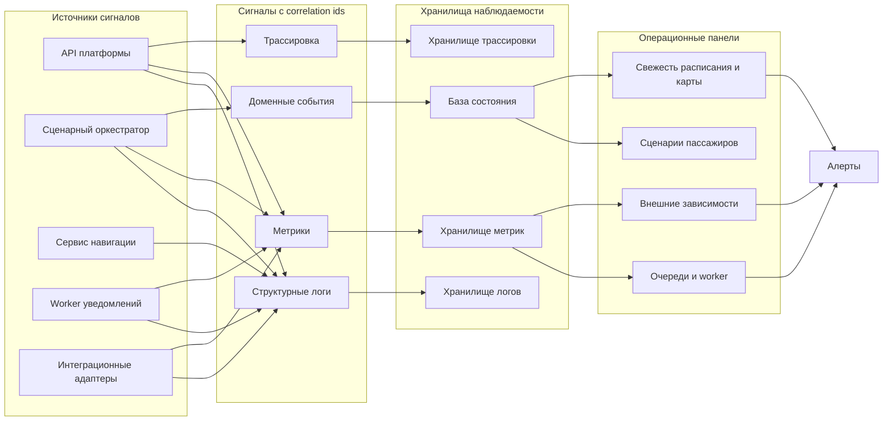

# 09. Надежность и эксплуатация

## Ключевые отказы

| Отказ | Реакция системы | Что видит канал |
|---|---|---|
| Билетная система недоступна при создании сессии | Сессия не создается, ошибка фиксируется с `request_id` | Предложение повторить или перейти к ручному сценарию |
| Сервис расписания недоступен | Используется последний известный `TripContext`, данные помечаются как `stale` | Сценарий доступен, но статус рейса отмечен как устаревший |
| Событие расписания пришло повторно | Повтор фиксируется в `ExternalEvent`, состояние не меняется | Ничего не меняется |
| Сервис навигации не построил маршрут | Создается шаг `needs_manual_check` и подсказка обратиться к сотруднику | Объяснение проблемы и рекомендация |
| Брокер событий недоступен | Команда не считается полностью успешной, событие можно восстановить из БД | Подсказка доступна через pull API после восстановления |
| Канал доставки уведомлений недоступен | `NotificationDelivery` получает статус `failed`, worker повторяет доставку | Подсказка остается доступной через API |
| Worker упал во время обработки | Сообщение возвращается в очередь или повторяется по retry policy | Возможна задержка доставки |
| PostgreSQL недоступен | API возвращает деградационную ошибку, запись состояния невозможна | Канал показывает временную недоступность сценария |

## Повторы и идемпотентность

| Операция | Ключ идемпотентности | Поведение при повторе |
|---|---|---|
| Создание сессии | `idempotency_key` + `channel_session_id` | Возвращается ранее созданная сессия |
| Внешнее событие расписания | `external_event_id` + `source_system` | Событие не применяется повторно |
| Создание подсказки | `journey_session_id` + `scenario_step_id` + `hint.type` | Не создается дубль активной подсказки |
| Доставка подсказки | `hint_id` + `channel_session_id` + `attempt` | Повтор фиксируется как новая попытка |
| Истечение сессии | `journey_session_id` | Завершенная сессия остается завершенной |

## Зависшие состояния

| Признак | Возможная причина | Действие оператора или системы |
|---|---|---|
| `JourneySession` долго в `resolving_ticket` | Ошибка билетной системы или таймаут | Перевести в `needs_manual_check` |
| `Hint` долго в `queued` | Worker или брокер недоступен | Проверить очередь, перезапустить worker |
| `NotificationDelivery` часто `failed` | Недоступен канал доставки | Открыть инцидент по внешней зависимости |
| `TripContext.data_freshness = stale` долгое время | Нет связи с расписанием | Проверить адаптер расписания |
| Рост возраста сообщений в очереди | Недостаточно worker или ошибка обработки | Увеличить worker или отключить проблемный consumer |

## Наблюдаемость

## Минимальный набор сигналов

| Тип | Поля | Зачем |
|---|---|---|
| Логи API | `request_id`, `channel_id`, `journey_session_id`, `route`, `status_code`, `error_code` | Разбор запросов канала |
| Логи оркестратора | `journey_session_id`, `scenario_step_id`, `external_event_id`, `reason`, `transition` | Объяснение изменений сценария |
| Логи worker | `hint_id`, `delivery_id`, `attempt`, `status`, `error_code` | Разбор доставки подсказок |
| Метрики API | latency, error rate, RPS | Здоровье внешней границы |
| Метрики очередей | размер очереди, возраст старейшего сообщения, retries | Backpressure и сбои worker |
| Метрики интеграций | latency и error rate внешних систем | Отказы зависимостей |
| Доменные события | создание сессии, смена статуса, подсказка, завершение | Восстановление истории |

## Алерты MVP

- Доля ошибок API выше 5% за 5 минут.
- Сервис расписания недоступен больше 2 минут.
- Возраст старейшего сообщения `hint.created` больше 1 минуты.
- Более 10% активных сессий имеют `TripContext.data_freshness = stale`.
- База состояния недоступна.
- Доля неуспешных доставок подсказок выше 20% за 10 минут.

## Резервное копирование и восстановление

- PostgreSQL резервируется регулярно, минимальная цель восстановления для MVP - не потерять больше 15 минут данных.
- Брокер событий не считается долгосрочным хранилищем; критичные события фиксируются в БД.
- При восстановлении после сбоя worker может перечитать недоставленные подсказки со статусом `queued` или `failed`.
- При потере временных метрик состояние сценариев восстанавливается из базы состояния и аудита.

