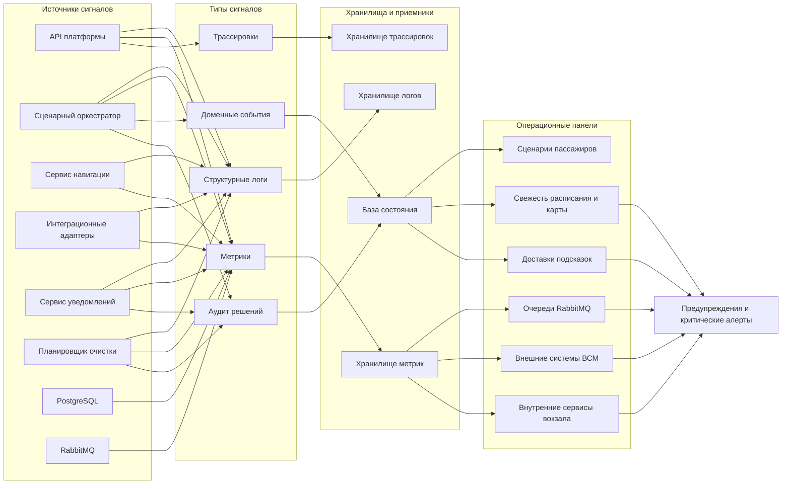

# 09. Надежность и эксплуатация

Раздел описывает, как MVP должен вести себя при отказах зависимостей, повторах событий, задержках доставки подсказок и восстановлении после сбоев. Для эксплуатации важно не только вернуть пассажиру понятный ответ, но и сохранить объяснимый след: что произошло, почему платформа приняла решение и какие данные были свежими на момент решения.

## Справочник терминов и полей

| Термин или поле | Пояснение | Зачем нужно в эксплуатации |
|---|---|---|
| `request_id` | Идентификатор конкретного HTTP-запроса к API платформы | Позволяет найти все логи, метрики и трассировки одного запроса |
| `journey_session_id` | Внутренний идентификатор активного пассажирского сценария | Связывает запросы, маршрут, подсказки, доставки и аудит одной сессии |
| `channel_id` | Идентификатор типа или экземпляра канала: приложение, сайт, киоск, робот-стюарт, табло, служебный канал | Помогает понять, через какой канал возникла ошибка или задержка |
| `channel_session_id` | Идентификатор взаимодействия конкретного канала с платформой без полного профиля пассажира | Нужен для доставки подсказок и диагностики смены канала |
| `JourneySession` | Состояние активного пассажирского сценария | Главная сущность для разбора пользовательского пути |
| `TripContext` | Последний известный контекст рейса: статус, платформа, время, свежесть данных | Показывает, на каких данных расписания основаны маршрут и подсказки |
| `ScenarioStep` | Шаг сценария: проверка билета, маршрут готов, ожидание посадки, отклонение | Объясняет, в каком месте сценария возникла проблема |
| `Hint` | Подсказка пассажиру или каналу с текстом, типом, причиной и статусом | Позволяет проверить, почему пассажиру было выдано конкретное сообщение |
| `NotificationDelivery` | Попытка или результат доставки подсказки в индивидуальный или служебный канал | Показывает, была ли подсказка доставлена и где возникла ошибка |
| `ExternalEvent` | Событие от внешней системы ВСМ или внутреннего сервиса вокзала | Нужен для аудита изменений и идемпотентной обработки повторов |
| `idempotency_key` | Ключ повторяемой команды API, например создания сессии | Защищает от создания дубля при повторе запроса |
| `external_event_id` | Уникальный идентификатор события от внешней или внутренней системы | Защищает от повторного применения одного события |
| `source_system` | Система-отправитель события | Помогает определить источник сбоя или некорректных данных |
| `event_type` | Тип события: `trip.platform.changed`, `station_zone.closed` и другие | Позволяет выбрать правильную обработку события |
| `map_version` | Версия карты-графа вокзала | Нужна для воспроизводимости маршрута и диагностики устаревшей карты |
| `route_unavailable` | Статус, при котором маршрут построить невозможно | Требует подсказки обратиться к сотруднику и сохранения причины |
| `data_freshness = stale` | Признак устаревших данных | Показывает, что платформа работает по последнему известному состоянию |
| RPO | Целевая точка восстановления: максимально допустимый объем потери данных во времени | Для MVP по PostgreSQL не больше 15 минут |
| RTO | Целевое время восстановления: за сколько нужно вернуть базовую работу после сбоя | Для MVP ориентир - до 1 часа для базовой работы платформы |
| Журнал исходящих событий (outbox) | Записи событий в PostgreSQL перед публикацией в RabbitMQ | Позволяет восстановить публикацию события после сбоя брокера или процесса |
| Очередь ошибочных сообщений (dead-letter) | Очередь RabbitMQ для сообщений, которые не удалось обработать после повторов | Помогает не терять проблемные события и разбирать их отдельно |

## Ключевые отказы

| Отказ | Реакция системы | Что видит канал | Пояснение |
|---|---|---|---|
| Билетная система недоступна при создании сессии | `JourneySession` не создается, ошибка фиксируется с `request_id` и `channel_id` | Предложение повторить запрос или обратиться к сотруднику | Без проверки билета платформа не может безопасно связать сценарий с рейсом |
| Сервис расписания недоступен | Используется последний известный `TripContext`, если он есть; данные помечаются как `data_freshness = stale` | Сценарий доступен, но статус рейса отмечен как устаревший | Канал должен явно показать, что информация может быть неактуальной |
| Событие расписания пришло повторно | Повтор фиксируется в `ExternalEvent` как `duplicate`, состояние не меняется | Ничего не меняется | `external_event_id` защищает от повторного пересчета маршрута и повторной подсказки |
| Сервис карты-графа недоступен | Используется последняя загруженная `map_version`; новая карта не применяется | Маршрут строится по последней доступной версии или показывается ручной сценарий | Важно не ломать активные сессии из-за недоступности обновления карты |
| Сервис ограничений зон недоступен | Платформа использует последнее известное состояние зон и помечает данные как потенциально устаревшие | Канал может показать предупреждение о необходимости свериться с сотрудником | Закрытые зоны влияют на безопасность маршрута |
| Сервис публичных сообщений недоступен | Последние активные `PublicMessage` остаются доступными до окончания срока действия | Табло показывает последнее доступное общее сообщение или пустое состояние | Табло не получает персональные подсказки и не должно показывать данные сессии |
| Сервис роботов-стюартов недоступен | Робот-канал не используется для доставки, остальные каналы продолжают работать | Пассажир может использовать приложение, сайт или киоск | Физическое управление роботом не входит в ответственность платформы |
| Сервис навигации не построил маршрут | Создается `ScenarioStep` со статусом `route_unavailable` и подсказка обратиться к сотруднику | Объяснение проблемы и рекомендация обратиться к сотруднику | Причина должна быть сохранена для служебного канала |
| RabbitMQ недоступен | Состояние и событие фиксируются в PostgreSQL/outbox, публикация в очередь повторяется после восстановления | Подсказка может быть доступна через API, но доставка в канал задерживается | RabbitMQ не является долговременным хранилищем состояния |
| Индивидуальный или служебный канал недоступен | `NotificationDelivery` получает статус `failed`, сервис уведомлений повторяет доставку | Подсказка остается доступной через API при следующем обращении | Ошибка доставки не должна создавать новую подсказку |
| Сервис уведомлений остановился во время обработки | Неподтвержденное сообщение остается в RabbitMQ и будет обработано повторно | Возможна задержка доставки подсказки | Повтор доставки фиксируется через `delivery_attempt` |
| Планировщик очистки не запускался | Истекшие сессии остаются в БД дольше политики хранения данных, создается эксплуатационное предупреждение | Пользовательский канал обычно не видит изменения | Это риск накопления данных и нарушения политики хранения |
| PostgreSQL недоступен | Создание и изменение `JourneySession` невозможно; API возвращает деградационный ответ без записи состояния | Канал показывает временную недоступность сценария | Без PostgreSQL нельзя надежно сохранить состояние, идемпотентность и аудит |

## Повторы и идемпотентность

| Операция или событие | Ключ идемпотентности | Поведение при повторе | Пояснение |
|---|---|---|---|
| Создание сессии | `idempotency_key` + `channel_session_id` | Возвращается ранее созданная `JourneySession` | Повтор запроса из-за таймаута не создает вторую сессию |
| `trip.status.changed` | `external_event_id` + `source_system` | `TripContext` не обновляется повторно | Повтор статуса рейса не создает новую подсказку |
| `trip.platform.changed` | `external_event_id` + `source_system` | Маршрут и подсказка не создаются повторно | Защищает от дублей при повторной доставке события расписания |
| `station_zone.closed` | `external_event_id` + `source_system` | Закрытие зоны не применяется второй раз | Повтор не должен повторно пересчитывать все активные маршруты |
| `station_zone.opened` | `external_event_id` + `source_system` | Открытие зоны не применяется второй раз | Повтор не должен менять уже обработанные сценарии |
| `public_message.published` | `external_event_id` + `source_system` | Публичное сообщение не дублируется | Табло получает одно общее сообщение, а не несколько одинаковых |
| `hint.created` | `journey_session_id` + `scenario_step_id` + `hint.type` | Не создается дубль активной подсказки | Одна причина сценария должна давать одну актуальную подсказку |
| Доставка подсказки | `hint_id` + `channel_session_id` + `delivery_attempt` | Повтор фиксируется как новая попытка доставки | Новая попытка доставки не означает новую подсказку |
| `journey_session.expired` | `journey_session_id` | Завершенная сессия остается завершенной | Повторное истечение не меняет финальный статус |

## Зависшие состояния

| Признак | Возможная причина | Автоматическое действие | Действие оператора | Пояснение |
|---|---|---|---|---|
| `JourneySession` долго в `resolving_ticket` | Таймаут билетной системы или адаптера | Перевести сценарий в `needs_manual_check` после таймаута | Проверить доступность билетной системы и адаптера | Пассажир не должен бесконечно ждать проверки билета |
| Подсказка долго ожидает доставки | RabbitMQ недоступен, сервис уведомлений остановлен или канал не отвечает | Повторить доставку, затем отправить в очередь ошибочных сообщений | Проверить очередь `hint.created`, сервис уведомлений и канал | Подсказка должна оставаться доступной через pull API |
| `NotificationDelivery` часто `failed` | Недоступен канал или неверные настройки токена | Увеличить `delivery_attempt`, остановить повтор после лимита | Открыть инцидент по каналу и проверить секреты | Высокая доля ошибок доставки влияет на пассажирский опыт |
| `TripContext.data_freshness = stale` долгое время | Нет связи с расписанием или адаптером расписания | Продолжить работу по последнему известному состоянию с пометкой stale | Проверить сервис расписания, подпись событий и сетевые ошибки | Устаревшее расписание должно быть явно видно каналу |
| `ExternalEvent` долго в статусе обработки | Ошибка сценарной логики или зависание транзакции | Повторить обработку после безопасного таймаута | Проверить логи по `external_event_id` и `source_system` | Событие не должно оставаться в неопределенном состоянии |
| Рост очереди RabbitMQ | Недостаточно потребителей или ошибка обработки сообщений | Масштабировать сервис уведомлений или перевести сбойные сообщения в dead-letter | Проверить возраст старейшего сообщения и ошибки потребителей | Рост очереди означает задержку подсказок и событий |
| Активна устаревшая `map_version` | Не применилось событие карты или недоступен сервис карты-графа | Использовать последнюю безопасную версию карты | Проверить публикацию `station_map.version.published` | Устаревшая карта может давать неактуальный маршрут |
| Планировщик очистки давно не запускался | Нет активного экземпляра или сбой выбора лидера | Создать предупреждение по расписанию выполнения | Проверить задачу планировщика и блокировки лидера | Нарушает политику хранения данных |

## Система наблюдения за инфраструктурой

## Минимальный набор сигналов

| Тип | Поля | Пояснение полей | Зачем |
|---|---|---|---|
| Логи API | `request_id`, `channel_id`, `channel_session_id`, `journey_session_id`, `route`, `status_code`, `error_code` | `request_id` - запрос; `channel_id` - канал; `channel_session_id` - сессия канала; `journey_session_id` - пассажирский сценарий; `route` - endpoint; `status_code` - HTTP-статус; `error_code` - код ошибки | Разбор запросов каналов и ошибок внешней границы |
| Логи оркестратора | `journey_session_id`, `scenario_step_id`, `external_event_id`, `reason`, `transition` | `journey_session_id` - сценарий; `scenario_step_id` - шаг сценария; `external_event_id` - событие-инициатор; `reason` - причина решения; `transition` - переход состояния | Объяснение изменений сценария и подсказок |
| Логи сервиса уведомлений | `hint_id`, `notification_delivery_id`, `channel_session_id`, `delivery_attempt`, `status`, `error_code` | `hint_id` - подсказка; `notification_delivery_id` - попытка доставки; `channel_session_id` - сессия канала; `delivery_attempt` - номер попытки; `status` - результат; `error_code` - причина ошибки | Разбор доставки подсказок и повторов |
| Логи интеграционных адаптеров | `request_id`, `source_system`, `event_type`, `external_event_id`, `latency_ms`, `error_code` | `request_id` - запрос; `source_system` - зависимость; `event_type` - тип события; `external_event_id` - идентификатор события; `latency_ms` - задержка в миллисекундах; `error_code` - код ошибки | Диагностика внешних систем ВСМ и внутренних сервисов вокзала |
| Логи планировщика очистки | `run_id`, `started_at`, `finished_at`, `expired_sessions_count`, `error_code` | `run_id` - запуск планировщика; `started_at` - начало; `finished_at` - завершение; `expired_sessions_count` - число завершенных сессий; `error_code` - код ошибки | Контроль выполнения политики хранения данных |
| Метрики API | latency, error rate, RPS | latency - задержка ответа; error rate - доля ошибок; RPS - запросы в секунду | Здоровье внешней границы платформы |
| Метрики RabbitMQ | размер очереди, возраст старейшего сообщения, количество повторов, очередь ошибочных сообщений (dead-letter) | Размер очереди - накопленная работа; возраст сообщения - задержка; количество повторов - нестабильность обработки; dead-letter - необработанные сообщения | Контроль доставки подсказок и асинхронных событий |
| Метрики PostgreSQL | доступность, число соединений, длительность транзакций, объем таблиц `ExternalEvent` и аудита | Доступность - возможность записи; соединения - нагрузка клиентов; транзакции - риск блокировок; объем таблиц - влияние политики хранения | Надежность основного хранилища состояния |
| Метрики интеграций | latency и error rate по `source_system` | latency - задержка ответа зависимости; error rate - доля ошибок; `source_system` - конкретная внешняя или внутренняя система | Отказы зависимостей и деградация данных |
| Метрики свежести данных | возраст `TripContext`, возраст `map_version`, актуальность ограничений зон, срок действия `PublicMessage` | Возраст `TripContext` - свежесть расписания; возраст `map_version` - свежесть карты; ограничения зон - актуальность проходов; `PublicMessage` - срок общих сообщений | Выявление устаревших данных до жалоб пользователей |
| Доменные события | создание сессии, смена статуса, смена платформы, закрытие зоны, подсказка, завершение | Создание сессии - старт сценария; смена статуса и платформы - изменение рейса; закрытие зоны - изменение маршрута; подсказка - рекомендация; завершение - финал сценария | Восстановление истории сценария |

## Предупреждения и критические алерты MVP

Предупреждения показывают ухудшение качества работы, но не всегда означают полный отказ:

- p95 задержки API выше 2 секунд за 5 минут.
- Более 10% активных сессий имеют `TripContext.data_freshness = stale`.
- Возраст старейшего сообщения `hint.created` больше 1 минуты.
- Доля `NotificationDelivery.failed` выше 20% за 10 минут.
- Активная `map_version` старше ожидаемого интервала обновления.
- Планировщик очистки выполнился, но обработал необычно много или мало истекших сессий.

Критические алерты требуют немедленной реакции:

- PostgreSQL недоступен или не принимает записи.
- RabbitMQ недоступен или не подтверждает публикацию сообщений.
- Сервис расписания недоступен больше 5 минут.
- Доля ошибок API выше 5% за 5 минут.
- Планировщик очистки не запускался в ожидаемое окно.
- `ExternalEvent` не обрабатываются или массово попадают в ошибочный статус.
- Очередь ошибочных сообщений растет без разбора оператором.

## Резервное копирование и восстановление

- PostgreSQL резервируется обязательно, потому что хранит состояние `JourneySession`, аудит, `ExternalEvent`, `IdempotencyRecord`, карту-граф, подсказки и `NotificationDelivery`.
- RPO для PostgreSQL в MVP - не потерять больше 15 минут данных.
- RTO для базовой работы платформы в MVP - восстановить создание и чтение сценариев в течение 1 часа после критического сбоя.
- RabbitMQ не считается долговременным хранилищем, но очереди должны быть устойчивыми к перезапуску (durable), а сообщения - подтверждаться потребителем только после успешной обработки.
- Критичные события сначала фиксируются в PostgreSQL через журнал исходящих событий (outbox), а затем публикуются в RabbitMQ.
- После сбоя сервиса уведомлений он перечитывает недоставленные подсказки по `NotificationDelivery.status = queued` или `failed`.
- После сбоя RabbitMQ платформа восстанавливает публикацию событий из outbox и не создает дубли благодаря `external_event_id` и `hint_id`.
- После сбоя сервиса карты-графа используется последняя сохраненная `map_version`; новая версия применяется только после успешной публикации и проверки.
- После сбоя сервиса расписания платформа отвечает по последнему `TripContext` с пометкой `data_freshness = stale`.
- Политика хранения данных не должна удалять `ExternalEvent`, аудит, `map_version`, `RouteSegment` и подсказки, которые еще нужны для объяснения маршрута, подсказки или отклонения.
