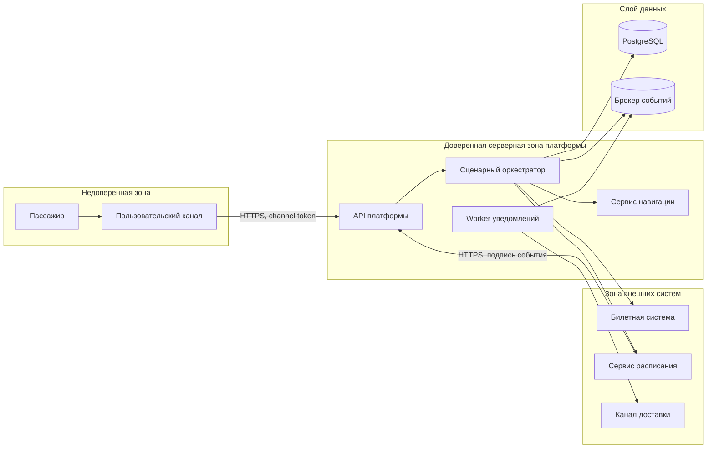

# 10. Безопасность

## Защищаемые данные

| Данные | Почему защищаются | Подход |
|---|---|---|
| `JourneySession` | По ней можно узнать сценарий пассажира на вокзале | Доступ только по токену канала и правам |
| `TicketReference` | Ссылка на билет может раскрыть поездку | Хранить хэш или внешний непрямой идентификатор |
| `TripContext` | Связан с конкретной сессией | Не раскрывать без доступа к сессии |
| `Hint` | Может раскрывать маршрут и ситуацию пассажира | Доступ только владельцу сессии и ограниченным служебным ролям |
| `ExternalEvent.payload` | Может содержать внешние идентификаторы | Хранить минимальный payload и `payload_hash` |
| Секреты интеграций | Дают доступ к внешним системам | Хранить в менеджере секретов |

## Роли

| Роль | Права |
|---|---|
| Пользовательский канал | Создать сессию, читать только свои сессии, подтверждать свои подсказки |
| Служебный канал сотрудника | Читать состояние сессий и причины подсказок без персональных данных |
| IT-специалист | Управлять настройками интеграций, картой-графом и правилами |
| Сервис расписания | Передавать подписанные события расписания |
| Worker уведомлений | Читать подсказки, создавать попытки доставки |

## Границы доверия

## Аутентификация и авторизация

- Внешний пользовательский канал аутентифицируется как доверенный клиент платформы.
- Для доступа к конкретной сессии канал передает `channel_session_id` и токен с ограниченной областью действия.
- Служебные роли проходят через корпоративную систему аутентификации.
- Входящие события расписания подписываются секретом или ключом внешней системы.
- Все операции чтения сессии проверяют владение или служебную роль.

## Валидация входов

| Вход | Проверки |
|---|---|
| `POST /journey-sessions` | Формат ссылки на билет, разрешенный канал, `idempotency_key`, входная точка карты |
| `POST /external-events/schedule` | Подпись, `external_event_id`, версия схемы, известный тип события |
| Административная загрузка карты | Версия карты, связность графа, отсутствие ссылок на несуществующие узлы |
| Подтверждение подсказки | Владение сессией, существование подсказки, допустимый статус |

## Что нельзя логировать

- полный QR-код или полный номер билета;
- ФИО и документы пассажира, если они случайно пришли из внешней системы;
- токены пользовательских каналов;
- секреты внешних интеграций;
- полный payload события, если он содержит персональные данные.

## Основные угрозы и меры

| Угроза | Мера снижения |
|---|---|
| Чтение чужой сессии | Проверка владения по `channel_session_id` и токену канала |
| Повтор внешнего события | `external_event_id` и журнал событий |
| Подделка события расписания | Проверка подписи и разрешенного источника |
| Утечка персональных данных через логи | Маскирование и запрет логирования чувствительных полей |
| Слишком широкие права служебного пользователя | Ролевой доступ и аудит служебных операций |
| Компрометация секрета интеграции | Ротация секретов и хранение вне кода |
| Некорректная карта-граф | Валидация связности и публикация новой версии вместо перезаписи |

