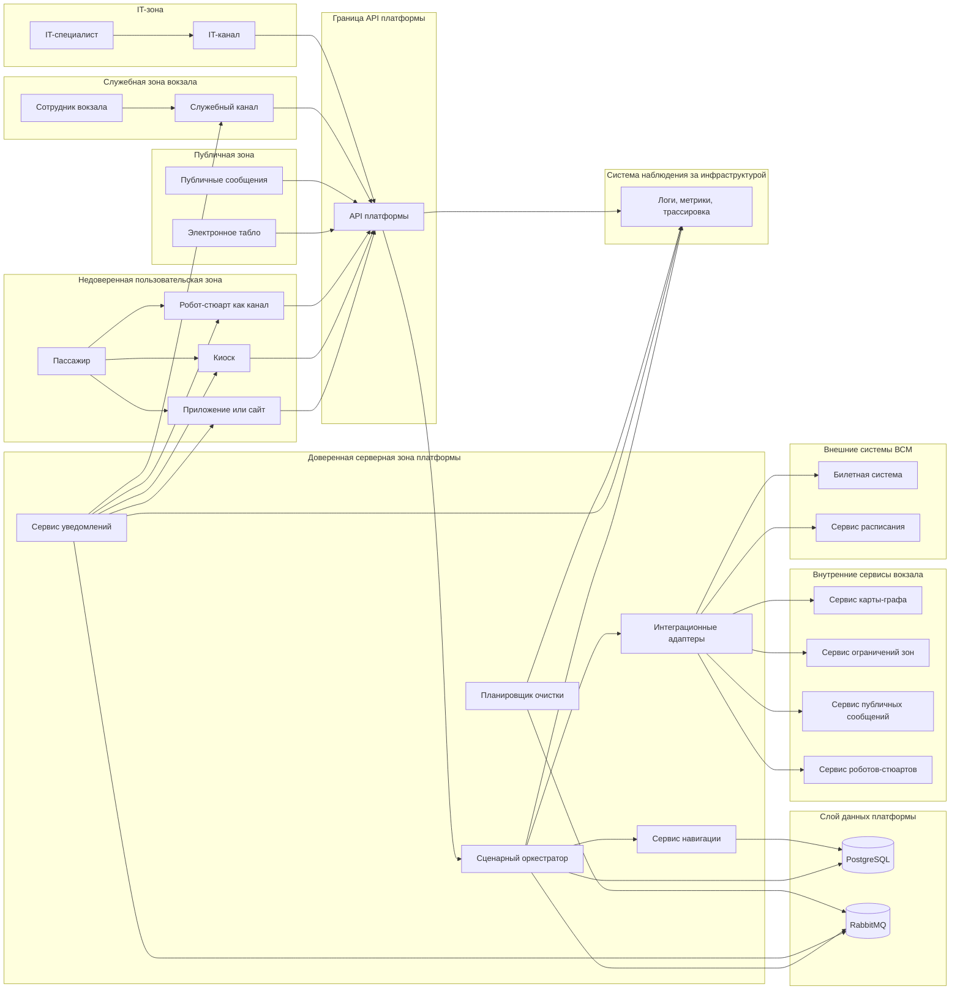

# 10. Безопасность

## Защищаемые данные

MVP не хранит полный профиль пассажира, ФИО, документы, платежные данные, полный QR-код билета и историю поездок. При этом платформа хранит псевдонимизированные и технические данные, которые все равно требуют защиты: по ним можно восстановить сценарий пассажира, маршрут, рейс, канал взаимодействия или причины выданных подсказок.

| Категория данных | Примеры | Специфика защиты | Подход |
|---|---|---|---|
| Идентификаторы сценария | `journey_session_id`, `channel_session_id`, `idempotency_key` | Не раскрывают личность напрямую, но связывают действия пассажира в рамках сценария | Ограничить доступ по токену канала, сроку жизни сессии и правам роли |
| Билетные ссылки и хэши | `ticket_hash`, `external_ticket_ref`, `ticket_ref` | Могут раскрыть факт поездки или связь с рейсом, если попадут к постороннему | Хранить хэш или непрямой идентификатор, не логировать полный билет или QR-код |
| Контекст рейса | `TripContext`, `external_trip_id`, платформа, время отправления, `data_freshness` | В связке с сессией показывает маршрут и поездку конкретного пассажира | Не раскрывать без доступа к `JourneySession`, помечать устаревшие данные |
| Маршрут и карта | `start_node_id`, `target_node_id`, `RouteSegment`, `map_version` | Показывают перемещение пассажира по вокзалу и используемую версию карты | Хранить только в рамках сессии и аудита, не передавать публичным каналам |
| Подсказки | `Hint`, причина подсказки, статус подсказки | Могут раскрывать отклонение в сценарии: смену платформы, недоступный маршрут, обращение к сотруднику | Доступ только владельцу сессии, служебной роли или внутреннему сервису уведомлений |
| Доставка подсказок | `NotificationDelivery`, `delivery_attempt`, `status`, `error_code` | Показывает, какой канал использовался и была ли доставка успешной | Хранить для аудита доставки, маскировать канальные идентификаторы в логах |
| Внешние события | `ExternalEvent`, `external_event_id`, `source_system`, `event_type`, `payload_hash` | Payload может содержать внешние идентификаторы или технические детали интеграции | Хранить минимальный payload, сохранять `payload_hash`, проверять подпись источника |
| Публичные сообщения | `PublicMessage`, зона, рейс, срок действия | Не персональны, но могут повлиять на поведение всех пассажиров в зоне | Проверять источник, срок действия, отсутствие персональных и сессионных данных |
| Технические логи и метрики | `request_id`, `trace_id`, коды ошибок, задержки | Нужны для эксплуатации, но могут раскрыть внутренние идентификаторы и структуру системы | Маскирование, ограниченный доступ, срок хранения по политике хранения данных |
| Секреты и ключи | токены каналов, ключи внешних систем, подписи событий, доступ к PostgreSQL и RabbitMQ | Компрометация дает возможность читать данные, подделывать события или нарушать работу платформы | Хранить вне кода, ротировать, ограничивать область действия |

Публичные каналы, включая электронное табло и сервис публичных сообщений, не должны получать `JourneySession`, `ticket_ref`, `channel_session_id`, персональные подсказки или маршрут конкретного пассажира.

## Роли и доступы

| Роль или субъект | Права | Ограничения |
|---|---|---|
| Индивидуальный пользовательский канал | Создать сессию, читать свою `JourneySession`, получать маршрут и подсказки, подтверждать получение подсказки | Доступ только по токену канала, `channel_session_id` и правам на конкретную сессию |
| Киоск самообслуживания | Создать или прочитать сессию, передать фиксированный `start_node_id`, показать маршрут и подсказки | Не получает чужие сессии; не хранит полный билет после завершения взаимодействия |
| Робот-стюарт как канал | Получить состояние сценария, маршрут и подсказки через API платформы | Физическое управление роботом остается в сервисе роботов; робот не получает полный профиль пассажира |
| Публичный канал | Читать только общие `PublicMessage` для вокзала, зоны или рейса | Не получает персональные сессии, билетные ссылки, маршруты и подсказки пассажира |
| Служебный канал сотрудника вокзала | Читать состояние сценария, причины подсказок и отклонений для помощи пассажиру | Не получает полный профиль пассажира, документы, платежные данные и полный билет |
| IT-канал | Управлять настройками интеграций, картой-графом, правилами, диагностикой и секретами по роли | Требует строгой авторизации, аудита действий и разграничения административных прав |
| Внешние системы ВСМ | Передавать данные билета, расписания и подписанные события | Не получают внутреннее состояние `JourneySession`, кроме явно согласованных ответов |
| Внутренние сервисы вокзала | Передавать карту, ограничения зон, публичные сообщения и данные сервиса роботов | Работают через адаптеры и подписанные события, не получают персональные данные без необходимости |
| Сервис уведомлений | Читать созданные подсказки, создавать `NotificationDelivery`, доставлять подсказки в разрешенные каналы | Не создает подсказки сам и не меняет сценарные правила |
| Планировщик очистки | Завершать истекшие сессии и применять политику хранения данных | Не должен удалять данные, которые нужны для объяснения сценария и аудита |

## Границы доверия

## Аутентификация и авторизация

- Все внешние и межсервисные API используют HTTPS/TLS.
- Индивидуальные, публичные, служебные и IT-каналы аутентифицируются как разрешенные клиенты платформы.
- Доступ к конкретной `JourneySession` требует `channel_session_id`, токен канала и проверку владения сессией.
- Публичные каналы имеют отдельную область доступа только к `GET /public-messages`.
- Служебные роли проходят через корпоративную систему аутентификации и получают доступ только к данным, нужным для помощи пассажиру.
- IT-роль отделяется от роли сотрудника вокзала: настройка карты, интеграций и секретов требует административных прав.
- Входящие события от внешних систем ВСМ и внутренних сервисов вокзала подписываются ключом источника и проверяются по `source_system`, `event_type`, `external_event_id`.
- Внутренние сервисы платформы получают только минимальные права: сервис уведомлений доставляет подсказки, планировщик очистки применяет политику хранения данных.

## Валидация входов

| Вход | Проверки |
|---|---|
| `POST /journey-sessions` | Разрешенный канал, формат `ticket_ref`, наличие `idempotency_key`, валидный `channel_session_id`, существующий `start_node_id`, отсутствие полного QR-кода билета |
| `GET /journey-sessions/{id}` | Владение сессией или служебная роль, срок жизни сессии, область действия токена |
| `GET /public-messages` | Запрос только общих сообщений, фильтрация по зоне, вокзалу или рейсу, отсутствие сессионных данных |
| `POST /external-events/schedule` | Подпись источника, `external_event_id`, `source_system`, `event_type`, версия схемы, известный рейс |
| `POST /external-events/station-zone` | Подпись источника, существующий `zone_id`, допустимый тип события, срок действия ограничения |
| `POST /external-events/public-message` | Подпись источника, срок действия сообщения, отсутствие персональных данных, отсутствие `journey_session_id` и `ticket_ref` |
| Административная загрузка карты | Уникальная `map_version`, связность графа, существующие узлы и ребра, отсутствие перезаписи активной версии |
| Подтверждение подсказки | Владение `JourneySession`, существование `hint_id`, допустимый статус подсказки, запрет подтверждения чужой подсказки |
| Служебный просмотр сценария | Проверка роли сотрудника, аудит обращения, ограничение данных до состояния сценария и причины решения |

## Что нельзя логировать

- полный QR-код или полный номер билета;
- ФИО, документы, телефон, e-mail и платежные данные пассажира;
- полный `ticket_ref`, если он раскрывает билет или пассажира;
- токены индивидуальных, публичных, служебных и IT-каналов;
- секреты внешних систем, внутренних сервисов, PostgreSQL и RabbitMQ;
- полный payload события, если он содержит персональные или договорные идентификаторы;
- персональные данные, `JourneySession`, `ticket_ref`, `channel_session_id` и индивидуальные подсказки в публичных сообщениях;
- диагностические дампы, содержащие маршруты, подсказки или payload внешних событий без маскирования.

В логах допустимы `request_id`, `journey_session_id`, `external_event_id`, `payload_hash`, маскированные идентификаторы и агрегированные технические метрики.

## Основные угрозы и меры

Уровни угроз являются качественной оценкой для архитектурной документации: низкий, средний, высокий, критический. Уровень определяется сочетанием вероятности, влияния на пассажира, объема затронутых данных и возможности нарушить работу платформы.

| Угроза | Уровень | Почему такой уровень | Мера снижения | Необходимая реакция |
|---|---|---|---|---|
| Чтение чужой `JourneySession` | Высокий | Раскрывает маршрут, рейс, подсказки и отклонения конкретного пассажира | Проверка владения по `channel_session_id`, токену канала и сроку жизни сессии | Немедленно закрыть доступ, проверить аудит, отозвать токены при подтверждении |
| Подделка события расписания | Критический | Может изменить платформу, маршрут и подсказки для множества пассажиров | Подпись событий, allowlist `source_system`, проверка `event_type` и `external_event_id` | Немедленно заблокировать источник, остановить применение событий, провести разбор |
| Повтор внешнего события | Средний | Может создать дубли подсказок или повторный пересчет маршрутов, если идемпотентность нарушена | Журнал `ExternalEvent`, уникальный `external_event_id`, идемпотентная обработка | Проверить журнал событий и исправить обработчик, если появился дубль |
| Персональные данные на публичном табло | Критический | Публичное раскрытие данных может затронуть неограниченный круг лиц | Табло получает только `PublicMessage`, фильтрация payload, запрет `JourneySession` и `ticket_ref` | Немедленно снять сообщение, заблокировать источник, провести аудит публикации |
| Утечка персональных данных через логи | Высокий | Логи доступны эксплуатационным ролям и могут храниться дольше пользовательских данных | Маскирование, запрет чувствительных полей, ограничение доступа к логам | Удалить или замаскировать логи, проверить источники записи, обновить фильтры |
| Компрометация токена канала | Высокий | Позволяет читать или создавать сценарии от имени канала | Короткий срок действия, ограниченная область прав, ротация токенов | Отозвать токен, выпустить новый, проверить действия по `channel_id` |
| Компрометация секрета интеграции | Критический | Позволяет обращаться к внешним системам или подделывать входящие события | Хранилище секретов, ротация, отдельные ключи по источникам | Срочно ротировать секрет, временно отключить интеграцию, проверить входящие события |
| Слишком широкие права служебного пользователя | Средний | Сотрудник может увидеть больше данных, чем нужно для помощи пассажиру | Ролевой доступ, минимальные права, аудит служебных просмотров | Пересмотреть роль, проверить аудит обращений, ограничить права |
| Подмена `start_node_id` | Средний | Может построить неверный маршрут или запутать пассажира | Проверка существования узла, разрешенность точки для канала, фиксированные точки киоска и робота | Отклонить запрос, записать ошибку канала, проверить настройки точки |
| Некорректная карта-граф | Высокий | Может привести к массово неверным маршрутам и подсказкам | Валидация связности, проверка узлов и ребер, публикация новой `map_version` вместо перезаписи | Откатить версию карты, заблокировать публикацию, проверить активные маршруты |
| Атака или сбой RabbitMQ | Средний | Задерживает доставку подсказок и асинхронные события, но состояние хранится в PostgreSQL | Durable-очереди, подтверждения, outbox, мониторинг очередей | Восстановить брокер, перепубликовать события из outbox, проверить dead-letter |
| Атака или сбой PostgreSQL | Критический | Невозможно надежно сохранять `JourneySession`, аудит, идемпотентность и события | Резервное копирование, ограничение доступа, мониторинг, отдельные учетные записи | Перейти в деградационный режим, восстановить БД, проверить целостность |
| Утечка диагностических данных | Средний | Трассировки и дампы могут содержать идентификаторы, маршруты и payload событий | Маскирование, контроль доступа, запрет дампов без очистки | Ограничить доступ, удалить чувствительный дамп, обновить правила сбора |
| Сканирование публичного endpoint общих сообщений | Низкий | Endpoint не должен возвращать персональные данные, но может создавать лишнюю нагрузку и шум в логах | Rate limit, кэширование публичных сообщений, мониторинг необычной активности | Ограничить источник при превышении лимитов, проверить отсутствие сессионных данных в ответах |
| Ошибка политики хранения данных | Средний | Можно удалить данные, нужные для объяснения маршрута, или хранить их дольше необходимого | Явная политика хранения, аудит удаления, исключения для активных расследований | Остановить очистку, восстановить из backup при необходимости, исправить правила |
