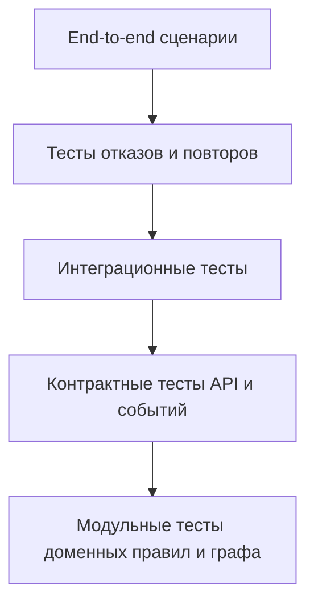

# 11. Тестирование

## Стратегия

Тестирование должно проверять не только API, но и архитектурные свойства: идемпотентность, работу при отказах, отсутствие полного профиля пассажира, стабильность контрактов и корректность маршрутов.

## Матрица проверок

| Область | Что проверить | Тип проверки |
|---|---|---|
| Создание сессии | Канал создает `JourneySession` по ссылке на билет | Integration / E2E |
| Билетная интеграция | Ответ билетной системы преобразуется в `TicketReference` и `TripContext` | Contract / Integration |
| Расписание | Статус рейса и платформа корректно попадают в сценарий | Contract / Integration |
| Навигация | Маршрут строится по карте-графу и учитывает недоступные зоны | Unit / Integration |
| Сценарные правила | Смена платформы создает новый шаг и подсказку | Unit |
| Идемпотентность | Один `external_event_id` не применяется дважды | Failure test |
| Доставка подсказки | Worker создает `NotificationDelivery` и обрабатывает ошибку доставки | Integration |
| Безопасность | Канал не читает чужую сессию | Integration / E2E |
| Retention | Истекшая сессия завершается и очищается по правилам | Integration |
| Наблюдаемость | Логи содержат `journey_session_id`, но не содержат билет и персональные данные | Integration / review |

## Обязательные сценарии приемки

### Happy path

1. Пользовательский канал отправляет `POST /journey-sessions`.
2. Fake билетной системы возвращает рейс.
3. Fake расписания возвращает платформу и время отправления.
4. Платформа рассчитывает маршрут.
5. API возвращает сессию, маршрут и подсказки.

Ожидаемый результат: сессия в статусе `route_ready` или `waiting_boarding`, есть `TripContext`, `RouteSegment` и хотя бы одна `Hint`.

### Смена платформы

1. Есть активная сессия с маршрутом к платформе A.
2. Fake расписания отправляет `trip.platform.changed` с платформой B.
3. Платформа принимает событие и пересчитывает маршрут.
4. Worker передает подсказку во внешний канал доставки.

Ожидаемый результат: маршрут указывает на платформу B, создана подсказка с причиной `platform_changed`.

### Отказ расписания

1. Есть активная сессия с последним известным `TripContext`.
2. Сервис расписания недоступен.
3. Канал запрашивает состояние сессии.

Ожидаемый результат: API возвращает сценарий с `data_freshness = stale`, а не полную ошибку.

### Повтор события

1. Платформа получает событие `trip.platform.changed`.
2. То же событие с тем же `external_event_id` приходит повторно.

Ожидаемый результат: `ExternalEvent` фиксирует повтор, новый маршрут и новая подсказка не создаются.

### Безопасность сессии

1. Канал A создает сессию.
2. Канал B пытается прочитать эту сессию.

Ожидаемый результат: доступ запрещен, в логах нет полного билета или персональных данных.

## Контрактные тесты

| Контракт | Проверка |
|---|---|
| API платформы для пользовательских каналов | Стабильные поля ответа, коды ошибок, версии схем |
| События расписания | `external_event_id`, `event_type`, `event_schema_version`, подпись |
| Канал доставки | Формат подсказки, идентификатор сессии канала, статус ответа |
| Билетная система | Минимальные поля для связи билета и рейса |

## Нагрузочные проверки MVP

- 100 запросов чтения сценария в секунду.
- 10 событий изменения расписания в секунду.
- 1000 активных сессий на один рейс при смене платформы.
- Возраст старейшего сообщения в очереди подсказок не выше 60 секунд.

## Ручные проверки

- Читаемость сценария для пассажира в пользовательском канале.
- Понятность причины подсказки для сотрудника.
- Корректность карты-графа на реальном плане вокзала.
- Согласованность терминов в документации и API.

