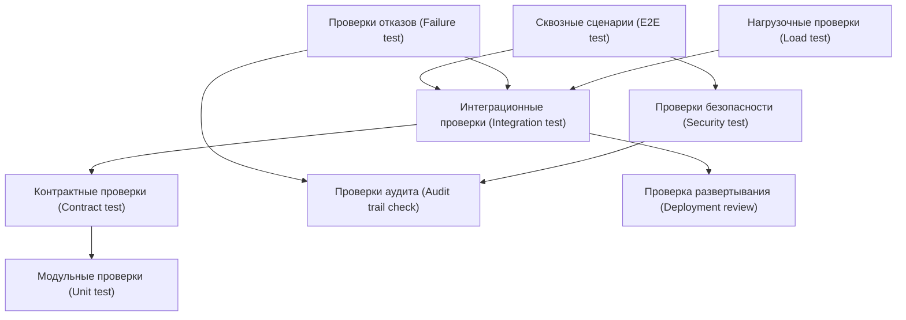

# 11. Тестирование

## Стратегия

Тестирование MVP должно проверять не только отдельные API, но и архитектурные свойства платформы: идемпотентность, работу при отказах, безопасность сессионных данных, отсутствие полного профиля пассажира, корректность маршрутов, стабильность контрактов и контролируемость через систему наблюдения за инфраструктурой.

## Типы проверок

| Тип проверки | Что означает |
|---|---|
| Проверка API (API test) | Запрос к API платформы и проверка ответа, кода ошибки, схемы и прав доступа без полного сквозного сценария |
| Интеграционная проверка (Integration test) | Проверка взаимодействия платформы с PostgreSQL, RabbitMQ, внешней системой или внутренним сервисом вокзала |
| Модульная проверка (Unit test) | Проверка отдельного правила, функции или алгоритма: сценарная политика, идемпотентность, расчет маршрута |
| Сквозной сценарий (E2E test) | Проверка полного пути от запроса канала или внешнего события до результата в канале |
| Контрактная проверка (Contract test) | Проверка стабильности API, событий, схем payload и обязательных полей интеграции |
| Проверка отказа (Failure test) | Проверка поведения при недоступности сервиса, повторе события, таймауте или ошибке обработки |
| Проверка аудита (Audit trail check) | Проверка, что действия платформы можно объяснить через логи, аудит, `journey_session_id` и причины решений |
| Проверка схемы развертывания (Deployment review) | Проверка соответствия тестируемой схемы контейнерам, сетевым связям, секретам и правилам масштабирования |
| Проверка безопасности (Security test) | Проверка авторизации, запрета доступа к чужой сессии, маскирования чувствительных данных и прав ролей |
| Нагрузочная проверка (Load test) | Проверка поведения API, RabbitMQ, PostgreSQL и сервиса уведомлений при ожидаемой пиковой нагрузке |
| Демонстрация сценария (Demonstration) | Ручной показ поведения MVP на подготовленных данных для защиты архитектурного решения |

## Матрица проверок

| Область | Что проверить | Тип проверки |
|---|---|---|
| Создание сессии | Индивидуальный канал создает `JourneySession` по ссылке или хэшу билета и явной начальной точке | Сквозной сценарий (E2E test), Проверка API (API test) |
| Билетная интеграция | Ответ билетной системы преобразуется в `TicketReference` и `TripContext` без хранения полного билета | Контрактная проверка (Contract test), Интеграционная проверка (Integration test) |
| Расписание | Статус рейса и платформа корректно попадают в `TripContext` | Контрактная проверка (Contract test), Интеграционная проверка (Integration test) |
| Навигация | Маршрут строится по `start_node_id`, `target_node_id`, `map_version` и учитывает недоступные зоны | Модульная проверка (Unit test), Интеграционная проверка (Integration test) |
| Сценарные правила | Смена платформы или закрытие зоны создает новый `ScenarioStep` и подсказку с причиной | Модульная проверка (Unit test) |
| Идемпотентность | Один `external_event_id` не применяется дважды, один `idempotency_key` не создает вторую сессию | Проверка отказа (Failure test), Модульная проверка (Unit test) |
| Сервис уведомлений | Сервис создает `NotificationDelivery`, повторяет доставку и фиксирует ошибку канала | Интеграционная проверка (Integration test), Проверка отказа (Failure test) |
| RabbitMQ | `hint.created` и `journey_session.expired` публикуются, читаются, подтверждаются и не теряются при повторе | Интеграционная проверка (Integration test), Проверка отказа (Failure test) |
| PostgreSQL и outbox | Состояние, аудит, `ExternalEvent`, `IdempotencyRecord` и исходящие события сохраняются транзакционно | Интеграционная проверка (Integration test), Проверка аудита (Audit trail check) |
| Публичное табло | Табло получает только `PublicMessage` и не получает `JourneySession`, `ticket_ref`, `channel_session_id` | Проверка безопасности (Security test), Проверка API (API test) |
| Служебный канал | Сотрудник видит состояние сценария и причину подсказки без полного профиля пассажира | Проверка безопасности (Security test), Сквозной сценарий (E2E test) |
| IT-канал | IT-специалист загружает новую `map_version`, проверяет интеграции и видит диагностику по роли | Проверка API (API test), Проверка безопасности (Security test) |
| Внутренние сервисы вокзала | Карта-граф, ограничения зон, публичные сообщения и сервис роботов обмениваются событиями по контракту | Контрактная проверка (Contract test), Интеграционная проверка (Integration test) |
| Политика хранения данных | Истекшая сессия завершается, `journey_session.expired` обрабатывается идемпотентно, данные очищаются по правилам | Интеграционная проверка (Integration test), Проверка аудита (Audit trail check) |
| Система наблюдения | Логи и аудит содержат `request_id`, `journey_session_id`, `external_event_id`, но не содержат чувствительные данные | Проверка аудита (Audit trail check), Проверка безопасности (Security test) |
| Развертывание | Контейнеры, PostgreSQL, RabbitMQ, переменные окружения, секреты и сетевые связи соответствуют разделу развертывания | Проверка схемы развертывания (Deployment review) |

## Обязательные сценарии приемки

### Happy path

1. Индивидуальный канал отправляет `POST /journey-sessions` с `idempotency_key`, `ticket_ref`, `channel_session_id` и `start_node_id`.
2. Fake билетной системы возвращает рейс.
3. Fake расписания возвращает платформу и время отправления.
4. Платформа получает актуальную `map_version` и ограничения зон.
5. Платформа рассчитывает маршрут.
6. API возвращает сессию, маршрут и подсказки.

Ожидаемый результат: `JourneySession` в статусе `route_ready` или `waiting_boarding`, есть `TripContext`, `RouteSegment`, `ScenarioStep` и хотя бы одна подсказка `Hint`.

### Смена платформы

1. Есть активная сессия с маршрутом к платформе A.
2. Fake расписания отправляет `trip.platform.changed` с платформой B и уникальным `external_event_id`.
3. Платформа принимает событие, обновляет `TripContext` и пересчитывает маршрут.
4. Сценарный оркестратор публикует `hint.created`.
5. Сервис уведомлений передает подсказку в индивидуальный или служебный канал.

Ожидаемый результат: маршрут указывает на платформу B, создана подсказка с причиной `platform_changed`, создана запись `NotificationDelivery`.

### Отказ расписания

1. Есть активная сессия с последним известным `TripContext`.
2. Сервис расписания недоступен.
3. Канал запрашивает состояние сессии.

Ожидаемый результат: API возвращает сценарий с `data_freshness = stale`, а не полную ошибку; маршрут и подсказки остаются доступными с пометкой устаревших данных.

### Повтор события

1. Платформа получает событие `trip.platform.changed`.
2. То же событие с тем же `external_event_id` приходит повторно.

Ожидаемый результат: `ExternalEvent` фиксирует повтор как `duplicate`, новый маршрут и новая подсказка не создаются.

### Безопасность сессии

1. Канал A создает сессию.
2. Канал B пытается прочитать эту сессию.

Ожидаемый результат: доступ запрещен, в логах нет полного билета, QR-кода, ФИО, документов, токенов и секретов.

### Киоск или робот-стюарт как начальная точка

1. Киоск или робот-стюарт создает сессию и передает фиксированный `start_node_id`.
2. Платформа проверяет, что точка существует в активной `map_version`.
3. Платформа строит маршрут без indoor-позиционирования.

Ожидаемый результат: `RouteSegment` начинается от переданной точки, а `JourneySession` не содержит координат точного позиционирования пассажира.

### Закрытие зоны вокзала

1. Есть активная сессия, маршрут которой проходит через `zone_id`.
2. Сервис ограничений зон отправляет `station_zone.closed`.
3. Платформа принимает событие и пересчитывает маршрут.

Ожидаемый результат: если обходной маршрут есть, создаются новые `RouteSegment` и подсказка; если маршрута нет, `ScenarioStep` получает статус `route_unavailable`, а подсказка рекомендует обратиться к сотруднику.

### Публичное сообщение для табло

1. Сервис публичных сообщений отправляет `public_message.published`.
2. Публичный канал вызывает `GET /public-messages`.
3. Табло получает сообщение для вокзала, зоны или рейса.

Ожидаемый результат: создан или обновлен `PublicMessage`; ответ не содержит `JourneySession`, `ticket_ref`, `channel_session_id`, персональный маршрут и индивидуальные подсказки.

### Отказ доставки подсказки

1. Сценарный оркестратор публикует `hint.created`.
2. Сервис уведомлений пытается доставить подсказку в канал.
3. Канал недоступен или возвращает ошибку.

Ожидаемый результат: `NotificationDelivery.status = failed`, номер попытки увеличен, подсказка остается доступна через `GET /journey-sessions/{id}/hints`.

### RabbitMQ недоступен

1. Сценарный оркестратор создает событие для доставки подсказки.
2. RabbitMQ временно недоступен.
3. Событие фиксируется в PostgreSQL/outbox.
4. После восстановления RabbitMQ событие публикуется повторно.

Ожидаемый результат: событие не потеряно, дубль подсказки не создан, доставка продолжается после восстановления брокера.

### Истечение сессии

1. Активная сессия достигает срока истечения.
2. Планировщик очистки публикует `journey_session.expired`.
3. То же событие истечения обрабатывается повторно.

Ожидаемый результат: `JourneySession` переходит в `expired`, повтор события не меняет финальный статус и не создает новые активные подсказки.

### Загрузка новой версии карты

1. IT-канал загружает новую `map_version`.
2. Платформа проверяет связность графа, узлы и ребра.
3. Новые маршруты строятся по новой версии карты.
4. Уже сохраненные маршруты сохраняют ссылку на прежнюю `map_version`.

Ожидаемый результат: новая карта опубликована без перезаписи старой версии, ранее рассчитанные `RouteSegment` остаются воспроизводимыми.

### Служебный канал сотрудника

1. Сотрудник открывает сценарий пассажира через служебный канал.
2. Платформа проверяет роль сотрудника.
3. Канал запрашивает причину подсказки или отклонения.

Ожидаемый результат: сотрудник видит состояние сценария, причину и следующий рекомендуемый шаг, но не видит полный профиль пассажира, документы, платежные данные и полный билет.

### Логи и аудит

1. Выполняется happy path, смена платформы и отказ доставки подсказки.
2. Проверяются структурные логи, аудит и события.

Ожидаемый результат: логи содержат `request_id`, `journey_session_id`, `external_event_id`, `reason`; логи не содержат полный билет, QR-код, ФИО, документы, токены, секреты и полный payload чувствительных событий.

## Контрактные проверки

| Контракт | Проверка |
|---|---|
| API платформы для индивидуальных каналов | Стабильные поля создания и чтения `JourneySession`, коды ошибок, проверка `idempotency_key` |
| API платформы для публичных каналов | `GET /public-messages` возвращает только общие неперсонализированные сообщения |
| API платформы для служебных каналов | Служебный канал получает состояние сценария и причины решений без полного профиля пассажира |
| API платформы для IT-канала | Загрузка карты, диагностика интеграций и настройки требуют административной роли |
| События расписания | `external_event_id`, `source_system`, `event_type`, `event_schema_version`, подпись |
| События карты-графа | `station_map.version.published`, `map_version`, статус публикации и совместимость схемы |
| События ограничений зон | `station_zone.closed`, `station_zone.opened`, `zone_id`, срок действия ограничения |
| События публичных сообщений | `public_message.published`, область сообщения, срок действия, отсутствие сессионных данных |
| Сервис роботов-стюартов | Передача точки взаимодействия робота без физического управления роботом со стороны платформы |
| RabbitMQ-события | `hint.created`, `journey_session.expired`, устойчивые очереди, подтверждение обработки |
| Билетная система | Минимальные поля для связи билета и рейса без полного билета |

## Нагрузочные проверки MVP

- 100 запросов чтения сценария в секунду через API платформы.
- 10 событий изменения расписания или зон в секунду через интеграционные адаптеры.
- 1000 активных сессий на один рейс при смене платформы.
- Возраст старейшего сообщения `hint.created` в RabbitMQ не выше 60 секунд.
- Сервис уведомлений обрабатывает пик подсказок без роста `NotificationDelivery.failed` выше допустимого порога.
- PostgreSQL сохраняет приемлемое время ответа для чтения `JourneySession`, записи `ExternalEvent` и outbox-событий.

## Ручные проверки

- Читаемость сценария для пассажира в приложении, сайте, киоске и роботе-стюарте.
- Понятность причины подсказки для сотрудника вокзала.
- Отсутствие персональных данных на публичном табло.
- Корректность карты-графа на реальном плане вокзала.
- Согласованность терминов в документации, API, событиях и диаграммах.
