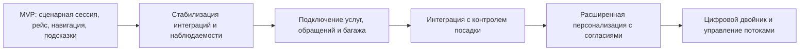

# 12. Риски и развитие

## Главные риски

| Риск | Вероятность | Влияние | Мера снижения |
|---|---|---|---|
| Внешние сервисы не имеют стабильных API | Средняя | Высокое | Адаптеры, контрактные тесты, mock-среда |
| События расписания приходят с задержкой | Средняя | Высокое | `data_freshness`, последнее известное состояние, алерты |
| Персональные данные случайно попадают в платформу | Средняя | Высокое | Минимальная модель данных, маскирование логов, проверки payload |
| Карта-граф не соответствует реальному вокзалу | Средняя | Среднее | Версионирование карты, ручная приемка, контроль связности |
| Сценарные правила становятся слишком сложными | Средняя | Среднее | ADR, тесты правил, явные причины подсказок |
| Подключение нового канала требует изменений домена | Средняя | Среднее | API-first контракты и отделение канала от сценария |
| Массовая смена платформы создает пик уведомлений | Средняя | Среднее | Очередь, worker, backpressure, приоритеты |
| Пользователь ожидает персонализацию, которой нет в MVP | Средняя | Среднее | Явно описать контекстную персонализацию и границы MVP |

## Ограничения MVP

- Нет полного профиля пассажира.
- Нет indoor-позиционирования.
- Нет цифрового двойника вокзала.
- Нет самостоятельного пассажирского приложения.
- Нет коммерческого заказа услуг.
- Нет интеграции с контролем посадки, багажом и обращениями.
- Нет автоматического управления оборудованием вокзала.

## Технический долг, допустимый в MVP

| Долг | Почему допустим | Когда закрывать |
|---|---|---|
| Простая модель сценарных правил в коде | Быстрее проверить ценность оркестратора | Когда правил станет много или ими должен управлять аналитик |
| Один PostgreSQL как основное хранилище | Упрощает транзакции и эксплуатацию | При росте нагрузки или появлении тяжелой аналитики |
| Fake внешних систем на тестовом стенде | Не блокирует разработку | После стабилизации реальных контрактов |
| Ручная публикация карты-графа | Достаточно для первой версии | При частых изменениях инфраструктуры вокзала |

## План развития

## Возможные расширения

- Подключение коммерческих услуг вокзала как внешнего сервиса.
- Подключение сервиса обращений пассажиров для сценариев помощи.
- Подключение багажа и потерянных вещей.
- Интеграция с контролем посадки для проверки готовности пассажира к проходу.
- Добровольный профиль пассажира с согласиями и политиками хранения.
- Indoor-позиционирование и динамическая навигация.
- Аналитика узких мест пассажирского пути.
- Цифровой двойник вокзала и прогноз загрузки зон.

## Решения для пересмотра

| Решение | Когда пересмотреть | Что смотреть |
|---|---|---|
| Платформа как оркестратор | Если внешние сервисы не дают нужных данных или SLA | Доля отказов зависимостей, ручные обходы |
| Отказ от полного профиля | Если ценность персонализации нельзя достичь контекстом | Требования бизнеса, согласия, риски ПДн |
| Карта-граф вместо indoor-позиции | Если пассажиры часто не могут сопоставить себя с точкой входа | Ошибки маршрутов, обращения, UX-тесты |
| Один PostgreSQL | Если растет нагрузка, аналитика или требования к изоляции данных | Метрики БД, блокировки, стоимость поддержки |
| Сценарные правила в коде | Если правила часто меняются без релиза | Частота изменений, ошибки конфигурации |

## Открытые вопросы

- Какие реальные внешние системы ВСМ будут доступны для MVP?
- Какие требования к хранению обезличенного аудита будут приняты юридически?
- Какой пользовательский канал станет первым потребителем API?
- Нужна ли в первой версии отдельная панель сотрудника или достаточно служебного API?

