# 12. Риски и развитие

Раздел фиксирует оставшиеся риски MVP и направления развития платформы после текущей архитектурной проработки. MVP остается платформой-оркестратором пассажирского сценария: она ведет `JourneySession`, использует данные внешних систем ВСМ и внутренних сервисов вокзала, выдает маршруты, подсказки и общие публичные сообщения, но не становится владельцем билетов, расписания, пользовательских интерфейсов и физического оборудования.

## Главные риски

| Риск | Вероятность | Влияние | Мера снижения |
|---|---|---|---|
| Внешние системы ВСМ не имеют стабильных API или событий | Средняя | Высокое | Интеграционные адаптеры, контрактные проверки, тестовые заглушки, версионирование схем событий |
| События расписания приходят с задержкой или повторяются | Средняя | Высокое | `TripContext`, `external_event_id`, журнал `ExternalEvent`, идемпотентная обработка, `data_freshness`, последнее известное состояние |
| Внутренние сервисы вокзала дают неполные или устаревшие данные | Средняя | Высокое | Контракты с сервисом карты-графа, ограничений зон, публичных сообщений и роботов; контроль свежести данных |
| Карта-граф или `map_version` не соответствуют реальному вокзалу | Средняя | Высокое | Версионирование карты, проверка связности графа, ручная приемка, запрет перезаписи активной версии |
| Закрытие зоны или ремонтные работы не учтены в маршруте | Средняя | Высокое | События `station_zone.closed` и `station_zone.opened`, пересчет маршрутов, подсказка обратиться к сотруднику при `route_unavailable` |
| Персональные данные случайно попадают в платформу или логи | Средняя | Высокое | Минимальная модель данных, запрет полного билета и QR-кода, маскирование логов, проверки payload и аудит доступа |
| Публичное табло получает персональную информацию | Низкая | Критическое | Отдельный поток `PublicMessage`, запрет `JourneySession`, `ticket_ref`, `channel_session_id`, маршрутов и персональных подсказок |
| Подключение нового канала требует изменения доменной модели | Средняя | Среднее | API-first контракты, отделение каналов отображения от `JourneySession` и сценарного оркестратора |
| Робот-стюарт воспринимается как часть платформы, а не как канал | Средняя | Среднее | Зафиксировать границу: платформа отдает сценарий, маршрут и подсказки; физическим роботом управляет сервис роботов |
| Массовая смена платформы создает пик подсказок | Средняя | Высокое | RabbitMQ, сервис уведомлений, подтверждения доставки, повторные попытки, dead-letter и контроль очереди `hint.created` |
| RabbitMQ недоступен или очередь быстро растет | Средняя | Среднее | Durable-очереди, PostgreSQL/outbox, алерты по возрасту сообщений, повторная публикация после восстановления |
| PostgreSQL недоступен или транзакции становятся узким местом | Низкая | Критическое | Резервное копирование, индексы, короткие транзакции, пул соединений, мониторинг блокировок и план восстановления |
| Планировщик очистки не выполняет политику хранения данных | Средняя | Среднее | Контроль запусков, один активный исполнитель или выбор лидера, аудит удаления и предупреждения эксплуатации |
| Сценарные правила становятся слишком сложными для кода | Средняя | Среднее | ADR, модульные проверки правил, явные причины подсказок, последующий вынос правил в конфигурацию |
| Пользователь ожидает персонализацию, которой нет в MVP | Средняя | Среднее | Явно описывать контекстную персонализацию без полного профиля пассажира и границы MVP |

## Ограничения MVP

- Нет полного профиля пассажира, ФИО, документов, платежных данных, полного QR-кода билета и истории поездок.
- Нет indoor-позиционирования: начальная точка маршрута передается явно как `start_node_id` через приложение, сайт, киоск или робота-стюарта.
- Нет самостоятельного пассажирского приложения внутри платформы: приложение, сайт, киоск, робот-стюарт, табло, служебный и IT-канал остаются внешними каналами.
- Нет персонализации публичного табло: табло получает только общие неперсонализированные `PublicMessage`.
- Нет коммерческих заказов услуг, обращений пассажиров, багажа, потерянных вещей и контроля посадки.
- Нет цифрового двойника вокзала и автоматического управления пассажирскими потоками.
- Нет физического управления роботами, табло, турникетами и оборудованием вокзала со стороны платформы.
- Нет замены билетной системы, сервиса расписания и внутренних сервисов конкретного вокзала.

## Технический долг, допустимый в MVP

| Долг | Почему допустим | Когда закрывать |
|---|---|---|
| Сценарные правила в коде | Быстрее проверить ценность оркестратора и объяснимых подсказок | Когда правила часто меняются без релиза или ими должен управлять аналитик |
| PostgreSQL без PostGIS для карты-графа | Indoor-навигация MVP является топологической: узлы, ребра, зоны, ограничения | Если появятся сложные геометрии, наружная навигация или пространственные запросы |
| Один PostgreSQL как основное хранилище состояния | Упрощает транзакции, аудит, идемпотентность и эксплуатацию MVP | При росте нагрузки, появлении тяжелой аналитики или требований к изоляции данных |
| RabbitMQ в компактной конфигурации | Достаточно для очередей подсказок, повторов и dead-letter в MVP | При промышленной отказоустойчивости, большем числе вокзалов или высоком потоке событий |
| PostgreSQL/outbox вместо долговременного хранения событий в брокере | Критичные события фиксируются транзакционно вместе с состоянием платформы | Если потребуется replay больших потоков событий и аналитика на уровне сети вокзалов |
| Docker Compose как способ запуска MVP | Позволяет компактно поднять API, сервисы платформы, PostgreSQL, RabbitMQ и заглушки | При переходе к промышленной эксплуатации и требованиям к автоматическому масштабированию |
| Тестовые заглушки внешних систем | Не блокируют разработку до стабилизации реальных контрактов | После появления доступных API билетной системы, расписания и сервисов вокзала |
| Ручная публикация карты-графа | Достаточна для первой версии и учебной демонстрации архитектуры | При частых изменениях зон, ремонтных работ и точек интереса |
| Ограниченная автоматизация IT-операций | MVP требует только базовой загрузки карты, настройки интеграций и диагностики | Когда появятся эксплуатационные роли, регламенты и регулярные изменения конфигурации |

## План развития

```mermaid
flowchart LR
    MVP["MVP: JourneySession, рейс, карта-граф, маршрут, подсказки"]
    Stabilization["Стабилизация контрактов, безопасности и эксплуатации"]
    StationServices["Развитие внутренних сервисов вокзала и каналов"]
    Positioning["Wi-Fi/Bluetooth-позиционирование и динамическая навигация"]
    ServiceScenarios["Коммерческие услуги, обращения, багаж и контроль посадки"]
    Personalization["Расширенная персонализация с согласиями"]
    DigitalTwin["Цифровой двойник и управление потоками"]

    MVP --> Stabilization
    Stabilization --> StationServices
    StationServices --> Positioning
    Positioning --> ServiceScenarios
    ServiceScenarios --> Personalization
    Personalization --> DigitalTwin
```

Стабилизация включает контракты API и событий, систему наблюдения за инфраструктурой, резервное копирование PostgreSQL, контроль RabbitMQ, аудит причин подсказок и проверку безопасности данных. Развитие внутренних сервисов вокзала включает карту-граф, ограничения зон, публичные сообщения, табло и сервис роботов-стюартов.

## Возможные расширения

- Автоматическое определение положения пассажира через Wi-Fi, Bluetooth-маяки или другие indoor-технологии.
- Расширение роботов-стюартов как диалогового канала: уточнение точки входа, помощь при отклонениях, передача пассажира сотруднику.
- Расширенное управление публичными сообщениями и электронными табло по зонам, рейсам и типам событий.
- Подключение коммерческих услуг вокзала как внешних сервисов.
- Подключение сервиса обращений пассажиров и сценариев помощи.
- Подключение багажа, потерянных вещей и сервисов сопровождения.
- Интеграция с контролем посадки для проверки готовности пассажира к проходу.
- Добровольный профиль пассажира с согласиями, ролевым доступом и отдельной политикой хранения данных.
- Аналитика узких мест пассажирского пути на обезличенных событиях и агрегатах.
- Цифровой двойник вокзала, прогноз загрузки зон и управление пассажирскими потоками.
- Переход от Docker Compose к промышленной оркестрации контейнеров при росте требований к отказоустойчивости.

## Решения для пересмотра

| Решение | Когда пересмотреть | Что смотреть |
|---|---|---|
| Платформа как оркестратор сценария | Если зависимые системы не дают нужных данных или SLA | Доля отказов зависимостей, ручные обходы, незакрытые сценарии |
| Отказ от полного профиля пассажира | Если контекстной персонализации недостаточно для целевых сценариев | Требования бизнеса, согласия, юридические риски, ценность персонализации |
| Карта-граф без indoor-позиционирования | Если пассажиры часто ошибаются с начальной точкой | Ошибки маршрутов, обращения, UX-тесты, доля `route_unavailable` |
| PostgreSQL без PostGIS | Если навигация выходит за пределы топологического indoor-графа | Потребность в геометриях, наружных маршрутах и пространственных запросах |
| Один PostgreSQL | Если растет нагрузка, аналитика или требования к изоляции данных | Метрики БД, блокировки, длительность транзакций, объем аудита и событий |
| RabbitMQ как брокер MVP | Если нужен долговременный replay, потоковая аналитика или масштаб сети вокзалов | Объем событий, требования к replay, стоимость эксплуатации Kafka/Redpanda/NATS |
| Сценарные правила в коде | Если правила часто меняются без релиза | Частота изменений, ошибки конфигурации, потребность в управлении правилами |
| Публичное табло как неперсонализированный канал | Если появятся персональные дисплеи или приватные экраны | Риски раскрытия данных, модель доступа, физическая приватность устройства |
| Внутренние сервисы вокзала как внешние зависимости платформы | Если конкретный вокзал не может обеспечить стабильные контракты | SLA сервисов, качество данных карты и зон, частота ручных корректировок |
| Сервис уведомлений как отдельный процесс | Если доставка подсказок становится слишком сложной или многоканальной | Очереди RabbitMQ, доля `NotificationDelivery.failed`, задержки доставки |
| Планировщик очистки как единственный активный исполнитель | Если появятся строгие требования к высокой доступности очистки | Пропуски запусков, объем устаревших данных, надежность выбора лидера |
| Политика хранения данных | Если изменятся юридические требования или потребности расследований | Сроки хранения аудита, `ExternalEvent`, `RouteSegment`, подсказок и карт |

## Открытые вопросы

- Какие реальные внешние системы ВСМ будут доступны для MVP и какие SLA они смогут предоставить?
- Какой безопасный формат `ticket_ref` или `ticket_hash` допустим для связи билета и рейса без хранения полного билета?
- Какие юридические сроки хранения обезличенного аудита, `ExternalEvent`, подсказок и `NotificationDelivery` будут приняты?
- Какой формат обмена с сервисом карты-графа выбрать для MVP: API, файл версии карты или событийная публикация `station_map.version.published`?
- Какая минимальная модель закрытых зон и ремонтных работ нужна для корректного пересчета маршрутов?
- Как несколько каналов безопасно связываются с одной `JourneySession`, если пассажир начинает сценарий в приложении, а продолжает у киоска или робота-стюарта?
- Какие публичные сообщения должны попадать на табло в MVP: только вокзал и зона или также рейс, платформа и тип события?
- Какие эксплуатационные роли будут отвечать за разбор dead-letter очереди, проверку карты-графа и контроль политики хранения данных?
