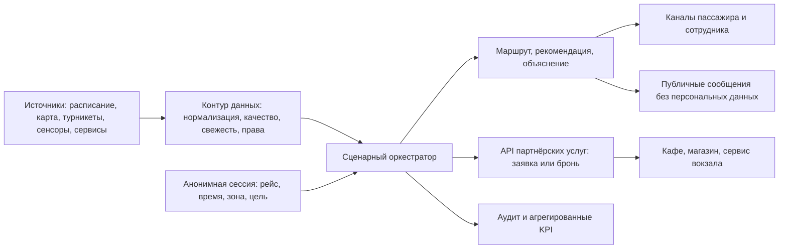

# Глава 1. Теоретические основы развития цифровой платформы умного вокзала для обеспечения бесшовного пассажирского пути на ВСМ

## Введение

Высокоскоростная железнодорожная магистраль (ВСМ) образует не только линию движения поездов, но и сеть сложных транспортно-сервисных узлов. Для пассажира качество поездки определяется не одним фактом прибытия поезда, а последовательностью взаимосвязанных действий: получением информации, прибытием на вокзал, ориентированием в здании, прохождением обязательных процедур, ожиданием, доступом к услугам и посадкой. Если каждое действие поддерживается отдельной системой, пассажир вынужден самостоятельно сопоставлять расписание, билет, табло, навигацию и предложения вокзальных сервисов. В результате даже при технически исправной работе отдельных систем путь остаётся фрагментированным.

В качестве предметного контекста в работе рассматривается проектируемая ВСМ Москва—Санкт-Петербург. На дату подготовки исследования она является реализуемым инфраструктурным проектом, а не действующей линией; поэтому работа не приписывает конкретному вокзалу неподтверждённые характеристики, фактические пассажиропотоки или состав оборудования. Официальные материалы Минтранса фиксируют проектный характер ВСМ и необходимость координации её участников [1]. Транспортная стратегия России и документы цифровой трансформации транспортной отрасли формируют общий ориентир на доступность, технологическое развитие и использование данных в транспортном комплексе [2; 3].

В исходной архитектурной документации репозитория описан MVP платформы-оркестратора. Он ведёт анонимную сессию пассажирского пути, получает контекст рейса из внешних систем, рассчитывает маршрут по карте-графу вокзала и возвращает подсказки внешним пользовательским каналам. Такой MVP принципиально не заменяет билетную систему, сервис расписания, приложение перевозчика или физическое оборудование. Он также не включает коммерческие заказы, автоматическое позиционирование, полный профиль пассажира и цифровой двойник. Эти ограничения рациональны для первого прототипа, но не исчерпывают задачу умного вокзального комплекса.

Настоящая глава формирует теоретическое основание развития MVP. Под развитием понимается не механическое добавление датчиков или витрины услуг, а переход к целевой API-first платформе, в которой: а) сведения о состоянии зон и потоков поступают из контролируемых источников; б) контекст поездки и состояние вокзала используются для своевременной рекомендации; в) независимые бизнесы и сервисы подключаются через управляемые интерфейсы; г) персональные данные минимизируются, а индивидуальное взаимодействие строится на временной сессии и согласии. Платформа остаётся цифровым ядром координации, а не владельцем всех данных, пользовательских каналов и процессов вокзала.

Цель главы — систематизировать подходы к бесшовному пассажирскому пути, умному вокзалу, цифровым платформам и мультиисточниковой аналитике; на этой основе определить понятийный аппарат, исследовательский пробел и методологию диссертации. Для достижения цели применён структурированный обзор русско- и англоязычных публикаций, нормативных документов, стандартов и открытых отраслевых материалов. Временной фокус обзора — 2016–2026 годы; более ранние источники сохранены там, где они задают базовые теории платформ и проектирования информационных систем.

## 1.1. Бесшовный пассажирский путь на ВСМ и проблема фрагментации вокзальных сервисов

### 1.1.1. Вокзал как узел пассажирского сценария

В данной работе пассажирский путь понимается как непрерывная последовательность целевых действий и информационных взаимодействий пассажира от первого цифрового обращения, прибытия на вокзал либо входа в него до посадки на поезд, пересадки или завершения пребывания. Термин «бесшовный» не означает отсутствия физических границ, контроля или ожидания. Он означает, что смена этапа не требует от пассажира заново искать данные, повторно объяснять контекст или вручную согласовывать противоречивые сведения разных сервисов.

Для ВСМ типовой сценарий включает по меньшей мере шесть этапов: подготовку к поездке; прибытие к вокзалу и вход в комплекс; ориентирование и прохождение регламентных процедур; ожидание; получение услуг; посадку либо обработку отклонения. На каждом этапе меняются цель пассажира, доступные каналы и критичность информации. До поездки востребованы сведения о времени отправления, способе прибытия и доступности сервисов. Внутри вокзала первичны указание зоны, маршрута и времени, остающегося до обязательного действия. При изменении платформы, задержке, закрытии прохода или снижении доступности зоны ключевой становится не общий информационный поток, а своевременное объяснение того, какое действие необходимо конкретному пассажиру.

Практики multimodal digital mobility services и исследования Mobility as a Service показывают, что пассажир воспринимает поездку как единый сервис, тогда как за ней стоят автономные поставщики транспорта, инфраструктуры, данных и услуг [33; 34; 41]. Для железнодорожного узла это означает наличие нескольких самостоятельных владельцев информации: перевозчик располагает билетным и поездным контекстом; диспетчерские и расписательные системы — оперативным статусом рейса; вокзал — картой, зонами, средствами информирования и сервисной инфраструктурой; арендаторы — ассортиментом, доступностью и статусом исполнения заказа. Нельзя предполагать, что единая организация будет владельцем всех этих данных. Следовательно, цифровое решение должно быть способно координировать распределённую среду, не разрушая границы ответственности участников.

Функциональная непрерывность пути достигается, если контекст, необходимый на новом шаге, доступен без повторного ввода и интерпретируется согласованно. К такому контексту относятся: ссылка на рейс и его актуальное состояние, временное окно до отправления, текущая или выбранная зона, ограничения маршрута, доступные сервисы и статус выполненных действий. Однако не вся информация нужна всем каналам. Публичное табло должно получить обобщённое сообщение о задержке или смене платформы, но не идентификатор сессии и не персональную рекомендацию. Сотрудник вокзала может видеть объяснимый служебный контекст обращения, но не полный профиль пассажира. Партнёрский сервис должен получить только те данные, которые необходимы для исполнения конкретного заказа или брони.

Таким образом, бесшовность имеет как минимум три измерения. Информационная бесшовность означает согласованность данных и своевременность их обновления. Пространственная бесшовность означает возможность найти доступный путь между зонами с учётом ограничений. Сервисная бесшовность означает возможность обнаружить, выбрать и получить услугу в нужный момент поездки. Четвёртое, организационное измерение связано с распределением ответственности: пассажир не должен сталкиваться с внутренними границами между системами, но они должны быть прозрачны для оператора и аудита.

### 1.1.2. Ограничения модели разрозненных сервисов

Исторически вокзальные цифровые сервисы развиваются по функциональному принципу. Система продажи билетов решает задачу оформления перевозки, табло — задачу отображения рейсов, навигация — задачу поиска объекта, система видеонаблюдения — задачу безопасности, а кафе и магазины используют собственные приложения и кассовые контуры. Такое разделение оправдано различием владельцев, жизненных циклов и требований к защите, однако оно создаёт несколько проблем.

Во-первых, возникает фрагментация состояния. Одно и то же событие — например, смена платформы — может быть отражено на табло, в расписании, на карте и в приложении с разной задержкой либо различной семантикой. Во-вторых, отсутствует сквозной контекст. Пассажир, получивший уведомление об изменении, часто должен сам определить, где он находится, какой маршрут актуален и достаточно ли времени для посещения заказанной услуги. В-третьих, интеграция каждого нового канала превращается в набор попарных соединений с билетной системой, расписанием, картой и сервисами. Это повышает стоимость изменений и ухудшает наблюдаемость.

Особую роль играет временная неопределённость. С точки зрения пассажира ошибка или запаздывание в информации о поезде критичнее, чем отсутствие второстепенной сервисной рекомендации. Поэтому модель платформы должна различать источник данных, время его обновления, уровень доверия и последствия устаревания. Европейские требования к телематическим приложениям железнодорожного транспорта подчёркивают необходимость совместимого доступа к данным о планировании поездки, пассажирской информации и билетах [11]. Спецификации SIRI, NeTEx и GTFS Realtime демонстрируют общий принцип: сведения о транспортном предложении и оперативных изменениях должны передаваться через документированные машиночитаемые модели, а не только в форме экранного сообщения [12–14].

Фрагментация влияет и на коммерческий контур. Если пользователь обнаружил кафе в стороннем приложении, оформил заказ, а затем получил изменение платформы, сервис не знает, остаётся ли время на получение заказа и как нужно проинформировать клиента. Обратная крайность — включение платежей, программы лояльности и исполнения всех заказов внутрь платформы — необоснованно превращает её в монолитного оператора. Для задачи диссертации обоснован промежуточный вариант: платформа обеспечивает каталог, контекстную рекомендацию, создание заявки или брони и передачу ограниченного набора данных партнёру; оплата, фискализация, производство и возврат остаются в системе исполнителя.

### 1.1.3. Участники и события сквозного сценария

Для теоретического описания вокзального комплекса недостаточно выделить пассажира и «систему». Минимальная акторная модель включает пассажира; оператора вокзала; перевозчика и владельца расписания; сотрудников помощи и безопасности; арендаторов и поставщиков услуг; поставщиков каналов взаимодействия; владельцев сенсоров и систем физической инфраструктуры; администратора цифровой платформы. Каждый участник поставляет данные, принимает решение либо создаёт ценность, поэтому его права и ожидаемые результаты должны быть зафиксированы до выбора технических средств.

Событийная модель позволяет связать действия участников. События поездки описывают изменение статуса рейса, платформы или времени. События вокзала описывают доступность зоны, прохода, лифта, сервиса или информационного устройства. События наблюдения фиксируют агрегированную загрузку зоны, интенсивность потока, качество датчика и время измерения. События сервиса отражают доступность предложения, создание брони, готовность заказа или его отмену. Наконец, события пассажирской сессии описывают выдачу рекомендации, её доставку, подтверждение либо истечение срока актуальности. Согласование этих классов необходимо не ради усложнения архитектуры, а для объяснимости: оператор должен понимать, на основании какого входного события была сформирована конкретная рекомендация.

Следовательно, центральной проблемой является не дефицит отдельных цифровых сервисов, а отсутствие слоя, который связывает оперативную ситуацию, этап пути и доступные действия. Такой слой не должен быть «ещё одним приложением». Его разумнее рассматривать как платформенный оркестратор: он собирает минимально необходимый контекст, применяет правила и предоставляет результат различным каналам. Это положение развивает исходную концепцию MVP и создаёт переход к умному вокзалу как к управляемой, наблюдаемой и открытой экосистеме.

## 1.2. Умный вокзальный комплекс: сенсорная среда, управление потоками и безопасность

### 1.2.1. Понятие умного вокзала

Под умным вокзальным комплексом в работе понимается физическая и цифровая среда транспортного узла, в которой состояние зон, инфраструктуры и сервисов наблюдается из проверяемых источников, интерпретируется с учётом контекста поездки и используется для информирования пассажиров, поддержки персонала и улучшения операционных решений. Это определение исключает упрощённую трактовку, при которой «умным» объявляется вокзал с большим числом экранов или датчиков. Наличие оборудования само по себе не создаёт ценности, если наблюдения не имеют понятной семантики, качества, владельца и сценария использования.

Умный вокзал целесообразно представить в виде четырёх взаимосвязанных слоёв. Первый, физический слой, включает зоны ожидания, проходы, платформы, турникеты, лифты, табло и сервисные точки. Второй, слой наблюдения, получает сведения от счётчиков прохода, турникетов, камер, устройств контроля оборудования, Wi‑Fi/Bluetooth-инфраструктуры и ручных сообщений персонала. Третий, информационно-аналитический слой нормализует наблюдения, оценивает их свежесть и агрегирует их до показателей, применимых к конкретной зоне или сценарию. Четвёртый, сервисный слой передаёт результаты пассажирским, публичным, служебным и партнёрским каналам. Стандарты умных и устойчивых городов поддерживают идею измеримых показателей и устойчивости сервисов, но не подменяют отраслевую модель вокзала [8–10].

Такое разделение важно по двум причинам. Во-первых, сенсор или камера не является источником окончательного управленческого вывода. Он формирует наблюдение с определённой точностью, зоной охвата, периодичностью и возможными ошибками. Во-вторых, рекомендации не должны напрямую управлять физической инфраструктурой без отдельного контура ответственности. В рамках рассматриваемой платформы допустимо рекомендовать пассажиру альтернативный зал ожидания, а оператору — обратить внимание на возрастающую загрузку. Автоматическое закрытие проходов, управление эскалатором или действия службы безопасности находятся вне границ работы и требуют самостоятельных регламентов.

### 1.2.2. Оценка загрузки зон и мультимодальное наблюдение

Загрузка зала ожидания, коридора или платформы не сводится к общему числу людей в здании. Для принятия решения важны зона, интервал времени, направление потока, доступная вместимость, уровень сервиса и ограничения доступности. Поэтому базовой аналитической единицей предлагается считать «состояние зоны» — запись, связывающую идентификатор зоны, время наблюдения, оценку загрузки, уровень достоверности, источник и применимые ограничения. Это позволяет отличить фактически полученное измерение от прогноза и от ручной оценки сотрудника.

Турникеты и счётчики прохода дают дискретные, но локальные сигналы о входе и выходе. Видеокамеры могут оценивать плотность и направление, однако чувствительны к освещению, заслонениям, ракурсу и правилам обработки изображений. Wi‑Fi и Bluetooth-наблюдения позволяют оценивать тенденцию присутствия устройств, но не тождественны числу людей: у одного человека может быть несколько устройств, а часть людей не передаёт наблюдаемый сигнал. Исследование на вокзале London Bridge сравнивало глубинные инфракрасные датчики и RGB-камеры с размеченными данными и показало необходимость полевой калибровки каждой технологии [27]. В работе для метро Шанхая комбинировались видеораспознавание и Wi‑Fi-зондирование для корректировки оценки потока [28]. Эти результаты не позволяют перенести конкретные показатели точности на российский вокзал, но подтверждают методический вывод: данные разных источников необходимо сопоставлять и сопровождать метаданными качества.

Мультимодальность не означает, что все возможные источники нужно собирать одновременно. Выбор делается от сценария к источнику, а не наоборот. Для рекомендации свободного зала ожидания может быть достаточно агрегированной оценки загруженности и доступности маршрута. Для расследования инцидента действуют отдельные требования к видеоархиву и доступу. Для долгосрочного планирования могут быть полезны обезличенные данные турникетов и статистика посещаемости сервисов. Такой подход снижает объём обрабатываемых данных и предотвращает неоправданное расширение цели сбора.

Краткосрочное прогнозирование дополняет фактические наблюдения. Исследования пассажиропотоков показывают, что точность прогноза зависит от выбранного временного шага, календарных факторов и характеристик конкретной станции [29]. Для высокоскоростных станций важна модель времени прибытия пассажиров к отправляющемуся поезду: поток определяется не только общим ритмом дня, но и совокупностью рейсов в ближайшем временном окне [30]. В целевой платформе прогноз трактуется как вспомогательный сигнал для предупреждения перегрузки, а не как основание для категоричного ограничения пассажира. При недостаточной уверенности система должна показать нейтральную информацию или передать ситуацию сотруднику.

### 1.2.3. От наблюдения к рекомендации

Рекомендация является объяснимым предложением действия, сформированным на основе цели пассажира, состояния поездки, доступности маршрута и состояния вокзальной зоны. Она отличается от навигационного указателя тем, что учитывает изменяющийся контекст; и от административного распоряжения тем, что не замещает решение оператора или требование безопасности. Примеры: предложить менее загруженный зал ожидания при наличии достаточного времени до посадки; предупредить о закрытии прохода и пересчитать маршрут; указать, что получение предварительно созданного заказа перестало быть совместимым с изменившимся временем посадки.

Для оценки рекомендации необходимы как минимум четыре условия. Первое — релевантность: она относится к текущему этапу пути и доступной для пассажира альтернативе. Второе — своевременность: информация доставлена до того, как действие потеряет смысл. Третье — выполнимость: предлагаемая зона и путь реально доступны с учётом ограничений и требований доступной среды. Четвёртое — объяснимость: служебный канал может установить, какие данные и правило породили совет. Эти условия связывают сенсорную среду с качеством пассажирского пути и не позволяют свести умный вокзал к витрине «самых популярных» сервисов.

Важной частью рекомендации является неопределённость. Если данные о загрузке поступили с задержкой, конфликтуют между собой или имеют низкое качество, платформа не должна выдавать оценку как достоверный факт. Вместо этого применяются признаки свежести, доверия к источнику и режимы деградации. Например, при недоступности датчика допустимо не рекомендовать «свободный зал», а показать нейтральную навигацию и сообщить оператору о недостаточности данных. Этот принцип согласуется с подходом к данным реального времени, где скорость поступления не избавляет от проверки происхождения, полноты и интерпретации данных [25].

### 1.2.4. Безопасность, приватность и доступность

Сенсоризация вокзала создаёт риск подменить безопасность чрезмерным наблюдением. Для целей управления потоками во многих случаях достаточно агрегированного показателя по зоне, а не идентификации каждого человека. Поэтому проектная презумпция работы состоит в минимизации данных: платформа хранит временный идентификатор сессии и служебные признаки контекста, но не формирует полный профиль, историю поездок, документы или платежные сведения. Индивидуальные рекомендации доступны только в активной сессии и при наличии законного основания, включая согласие там, где оно необходимо.

Федеральные законы об информации и персональных данных формируют обязательную российскую рамку обработки и защиты данных [4; 5]. При размещении решения на объектах, подпадающих под соответствующий режим критической информационной инфраструктуры, дополнительно требуется оценка применимости требований закона о безопасности КИИ [6]. Международные документы и стандарты — GDPR, NIST Privacy Framework, ISO/IEC 27701 — используются не как применимое право, а как методические источники принципов минимизации, ограничения цели, прозрачности и управления рисками приватности [15; 37; 38]. Для платформы это означает разделение потоков: публичные сообщения не должны содержать идентификаторы сессии; партнёр получает только данные, нужные для брони; аналитический контур использует агрегаты; доступ к исходным данным сенсоров и журналам разграничивается по ролям.

Доступность — ещё одно условие бесшовности. Рекомендация альтернативного маршрута не является полезной, если она игнорирует лифты, безбарьерный проход, ограничение подвижности или возможность обращения к сотруднику. Стандарт ISO 9241-210 подчёркивает необходимость человеко-ориентированного проектирования и проверки решений на задачах пользователей [40]. Поэтому качество системы должно оцениваться не только прогнозной точностью и задержкой API, но и тем, помогает ли она разным группам пассажиров завершить необходимый сценарий. Безопасность информации, устойчивость к сбоям и качество пользовательского взаимодействия образуют единый набор требований, а не конкурирующие дополнения.

## 1.3. API-first цифровая платформа как основа сервисной экосистемы

### 1.3.1. Платформа, а не единое приложение

Цифровая платформа отличается от отдельного прикладного сервиса тем, что предоставляет устойчивое программируемое ядро и правила взаимодействия для нескольких независимых групп участников. В теории платформ она рассматривается как механизм координации и создания ценности между владельцем, пользователями и комплементарными участниками [20; 22; 23]. Для вокзального комплекса такими группами являются пассажиры, оператор вокзала, перевозчики, владельцы каналов, сотрудники и партнёры услуг. Пассажирское мобильное приложение, киоск, сайт или робот-стюард в этой логике являются каналами представления, но не самим ядром платформы.

API-first означает, что возможности ядра изначально проектируются как документированные интерфейсы и события, а не возникают как побочный результат готового пользовательского интерфейса. Такой принцип особенно важен для вокзала: новый канал не должен заново интегрироваться с билетами, расписанием, картой, наблюдениями зон и каждым партнёром. Он получает согласованное состояние сценария через платформу и выбирает способ его отображения. Одновременно API-first не равнозначен «полной открытости». Внешние интерфейсы различаются по назначению, данным, уровню доверия и правилам доступа.

Исследования граничных ресурсов цифровых платформ определяют API, SDK, документацию и правила участия как средства, с помощью которых ядро связывает независимых участников [21; 24]. В контексте умного вокзала к граничным ресурсам относятся: контракт состояния пассажирского сценария для индивидуальных каналов; контракт обобщённых сообщений для публичных устройств; контракт событий операционной среды; каталог и интерфейс бронирования для партнёров; служебный контекст для сотрудников; требования к версии, авторизации, идемпотентности и аудиту. Такая классификация позволяет открыть полезные возможности партнёрам, не передавая им избыточный доступ к данным и процессам.

### 1.3.2. Целевые контуры платформы и их границы

Развитая модель включает пять логических контуров.

1. Контур контекста поездки объединяет ссылку на билет, рейс, расписание, платформу и временное окно сценария. Он не становится владельцем полного билета или персонального профиля.
2. Контур пространственной ситуации хранит версионную карту-граф, доступность зон, ограничения маршрутов и агрегированное состояние загрузки. Он не управляет физическим оборудованием.
3. Контур сценариев и рекомендаций сопоставляет цель пассажира, контекст поездки и ситуацию вокзала, формируя объяснимые подсказки.
4. Контур партнёрских услуг предоставляет каталог, доступность, создание заявки либо брони и передачу ограниченного контекста исполнителю. Платёж, фискализация, производство заказа, возврат и программа лояльности остаются за пределами платформы.
5. Контур аналитики и управления качеством собирает обезличенные операционные показатели, происхождение данных, журналы событий и KPI. Он не является полным цифровым двойником комплекса.

Разделение контуров сохраняет преимущества исходного MVP: анонимная сессия, внешние каналы, независимость от конкретного приложения и недопущение монолитной замены всех систем. Одновременно оно формирует расширяемую целевую архитектуру. В частности, появление датчика не требует изменения партнёрского каталога, а подключение нового кафе не требует доступа к данным камер. Именно управление этими границами, а не количество интеграций, определяет зрелость API-first платформы.

Для описания обмена данными полезны принципы стандартизированных транспортных и сенсорных моделей. SIRI и GTFS Realtime иллюстрируют передачу оперативных изменений сервиса, NeTEx — описание транспортной сети и предложений, а OGC SensorThings API — единообразное представление наблюдений, сенсоров и их свойств [12–14; 42]. Эти стандарты не предписывают готовую архитектуру российского вокзала, но позволяют избежать закрытых, нерасширяемых моделей там, где существуют устойчивые отраслевые понятия.

### 1.3.3. Сервисная экосистема и взаимодействие с бизнесами

Вокзальные кафе, магазины, комнаты отдыха, багажные сервисы и иные арендаторы выступают комплементарными участниками. Они создают ценность для пассажира, но имеют собственные учётные, производственные и юридические процессы. В платформенной модели целесообразно предоставить им стандартизированное включение в пассажирский сценарий: публикацию доступной услуги, указание условий получения, создание заказа или брони, передачу статуса исполнения и отмену в случаях, определённых партнёрским соглашением. Платформа при этом проверяет технический контракт и контекст сценария, но не присваивает себе роль продавца.

Такое распределение решает две задачи. Первая — контекстность предложения: система может не просто показать перечень всех кафе, а учитывать время до посадки, достижимость точки и её операционную доступность. Вторая — устойчивость экосистемы: партнёр может обновить ассортимент или статус, не изменяя пассажирское приложение, а новый канал может отобразить уже доступные предложения. Теория платформ подчёркивает, что открытие ресурсов приносит эффект только вместе с управлением качеством, правилами доступа и распределением ответственности [22–24].

Границы коммерческого контура в работе сформулированы намеренно строго. В состав целевой модели входят поиск, рекомендация, создание заявки и бронирование без платежа. Не входят хранение платёжных реквизитов, эквайринг, кассовые операции, программа лояльности, урегулирование возврата и персональная рекламная сегментация. Это уменьшает объём персональных и финансовых данных в ядре платформы, облегчает подключение разнородных бизнесов и позволяет сосредоточить исследование на обеспечении бесшовного пути, а не на построении маркетплейса.

### 1.3.4. Управление интерфейсами и событиями

API-first платформа нуждается не только в наборе эндпоинтов, но и в правилах их жизненного цикла. Для каждого интерфейса определяются владелец, аудитория, минимально допустимые поля, версия, политика авторизации, ограничение частоты, журналирование и условия прекращения доступа. Для событий дополнительно фиксируются идентификатор, время возникновения, источник, схема полезной нагрузки, признак повторной доставки и политика хранения. Эти правила позволяют сохранить идемпотентность обработки: повтор одного и того же события не должен дважды изменить сценарий или создать повторный заказ.

Разделение синхронных запросов и событийных уведомлений отвечает характеру процесса. Канал запрашивает актуальное состояние сценария или каталог услуги синхронно; расписание и сенсорная среда сообщают об изменениях асинхронно; аналитика обрабатывает агрегированные события вне критического пути пассажира. Такой подход делает возможным режим деградации: при временной недоступности внешнего расписания канал получает последнее известное состояние с признаком устаревания, а не ошибочное утверждение об актуальности. Рекомендация, созданная на основе изменившейся платформы, должна сохранять причину, версию исходных данных и время, чтобы её можно было проверить.

Безопасность интерфейсов становится частью функциональности. OWASP API Security Top 10, NIST CSF и ГОСТ Р ИСО/МЭК 27001 акцентируют необходимость аутентификации, авторизации, валидации ввода, управления секретами, мониторинга и реагирования на инциденты [7; 16; 17]. Для умного вокзала особенно критично разделить публичный, партнёрский, служебный и административный доступ: одинаковый факт задержки поезда может быть публичным, но контекст конкретной сессии или основания персональной рекомендации — нет.

## 1.4. Мультиисточниковая аналитика и управление данными пассажирского пути

### 1.4.1. Данные как средство принятия решений, а не самоцель

Для умного вокзала данные имеют ценность только в связи с решением. Сведения о количестве проходов через турникет нужны для оценки динамики зоны, сообщение расписания — для определения срочности действий, статус сервиса — для проверки выполнимости брони, а маршрут по карте — для объяснения рекомендации. Если собрать эти данные без привязки к сценарию и владельцу, возникнет дорогое хранилище, в котором трудно установить происхождение показателя и допустимость его использования. Поэтому в работе предлагается исходить из цепочки «событие — наблюдение — интерпретация — решение — результат».

Событие фиксирует факт, произошедший во внешней системе или на вокзале: изменён статус рейса, открыт проход, пришло измерение датчика, партнёр обновил доступность услуги. Наблюдение связывает факт с местом, временем, источником и качеством. Интерпретация преобразует наблюдения в состояние зоны, признак риска, маршрут или контекст сценария. Решение выражается в подсказке, публичном сообщении, служебном уведомлении либо создании заявки. Результат представляет собой доставку, подтверждение, отмену, истечение актуальности или иной наблюдаемый исход. Такая цепочка позволяет проверить не только «что было показано пассажиру», но и почему это произошло.

Исследования urban computing рассматривают городскую среду как взаимодействие физической инфраструктуры, людей и цифровых следов [26]. Для вокзала это означает, что нельзя смешивать все исходные потоки в один недифференцированный показатель «пассажиропоток». Данные билетов описывают право на перевозку и рейс, но не присутствие в конкретном зале. Данные турникетов отражают прохождение контрольной точки, но не последующее распределение людей. Видеонаблюдение может оценивать плотность, однако не должно автоматически использоваться для идентификации. Сигнал мобильного устройства свидетельствует о наблюдаемости устройства, но не о личности владельца и не всегда о его положении. Следовательно, аналитика должна сохранять смысл и ограничение каждого исходного сигнала.

Полезно различать четыре категории данных. Операционные данные описывают рейс, платформу, доступность проходов и техническое состояние сервисов. Пространственные данные описывают зоны, связи между ними, точки интереса, барьеры и версии карты. Наблюдательные данные описывают измерения датчиков и агрегированные показатели потока. Сессионные данные описывают временное взаимодействие с пассажиром и результат выданной рекомендации. Коммерческие данные партнёра описывают услугу, её доступность и статус заявки. Такое разделение не предполагает физически изолированных баз данных; оно фиксирует логические границы, необходимые для контроля доступа, хранения и качества.

### 1.4.2. Качество, происхождение и свежесть данных

Мультиисточниковый контур должен отвечать не только на вопрос «какое значение получено», но и на вопросы «кем, когда, как и с какой уверенностью оно получено». Минимальный паспорт наблюдения включает идентификатор источника, идентификатор зоны или объекта, время возникновения и поступления, способ измерения, версию схемы, показатель качества и срок актуальности. Для вычисляемого показателя дополнительно фиксируются набор входов и версия правила либо модели. Именно эти сведения позволяют отличить результат реального датчика от прогноза, ручной корректировки или тестовой заглушки.

Свежесть данных особенно существенна для динамического маршрута и рекомендаций. Сообщение о платформе, полученное после посадки, бесполезно, даже если оно формально корректно. Оценка заполненности зала, обновлённая слишком давно, не должна иметь тот же статус, что и недавнее измерение. Поэтому система должна вводить сроки актуальности по типам данных и явные признаки «актуально», «устарело», «неизвестно» или «требует подтверждения». При конфликте источников приоритет определяется не только организационным статусом владельца, но и временем, зоной действия, версией и качеством конкретного сообщения.

Контроль качества не ограничивается технической валидацией формата. Он включает проверку полноты, непротиворечивости, точности, своевременности и воспроизводимости. Например, значение загрузки без времени и зоны не пригодно для рекомендации; событие закрытия зоны без версии карты может быть невозможно применить к маршруту; статус услуги без срока действия создаёт риск показа устаревшего предложения. Для каждого критичного потока необходимы метрики доли сообщений с заполненными обязательными полями, возраста данных, числа конфликтов и доли отклонённых сообщений. Платформа не исправляет первичный источник молча: при невозможности интерпретации она фиксирует диагностическое событие и включает безопасный режим ответа.

Массовое поступление данных также не является доказательством их представительности. Работы о данных реального времени указывают на риск подмены наблюдаемой части среды всей средой и на зависимость аналитического вывода от способов сбора [25]. Исследование на данных пригородных поездов Хельсинки показывает, что объединение автоматических счётчиков с добровольными мобильными данными может расширить понимание пути, но не отменяет необходимости явно описать метод и границы наблюдаемой выборки [32]. Поэтому будущий эксперимент не должен использовать синтетические данные как имитацию реального пассажиропотока ВСМ. Если реальные данные отсутствуют, контролируемая модель будет служить лишь для проверки логики платформы и сравнительного сценария при явно сформулированных предпосылках.

### 1.4.3. Аналитические функции целевой платформы

В пределах диссертации целесообразно выделить три уровня аналитики. Описательная аналитика отвечает на вопрос о текущем состоянии: загрузка зоны, статус рейса, доступность пути и услуги, время обновления источника. Диагностическая аналитика объясняет отклонение: какие события привели к смене рекомендации, почему маршрут недоступен, какой источник устарел. Предиктивная аналитика оценивает вероятное состояние в ближайшем интервале, например риск роста загрузки к отправлению нескольких поездов. Предписывающая аналитика в полном смысле — автоматическое управление потоками и оборудованием — в границы работы не входит; вместо неё рассматриваются объяснимые рекомендации пассажиру и служебные сигналы оператору.

Такое ограничение методически важно. Прогнозная модель, показавшая лучшее значение метрики на наборе исторических наблюдений, не автоматически пригодна для назначения пассажиру действия. Для рекомендации необходимы проверка доступности альтернативы, учёт времени до посадки, доступной среды, политики оператора и неопределённости прогноза. Следовательно, аналитика не заменяет процессное правило, а предоставляет ему обоснованный вход. При высоком риске или низкой уверенности решение эскалируется сотруднику, а не скрывается за автоматическим сообщением.

Объединение источников должно быть масштабируемым по степени персонализации. На первом уровне формируются общие показатели зоны и публичные сообщения; они не связаны с конкретной сессией. На втором уровне временная анонимная сессия получает контекстную рекомендацию, например маршрут до платформы или совет выбрать доступный зал. На третьем уровне, допускаемом только при законном основании и согласии, канал может передать дополнительные предпочтения, необходимые для индивидуальной услуги. Полный постоянный профиль, объединяющий историю всех поездок, посещения зон и коммерческие действия, в модель не включается.

### 1.4.4. Приватность, согласие и управление доступом

Принцип минимизации данных следует применять на стадии проектирования схемы, а не только при удалении полей из отчёта. Для каждого процесса должны быть определены цель обработки, набор необходимых атрибутов, владелец, срок хранения, получатели и основание доступа. В частности, рекомендация свободного зала не требует имени пассажира; идентификатор устройства не нужен для публикации общего сообщения; партнёру не требуется доступ к маршруту, если он исполняет только бронь с ограниченным временем получения.

Согласие не является универсальным способом оправдать любую обработку. Оно применяется в тех случаях, где это предусмотрено правовым режимом и может быть выражено свободно и осознанно. Поэтому проектная модель отделяет обязательный контекст перевозки и безопасности от добровольных сервисных предпочтений. Пассажир должен понимать, какая услуга получает его данные, зачем это происходит и как прекратить дополнительное взаимодействие. Для аналитики по умолчанию используются агрегированные и, где применимо, обезличенные показатели. Это не отменяет необходимости правовой оценки: обезличивание, псевдонимизация и агрегация имеют разные свойства и должны подтверждаться для конкретного набора данных.

Модель ролей включает как минимум пассажирский канал, публичный канал, партнёрский сервис, сотрудника, администратора интеграций, аналитика и службу информационной безопасности. Принцип наименьших привилегий означает, что каждая роль получает только необходимую функцию и временной объём данных. Например, публичный канал читает обобщённые сообщения по зоне; партнёр подтверждает статус собственной брони; сотрудник видит контекст обращения в пределах служебной задачи; администратор не получает автоматически содержимое аналитических и пользовательских данных. NIST Privacy Framework, NIST CSF и ISO/IEC 27001/27701 могут быть использованы как рамки для связывания процессов, рисков, технических мер и доказательств контроля [7; 15; 16; 38].

Следовательно, приватность не противостоит бесшовности. Наоборот, понятная граница данных повышает доверие к сервису и снижает вероятность того, что отдельные участники будут создавать неконтролируемые дублирующие профили. Бесшовность достигается за счёт совместимости минимального контекста и согласованных событий, а не за счёт неограниченного накопления информации о пассажире.

## 1.5. Сравнение подходов, исследовательский пробел и концептуальная модель

### 1.5.1. Сравнение существующих подходов

Обзор позволяет выделить четыре преобладающих класса решений. Первый класс — пассажирские информационные системы, ориентированные на расписание, табло и уведомления. Их сильная сторона — распространение оперативной информации; ограничение — слабая связь с пространственным состоянием вокзала и действиями сервисных партнёров. Второй класс — системы мониторинга и прогнозирования потоков. Они повышают наблюдаемость и поддерживают безопасность, но часто рассматривают пассажира как статистическую единицу и не связывают измерение с индивидуальным, но приватным сценарием [27–30].

Третий класс — платформы мобильности и бронирования. Они объединяют планирование, билеты и отдельные услуги, однако обычно сосредоточены на городской поездке до станции или между видами транспорта, а не на деталях пребывания внутри вокзального комплекса [33; 34; 41]. Четвёртый класс — цифровые двойники и имитационные модели. Они сильны в моделировании физического объекта и вариантов нагрузки, но требуют согласованных данных, модели синхронизации и отдельной организационной ответственности [31; 35; 36]. Полный цифровой двойник выходит за пределы цели настоящего исследования, поскольку потребовал бы представления всего физического комплекса, инженерного оборудования и контуров управления.

Платформенный подход отличается тем, что соединяет результаты перечисленных классов, не поглощая их. Он не строит собственную билетную систему вместо перевозчика, не заменяет систему видеонаблюдения, не управляет кассой партнёра и не обязан воспроизводить все процессы цифрового двойника. Его функция состоит в установлении правил и интерфейсов, через которые контекст рейса, пространственная ситуация, сервисные возможности и выводы аналитики становятся доступными нужному участнику в нужный момент. Архитектура платформенных экосистем подчёркивает необходимость баланса автономии участников, ценности дополняющих сервисов и управляемости ядра [20–24].

| Подход | Основной результат | Ограничение при использовании изолированно | Роль в целевой модели |
|---|---|---|---|
| Табло и пассажирское информирование | Статус рейса и публичные сообщения | Не учитывает индивидуальный этап пути и доступность зоны | Публичный и индивидуальный канал |
| Сенсорный мониторинг потоков | Оценка заполненности, интенсивности, риска | Не формирует сервисное действие и требует калибровки | Источник наблюдений и аналитики |
| Навигация по карте | Маршрут между точками | Может быть статичной и не учитывать оперативную ситуацию | Пространственный контур сценария |
| Платформа мобильности и бронирования | Интеграция предложений и услуг | Часто не покрывает внутреннее пространство вокзала | Партнёрский сервисный контур |
| Цифровой двойник | Модель объекта и сценариев нагрузки | Высокая сложность, потребность в синхронизации и модели управления | Смежный инструмент моделирования, не результат работы |
| API-first платформа | Координация данных, сценариев и участников | Требует строгого управления интерфейсами и данными | Центральное ядро целевой модели |

### 1.5.2. Исследовательский пробел

Изолированные исследования решают важные частные задачи: точнее посчитать людей в зоне, спрогнозировать приток к поезду, выдать пассажирскую информацию, реализовать бронирование или построить модель толпы. Вместе с тем в них недостаточно раскрыт вопрос о том, как объединить эти возможности в архитектуру вокзальной платформы, которая одновременно соблюдает четыре условия. Во-первых, она использует оперативные наблюдения для сценарной рекомендации, а не только для отчётности. Во-вторых, она предоставляет независимым сервисам безопасные API без превращения в владельца их бизнес-процессов. В-третьих, она допускает контекстное взаимодействие с пассажиром без постоянного профилирования. В-четвёртых, она фиксирует происхождение данных и объяснение рекомендации, что важно для эксплуатации и доверия.

Этот пробел особенно значим для проектируемой ВСМ. Отсутствие эксплуатационной истории означает, что нельзя переносить на будущий вокзал алгоритмические параметры из зарубежных кейсов без проверки. Однако можно заранее разработать структурно-функциональную модель, требования к данным, границы ответственности, сценарии и способ оценки. Тем самым предметом исследования становится не обещание «умного» оборудования, а воспроизводимый метод развития цифровой платформы вокзала.

Предлагаемое решение состоит в концептуальной модели, связывающей пассажирский сценарий и событийно-данные контуры. Её центральная сущность — временная анонимная сессия пассажирского пути. Сессия связывается с минимальным контекстом рейса, выбранной или переданной начальной зоной и целью; она не содержит полный билет и историю пользователя. Оркестратор получает события расписания, карты, доступности зон, агрегированные наблюдения и статусы услуг. На основании версионных правил он формирует маршрут, рекомендацию или объяснимую причину невозможности действия. Каналы отображают результат в соответствии со своими правами; партнёрские сервисы получают только необходимые сведения для заявки или брони.

Концептуальная модель не является технической спецификацией API, цифровым двойником или готовой системой управления оборудованием. Её назначение — определить проверяемые связи между сущностями и будущими этапами диссертации: какие данные требуются для сценария, кто владеет ими, где проходит граница обработки, что можно оценить в прототипе и что требует реального доступа к объекту.

### 1.5.3. Рабочий понятийный аппарат

Термины ниже являются рабочими и подлежат уточнению в последующих главах при разработке модели и прототипа.

| Термин | Рабочее определение |
|---|---|
| Бесшовный пассажирский путь | Согласованная последовательность действий и сервисов, в которой смена этапа не требует повторного поиска и ручного согласования контекста. |
| Умный вокзальный комплекс | Физическая и цифровая среда вокзала, использующая проверяемые данные о состоянии зон, инфраструктуры и услуг для поддержки пассажиров и персонала. |
| Цифровая платформа | Программируемое ядро и правила взаимодействия, координирующие независимых участников и сервисы. |
| API-first | Подход, при котором функции ядра изначально проектируются как документированные и управляемые интерфейсы и события. |
| Граничный ресурс | Интерфейс, документация, стандарт или правило, через которое внешний участник использует возможности платформы. |
| Пассажирская сессия | Временный контекст взаимодействия с пассажиром, связанный с этапом пути, но не являющийся постоянным профилем. |
| Контекст поездки | Минимальные актуальные сведения о рейсе, времени, платформе и связанных ограничениях, нужные для сценария. |
| Состояние зоны | Оценка доступности и загрузки конкретной зоны в заданный момент с указанием источника и качества. |
| Наблюдение | Запись измерения либо сообщения источника с местом, временем, происхождением и метаданными качества. |
| Рекомендация | Объяснимое предложение действия, связанное с целью пассажира и актуальной ситуацией. |
| Мультиисточниковая аналитика | Интерпретация данных нескольких типов с сохранением их смысла, происхождения и ограничений. |
| Свежесть данных | Признак того, насколько время поступления и возникновения данных позволяет использовать их в заданном сценарии. |
| Идемпотентность | Свойство обработки, при котором повтор одного события не создаёт повторного изменения результата. |
| Партнёрский сервис | Независимый поставщик услуги на вокзале, подключённый к платформе по управляемому контракту. |
| Бронирование | Создание обязательства сервиса предоставить услугу в заданных условиях без включения платежа в ядро платформы. |
| Обезличивание | Обработка, после которой данные не позволяют определить субъекта без дополнительной информации в пределах установленной модели угроз. |
| Псевдонимизация | Замена идентификаторов на псевдонимы при сохранении возможности обратного связывания при наличии дополнительной информации. |
| Privacy-by-design | Учёт целей, минимизации, прав доступа и рисков приватности на стадии проектирования. |
| Цифровой двойник | Синхронизированное представление физического объекта, его состояния и модели поведения; в работе используется только как смежная концепция. |
| KPI | Измеримый показатель, по которому оценивается достижение цели или качество процесса. |

## 1.6. Методология, цель и задачи исследования

### 1.6.1. Методологическая рамка

Диссертация относится к прикладным исследованиям в области развития информационных систем транспортной инфраструктуры. Её методологическая основа сочетает системный, процессный и платформенный подходы. Системный подход нужен для выделения элементов вокзального комплекса и их связей; процессный — для моделирования последовательности действий пассажира и обработки отклонений; платформенный — для разграничения ядра, каналов, владельцев данных и комплементарных сервисов.

Обзор литературы проводится как структурированный, а не как формальный метаанализ. Источники отбираются по тематическим группам: высокоскоростные и мультимодальные пассажирские сервисы; мониторинг и прогнозирование потоков; цифровые платформы и API; управление данными, приватность и безопасность; цифровые двойники и моделирование; российское регулирование и стратегические документы. Критериями включения выступают проверяемое происхождение, наличие методологии или нормативного статуса, тематическая релевантность и возможность установить библиографические реквизиты. Матрица источников хранится в отдельном файле репозитория и предотвращает смешение исследовательских результатов с рекламными материалами.

Для построения и проверки концепции применяется design science research. В соответствии с данным подходом результатом исследования является не только описание проблемы, но и артефакт — концептуальная и затем прототипная модель платформы; качество артефакта оценивается в заранее определённых сценариях [18; 19]. В рамках данной диссертации DSR конкретизируется следующей последовательностью: выявление проблем фрагментации; формулирование целей и требований; разработка модели данных, сценариев и интерфейсных границ; создание прототипа; демонстрация на контрольных сценариях; оценка результатов и ограничений.

Количественная оценка строится двухуровнево. Обязательный уровень — контролируемая имитация и тестирование прототипа на явно описанных сценариях. Он позволяет проверить корректность маршрутизации, обработку повторных событий, разграничение доступа, своевременность реакции и правила деградации без выдачи синтетических данных за реальные. Дополнительный уровень — эксперимент на законно полученных, достаточных по качеству и обезличенных данных оператора. Он может быть выполнен только после подтверждения правового режима, структуры, полноты, временного покрытия и возможности получить контрольную проверку. Отсутствие таких данных не отменяет результаты первого уровня, но ограничивает перенос выводов на реальную эксплуатацию.

Сравнительный анализ используется для отделения платформы от смежных решений: сенсорного мониторинга, приложения пассажирской информации, маркетплейса и цифрового двойника. Моделирование сценариев используется для описания нормального пути и отклонений: смены платформы, закрытия зоны, роста загрузки, недоступности источника, невозможности завершить бронь. Человеко-ориентированное проектирование используется для проверки того, что результат понятен пассажиру и сотруднику, а не только корректен с точки зрения системы [40].

### 1.6.2. Цель, объект, предмет и гипотеза

**Цель исследования** — разработать концептуальную и структурно-функциональную модель API-first цифровой платформы умного вокзального комплекса ВСМ Москва—Санкт-Петербург, обеспечивающей бесшовный пассажирский путь посредством объединения оперативных данных, сценарных рекомендаций и сервисов партнёров при минимизации обработки персональных данных.

**Объект исследования** — процессы информационной поддержки, организации пассажирских потоков и предоставления сервисов в вокзальном комплексе высокоскоростной магистрали.

**Предмет исследования** — методы, модели и интерфейсные принципы развития цифровой платформы, интегрирующей контекст поездки, состояние зон, мультиисточниковые наблюдения и услуги независимых участников для формирования сценарных рекомендаций.

**Гипотеза исследования** состоит в том, что API-first платформа, которая объединяет минимальный контекст поездки, проверяемые агрегированные данные о состоянии вокзала и управляемые интерфейсы партнёрских услуг, способна повысить непрерывность и своевременность пассажирского сценария по сравнению с изолированным предоставлением расписания, навигации и услуг. Проверка гипотезы будет проводиться на уровне сценариев и KPI прототипа; она не предполагает неподтверждённого заявления об эффекте на реальном вокзале до получения соответствующих данных.

### 1.6.3. Задачи исследования

Для достижения поставленной цели необходимо решить следующие задачи.

1. Провести структурированный обзор научных, нормативных и отраслевых источников о бесшовном пути, умных вокзалах, цифровых платформах, сенсорных данных и приватности.
2. Сформировать понятийный аппарат, акторную модель и границы ответственности участников умного вокзального комплекса ВСМ.
3. Разработать концептуальную модель платформы, объединяющую контекст поездки, состояние зон, сценарные рекомендации и партнёрские услуги без включения платежей и полного профиля пассажира.
4. Определить требования к происхождению, качеству, свежести и разграничению доступа к данным, а также принципы API-first и событийной интеграции.
5. Спроектировать и реализовать прототип ключевых сценариев: построение маршрута, рекомендация при изменении состояния, обработка повторного события, передача заявки или брони партнёру и безопасная деградация при недоступности источника.
6. Разработать методику оценки прототипа с использованием контролируемого моделирования, тестовых данных и, при наличии законно доступных данных, дополнительной эмпирической проверки.

### 1.6.4. Научная новизна и практическая значимость

Предполагаемая научная новизна работы состоит в следующих положениях.

1. Предложена концептуальная модель цифровой платформы умного вокзала, связывающая контекст поездки, агрегированное состояние зон, сценарные рекомендации и сервисы независимых партнёров в едином, но не монолитном ядре.
2. Предложен принцип мультиисточниковой событийной интерпретации, при котором каждая рекомендация сопровождается происхождением, свежестью и качеством входных данных, а неопределённость приводит к безопасному режиму, а не к ложной точности.
3. Предложен подход к API-first границам сервисной экосистемы вокзала: создание заявки и бронирования доступно внешним бизнесам при минимальном передаваемом контексте, тогда как платежи, постоянное профилирование и исполнение заказа не включаются в ядро платформы.

Эти положения формулируются как предполагаемая новизна до разработки и оценки последующих глав. Их окончательная редакция должна быть уточнена после сопоставления с полным литературным обзором и результатами прототипа. Такая оговорка необходима для соблюдения академической корректности: новизна подтверждается не самим наличием архитектурной схемы, а отличием от известных решений и доказательством работоспособности предложенного подхода.

Практическая значимость заключается в возможности использовать результаты как основу для развития архитектурной документации и прототипа платформы умного вокзала. Концептуальная модель задаёт границы интеграций, контуры данных, типы сценариев, требования к качеству и перечень рисков приватности. Матрица источников и глоссарий позволяют поддерживать единообразие терминов при работе над последующими главами. Для оператора вокзала и партнёров ценность состоит в том, что подключение нового канала или сервиса не должно требовать передачи всех данных и переработки каждого существующего взаимодействия.

### 1.6.5. Показатели будущей оценки

На теоретическом этапе определены следующие KPI, подлежащие операционализации при разработке прототипа. Их выбор согласуется с представлением качества программного продукта как набора взаимосвязанных характеристик, а не единственной технической метрики [39].

| Показатель | Смысл | Способ проверки в прототипе |
|---|---|---|
| Своевременность рекомендации | Доля рекомендаций, доставленных до потери актуальности сценария | Метки времени события, расчёта, доставки и истечения |
| Успешность сценария | Доля контрольных сценариев, завершённых без противоречивого состояния | Сквозные тесты нормальных и альтернативных потоков |
| Актуальность состояния зоны | Доля решений, использующих данные в пределах установленного срока свежести | Проверка происхождения и возраста входных данных |
| Изменение загрузки зон | Способность сценария предложить доступную альтернативу при смоделированной перегрузке | Контролируемая модель с базовым и платформенным вариантами |
| Задержка предоставления информации | Время от внешнего события до готовности обновлённого результата каналу | Нагрузочные и интеграционные проверки |
| Доступность сервиса | Способность выдать безопасный результат при недоступности отдельного источника | Отказоустойчивые сценарии и режимы деградации |
| Корректность разграничения доступа | Отсутствие выдачи персонального контекста публичному либо неуполномоченному каналу | Контрактные и негативные тесты API |

Показатели не следует трактовать как уже достигнутые целевые значения. Их численные пороги будут определены после выбора прототипа, сценариев и доступной базы данных. На данном этапе они задают измеримую связь между заявленной бесшовностью пути и проверкой проектного решения.

## Выводы по главе 1

1. Бесшовный пассажирский путь на ВСМ требует координации данных и действий на этапах прибытия, ориентирования, ожидания, получения услуги и посадки. Разрозненные сервисы не обеспечивают такой координации сами по себе.
2. Умный вокзал определяется не количеством устройств, а способностью получать проверяемое состояние зон и сервисов, учитывать неопределённость и использовать результат для понятных сценарных действий.
3. API-first платформа является обоснованной организационно-технической формой для объединения перевозчика, оператора вокзала, каналов и независимых бизнесов при сохранении их ответственности и автономии.
4. Мультиисточниковая аналитика должна сохранять происхождение, качество и свежесть данных; по умолчанию применяются агрегированные данные и временные анонимные сессии, а не полный профиль пассажира.
5. Исследовательский пробел заключается в недостаточной проработке интегрированной платформенной модели, которая соединяет наблюдение потоков, сценарную рекомендацию и сервисную экосистему при управляемых границах данных. Этот пробел определяет цель, задачи и методологию дальнейшей разработки прототипа.

## Список литературы

1. Министерство транспорта Российской Федерации. Реализация проекта ВСМ-1 Москва—Санкт-Петербург идет по графику : официальный сайт. 11.12.2024. URL: https://www.mintrans.gov.ru/press-center/news/11628 (дата обращения: 06.08.2026).
2. Распоряжение Правительства Российской Федерации от 27.11.2021 № 3363-р «Об утверждении Транспортной стратегии Российской Федерации до 2030 года с прогнозом на период до 2035 года». URL: https://mintrans.gov.ru/documents/2/11577 (дата обращения: 06.08.2026).
3. Стратегическое направление в области цифровой трансформации транспортной отрасли Российской Федерации до 2030 года : официальный портал Правительства России. URL: https://government.ru/docs/all/150354/ (дата обращения: 06.08.2026).
4. Федеральный закон от 27.07.2006 № 149-ФЗ «Об информации, информационных технологиях и о защите информации». URL: https://www.398-fz.rkn.gov.ru/docs/149-FZ.pdf (дата обращения: 06.08.2026).
5. Федеральный закон от 27.07.2006 № 152-ФЗ «О персональных данных».
6. Федеральный закон от 26.07.2017 № 187-ФЗ «О безопасности критической информационной инфраструктуры Российской Федерации».
7. ГОСТ Р ИСО/МЭК 27001—2021. Информационная технология. Методы и средства обеспечения безопасности. Системы менеджмента информационной безопасности. Требования.
8. ISO 37120:2018. Sustainable cities and communities — Indicators for city services and quality of life. URL: https://www.iso.org/standard/68498.html (accessed: 06.08.2026).
9. ISO 37122:2019. Sustainable cities and communities — Indicators for smart cities. URL: https://www.iso.org/standard/69050.html (accessed: 06.08.2026).
10. ISO 37123:2019. Sustainable cities and communities — Indicators for resilient cities. URL: https://www.iso.org/standard/70428.html (accessed: 06.08.2026).
11. European Union Agency for Railways. New Telematics Applications TSI enters into force. 2026. URL: https://www.era.europa.eu/content/new-telematics-applications-tsi-enters-force (accessed: 06.08.2026).
12. SIRI. Service Interface for Real Time Information. URL: https://www.siri-cen.org/ (accessed: 06.08.2026).
13. NeTEx. Network Timetable Exchange. URL: https://netex-cen.org/ (accessed: 06.08.2026).
14. GTFS Realtime Reference. MobilityData. URL: https://gtfs.org/documentation/realtime/reference/ (accessed: 06.08.2026).
15. National Institute of Standards and Technology. NIST Privacy Framework: A Tool for Improving Privacy through Enterprise Risk Management. Version 1.0. 2020. URL: https://www.nist.gov/privacy-framework (accessed: 06.08.2026).
16. National Institute of Standards and Technology. The NIST Cybersecurity Framework (CSF) 2.0. 2024. URL: https://www.nist.gov/cyberframework (accessed: 06.08.2026).
17. OWASP Foundation. OWASP API Security Top 10 — 2023. URL: https://owasp.org/API-Security/editions/2023/en/0x11-t10/ (accessed: 06.08.2026).
18. Hevner A. R., March S. T., Park J., Ram S. Design Science in Information Systems Research // MIS Quarterly. 2004. Vol. 28, no. 1. P. 75–105.
19. Peffers K., Tuunanen T., Rothenberger M. A., Chatterjee S. A Design Science Research Methodology for Information Systems Research // Journal of Management Information Systems. 2007. Vol. 24, no. 3. P. 45–77. DOI: 10.2753/MIS0742-1222240302.
20. de Reuver M., Sørensen C., Basole R. C. The Digital Platform: A Research Agenda // Journal of Information Technology. 2018. Vol. 33, no. 2. P. 124–135. DOI: 10.1057/s41265-016-0033-3.
21. Ghazawneh A., Henfridsson O. Balancing Platform Control and External Contribution in Third-Party Development: The Boundary Resources Model // Information Systems Journal. 2013. Vol. 23, no. 2. P. 173–192. DOI: 10.1111/j.1365-2575.2012.00406.x.
22. Tiwana A. Platform Ecosystems: Aligning Architecture, Governance, and Strategy. Waltham, MA : Morgan Kaufmann, 2014. 312 p.
23. Hein A. et al. Digital Platform Ecosystems // Electronic Markets. 2020. Vol. 30. P. 87–98. DOI: 10.1007/s12525-019-00377-4.
24. Nerbel J. F., Kreutzer M. Digital Platform Ecosystems in Flux: From Proprietary Digital Platforms to Wide-spanning Ecosystems // Electronic Markets. 2023. Vol. 33, no. 1. P. 1–20. DOI: 10.1007/s12525-023-00625-8.
25. Kitchin R. The Real-time City? Big Data and Smart Urbanism // GeoJournal. 2014. Vol. 79. P. 1–14. DOI: 10.1007/s10708-013-9516-8.
26. Zheng Y., Capra L., Wolfson O., Yang H. Urban Computing: Concepts, Methodologies, and Applications // ACM Transactions on Intelligent Systems and Technology. 2014. Vol. 5, no. 3. Art. 38. DOI: 10.1145/2629592.
27. Martani C., Stent S., Acikgoz S., Soga K., Bain D., Jin Y. Pedestrian Monitoring Techniques for Crowd-flow Prediction // Proceedings of the Institution of Civil Engineers — Smart Infrastructure and Construction. 2017. Vol. 170, no. 2. P. 17–27. DOI: 10.1680/jsmic.17.00001.
28. The passenger flow status identification based on image and WiFi detection for urban rail transit stations // Journal of Visual Communication and Image Representation. 2019. Vol. 58. P. 119–129. DOI: 10.1016/j.jvcir.2018.11.033.
29. Zhao X., Li C., Zou X., Du X., Ismail A. Passenger Flow Prediction for Rail Transit Stations Based on an Improved SSA-LSTM Model // Mathematics. 2024. Vol. 12, no. 22. Art. 3556. DOI: 10.3390/math12223556.
30. Short-term inbound passenger flow prediction at high-speed railway stations considering the departure passenger arrival pattern // Applied Soft Computing. 2024. Art. 112219. DOI: 10.1016/j.asoc.2024.112219.
31. Yasuda Y., Amano T., Yamaguchi H. A Digital Twin Approach for Crowd Flow Modeling on Railway Station Platforms // 2025 IEEE International Conference on Smart Computing. 2025. P. 82–89. DOI: 10.1109/SMARTCOMP65954.2025.00069.
32. Huang Z., Espinosa Mireles de Villafranca A., Sipetas C., Quach T. Crowd-sensing Commuting Patterns Using Multi-source Wireless Data: A Case of Helsinki Commuter Trains. 2023. arXiv:2302.02661. URL: https://arxiv.org/abs/2302.02661 (accessed: 06.08.2026).
33. Jittrapirom P. et al. Mobility as a Service: A Critical Review of Definitions, Assessments of Schemes, and Key Challenges // Urban Planning. 2017. Vol. 2, no. 2. P. 13–25. DOI: 10.17645/up.v2i2.931.
34. Sochor J., Strömberg H., Karlsson I. C. M. Implementing Mobility as a Service: Challenges in Integrating User, Commercial, and Societal Perspectives // Transportation Research Record: Journal of the Transportation Research Board. 2015. No. 2536. P. 1–9. DOI: 10.3141/2536-01.
35. Kritzinger W. et al. Digital Twin in Manufacturing: A Categorical Literature Review and Classification // IFAC-PapersOnLine. 2018. Vol. 51, no. 11. P. 1016–1022. DOI: 10.1016/j.ifacol.2018.08.474.
36. Fuller A., Fan Z., Day C., Barlow C. Digital Twin: Enabling Technologies, Challenges and Open Research // IEEE Access. 2020. Vol. 8. P. 108952–108971. DOI: 10.1109/ACCESS.2020.2998358.
37. Regulation (EU) 2016/679 of the European Parliament and of the Council of 27 April 2016 (General Data Protection Regulation). URL: https://eur-lex.europa.eu/eli/reg/2016/679/oj (accessed: 06.08.2026).
38. ISO/IEC 27701:2019. Security techniques — Extension to ISO/IEC 27001 and ISO/IEC 27002 for privacy information management. URL: https://www.iso.org/standard/71670.html (accessed: 06.08.2026).
39. ISO/IEC 25010:2023. Systems and software engineering — Product quality model. URL: https://www.iso.org/standard/78176.html (accessed: 06.08.2026).
40. ISO 9241-210:2019. Ergonomics of human-system interaction — Human-centred design for interactive systems. URL: https://www.iso.org/standard/77520.html (accessed: 06.08.2026).
41. European Commission. Multimodal Digital Mobility Services. URL: https://transport.ec.europa.eu/transport-themes/intelligent-transport-systems/multimodal-digital-mobility-services_en (accessed: 06.08.2026).
42. Open Geospatial Consortium. OGC SensorThings API. URL: https://www.ogc.org/standards/sensorthings/ (accessed: 06.08.2026).
